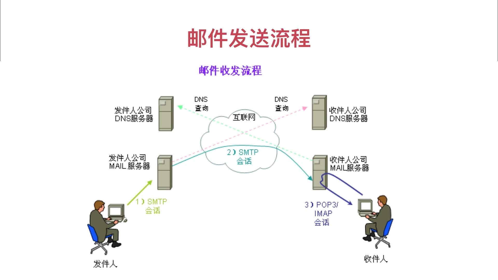

https://blog.csdn.net/IndexMan/article/details/89409512

一、使用场景

（1）注册验证
   注册各大网站，通常需要输入邮件地址，在注册成功后，会发送一封邮箱验证的邮件，点击确认，证明这个邮箱是用户自己的

（2）网站营销
   公司运营做活动的时候，提前几天给用户发邮件，提醒老用户在活动时间参加活动。

（3）安全的最后一道防线
   一个网站好久不用的时候，会忘记密码，这个时候需要找回密码，很多种找回方式，最常用的找回方式就是通过邮箱找回密码。

首先，在网站输入邮箱，系统会根据注册的邮箱发送一封邮件，根据邮件中的地址，可以重新设置新的密码。

（4）提醒邮件告警
   如果系统没有监控，将是一种灾难性的事件，系统被实时的监控起来，出了问题，第一时间通知到开发人员，在事态没有扩散，影响最小的时候把问题解决掉。

（5）触发机制

   定时邮件的发送，计算机忘记关机，发送一个特殊的邮件，让计算机自动关机。

smtp:邮件从一台服务器·传输到另外一台服务器；

pop：如何从服务器上下载邮件；

邮件传输协议:SMTP协议和POP3协议

内容不断发展：IMAP协议和Mime协议 

邮箱传输协议：SMTP协议，POP3协议、IMAP协议、Mime协议

spring boot实现邮箱验证注册与登录实战：

https://blog.csdn.net/IndexMan/article/details/89409512

https://github.com/ityouknow/spring-boot-examples/tree/master/spring-boot-mail

一、第一封邮件

  1、1969年10月，世界上的第一封电子邮件
   1969年10月世界上的第一封电子邮件是由计算机科学家Leonard K.教授发给他的同事的一条简短消息。第一条网上信息就是‘LO’，意思是‘你好！’。
  2、1987年9月14日中国的第一封电子邮件
   在此之后，1987年9月14日中国的第一封电子邮件，这封邮件是由德国维尔纳·措恩与中国的王运丰在北京计算机应用技术研究所，发往德国一个大学的，邮件内容颇具深意，“Across the Great Wall we can reach every corner in the world.(越过长城，走向世界)”，这是中国通过北京与德国大学之间的网络连接，向全球科学网发出的第一封电子邮件。

  3、30年代发展历程
   接下来中国的电子邮件进入了30年的发展期，虽然在1987年就有了电子邮件，但是，真正的邮件兴起，应该在90年代到2000年之间，因为在1987的时候中国网速特别慢，真正能接触到互联网的用户是非常少的，到了90年代中期，互联网浏览器的诞生，使得全民上网人数激增，电子邮件被广泛使用，此时，中国的部分学生在研究中使用到电子邮件，真正普及的时间是在2000年左右。
  4、Java发送邮件
   Java在发明之初，就开始支持发送邮件，通过java mail包方式去操作邮件发送的内容和协议，但是，这种发送方式稍微比较复杂，需要配置各种参数，协议，内容，之后产生了spring框架。
 5、Spring发送邮件
   Spring在java mail的基础上进行了一些封装，使发送邮件的过程的复杂大大减少
 6、SpringBoot发送邮件
   SpringBoot Mail在Spring Mail的基础上，再次进行一次封装，使得发送邮件的便利度上，更为简单。

springboot优点：
1.约定大于配置；
2.简单快速开发；
3.强大的生态链；

springboot 发送邮件：

https://blog.csdn.net/IndexMan/article/details/87563438

邮件服务器遵循协议：一开始：SMTP(简易邮件传输协议、一台服务器发送邮件到另一台服务器)和POP3(邮件协议、下载邮件到本地)，后期发展：IMAP(因特网邮件交互协议)和MIME(支持二进制扩展、支持附件、HTML等)

蓝鲸云 后台管理模板

http://docs.antdvue.lanjingcloud.vip/

