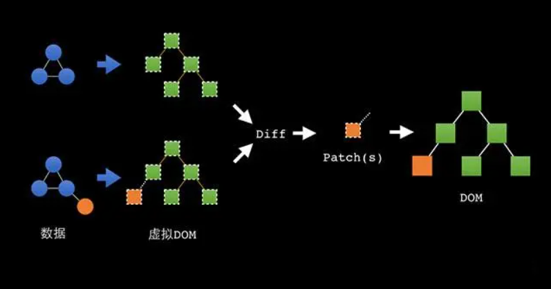
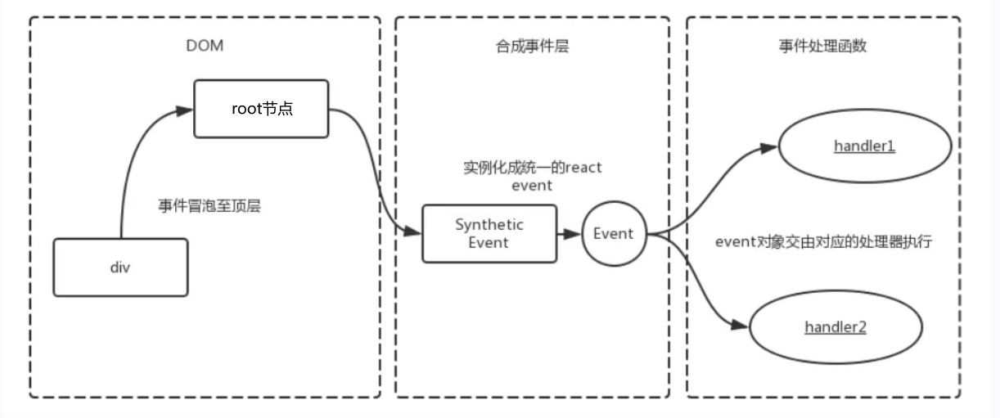
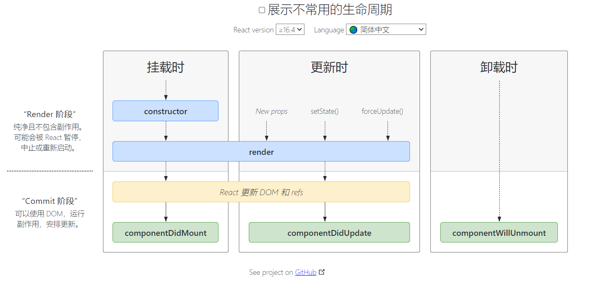
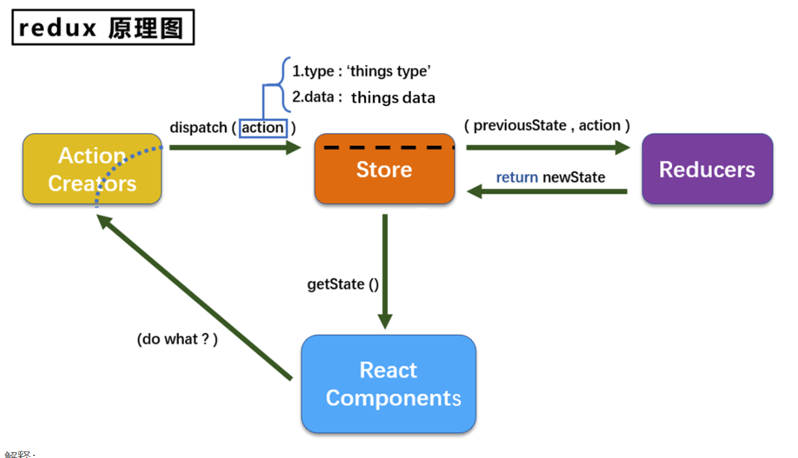
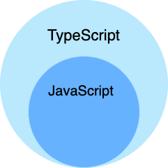
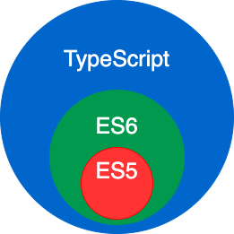

# react基础

## web前端工程化

**前端工程化是大厂前端开发人员的必备技能**。

在了解web前端工程化之前，我给大家回顾下web前端的发展史：

以2011年左右这个时间点为界线，在此之前的web前端就是为了完成HTML网页开发（一般叫拆板侠、切图仔），日常工作就是拿到UI设计师的设计稿，然后基于HTML、CSS、javascript一张一张地完成静态化网页的制作，然后把静态网页交给服务端开发（java，php等），完成的项目基本都是前后端不分离的web项目。

在此之后的web前端随着移动智能手机的普及，各种APP，微信开发随之蜂拥而来，场景也越来越丰富复杂了，不得不把前端独立出来，也是目前主流的前后端分离开发模式。

2015年之后，前端开发更是进入了技术井喷期，使前端开发的**开发形式**产生了翻天覆地的变化。至今为止，Web前端业务日益复杂化和多元化，前端项目开发早已经不是过去的5-6个页面、复制几个jQuery插件就能完成的了。

项目复杂了就会产生许多问题，比如：当开发团队的人数达到一定的规模以后（例如，30 人以上），如何进行高效的多人协作？如何保证项目的可维护性？如何提高项目的开发质量？

**前端工程化**是前端项目架构中重要的一环，它的出现就是为了解决上述大部分问题的。

### 声明式和命令式

1. 声明式：小明，出去操场跑5圈。

2. 命令式：小明，起来，滚出去，往东50米，看到操场了，跑1圈，跑完以后再跑一圈，再跑。。直到5圈。

   

## React基础

### 是什么

React是一个用于构建UI（User Interface，用户界面）的**JavaScript库**，也是目前全世界最流行的web前端框架之一，由Facebook在2013年5月开源的前端项目，因为Facebook对市场上所有 **JavaScript MVC框架**都不满意，所以就自己写了一个前端框架用来架设**Instagram网站**。


### 官方网址

官方网站：https://zh-hans.reactjs.org/

### 特点

React官方并不认可MVC开发模式，所以React不是一个完整的MVC前端框架，只能说是**一个轻量级的视图框架（MVC中的View**）。

React具有如下特点：

- **声明式设计**。为**应用的每一个状态**设计简洁的视图，当数据改变时 React 能有效地更新并正确地渲染组件。
- **高效**。React采用Virtual DOM(虚拟DOM), 极大的提升了UI渲染(更新)效率。
- **灵活**。React 允许你结合其他框架或库一起使用，而且有大量的开发者围绕着React去**开发各种各样的工具库**。
- **JSX**。JSX 是 React框架基于JavaScript的语法扩展。JSX 可以很好地描述 UI 应该呈现出它应有交互的本质形式。
- **组件** 。通过 React 构建组件，使得**代码更加容易得到复**用，能够很好的应用在大项目的开发中。
- **单向响应的数据流**。React 采用了单向响应的数据流，使组件状态更容易维护, 组件模块化更易于快速开发。

### 虚拟DOM




- 用 JavaScript 对象模拟真实 DOM 树，对真实 DOM 进行抽象；
- diff 算法 — 比较两棵虚拟 DOM 树的差异；
- pach 算法 — 将两个虚拟 DOM 对象的差异应用到真正的 DOM 树。

## 快速上手


### 渲染内容 ReactDOM.createRoot

* react: 核心包，操作react的所有必要功能

* react-dom：dom包 提供操作DOM的相关功能


方法：

```java

var msg="hello react!"
var root=ReactDom.createRoot(document.querySelector("#root"))
root.reander(msg)
```


```javascript
<!DOCTYPE html>
<html lang="en">
<head>
    <meta charset="UTF-8">
    <title>Title</title>
    <!-- React核心包，提供了操作React的所有必要功能，但不提供DOM操作相关的部分功能   -->
    <script src="https://unpkg.com/react@18/umd/react.development.js"></script>
    <!-- ReactDOM，提供了支持react操作DOM的相关功能 -->
    <script src="https://unpkg.com/react-dom@18/umd/react-dom.development.js"></script>
</head>
<body>
    <div id="root"></div>
    <script>
        var msg = 'hello，React!';
        const root = ReactDOM.createRoot(document.querySelector('#root'));
        // 渲染，把msg变量的信息渲染到绑定的根节点中
        root.render(msg);
    </script>
</body>
</html>
```

 

### 创建虚拟节点 React.createElement


```javascript
<!DOCTYPE html>
<html lang="en">
<head>
    <meta charset="UTF-8">
    <title>Title</title>
    <!--
    React，实际上分 React-dom 网页开发  React-native App开发
    React核心包，提供了操作React的所有必要功能，但不提供DOM操作相关的部分功能   -->
    <script src="https://unpkg.com/react@18/umd/react.development.js"></script>
    <!-- ReactDOM，提供了支持react操作DOM的相关功能 -->
    <script src="https://unpkg.com/react-dom@18/umd/react-dom.development.js"></script>
</head>
<body>
    <div id="root">

    </div>

    <script>
        var msg = "hello, React"
        // 创建React的虚拟DOM节点，a元素
        const SVDOM = React.createElement("a", {href: "http://www.qq.com"}, msg)
        // 创建React的虚拟DOM节点，h1元素
        const VDOM = React.createElement("h1", {title: msg}, SVDOM)
        // React把数据展示到#root标签
        const root = ReactDOM.createRoot(document.querySelector('#root'))
        // 渲染，把msg变量的信息渲染到绑定的根节点中
        root.render(VDOM)
    </script>

</body>
</html>
```

 

---


**`React.createElement`(type, [props], [...children])**  方法用于在 React 中创建一个元素。其参数结构可以概括为三个部分，具体来说：

1. **类型 (type)**: 这是要创建的 React 元素的类型，可以是一个字符串（如 "div"、"a"、"span" 等对应 HTML 元素）或是一个组件（如一个自定义的类组件或函数组件）。
2. **属性 (props)**: 这是一个对象，包含要应用到元素上的属性。对于 `a` 标签，常见的属性包括 `href`、`target`、`rel` 等。在你的示例中，`{ href: "http://www.qq.com" }` 就是 props 对象。
3. **子元素 (children)**: 这是元素的子内容，可以是文本、其他 React 元素或者数组。可以传递一个或多个子元素。在你的示例中，`msg` 代表要作为子元素的内容，它可以是一个字符串或其他 React 元素。

结合你的示例，

`React.createElement("a", {href: "http://www.qq.com"}, msg)` 的参数如下：

- 第一个参数是 `"a"`，表示创建一个 `a` 标签。
- 第二个参数是一个对象 `{href: "http://www.qq.com"}`，表示该 `a` 标签的属性。
- 第三个参数是 `msg`，表示该 `a` 标签的内容（子元素）。

因此，整体上这个方法创建了一个带有 `href` 属性的 `a` 标签，该标签显示了 `msg` 的内容。

React.createElement 方法文档

概述

`React.createElement` 是 React 中用于创建 React 元素的核心方法。它允许开发者以编程的方式生成 React 组件，并且是 JSX 编译的基础。此方法通常在使用 JSX 语法时被隐式调用，但在一些情况下（如在没有 JSX 的环境中），可以显式调用该方法以创建元素。

方法签名

```
javascriptReact.createElement(type, [props], [...children])
```

参数

1. **type (string | function)**:
   - 要创建的元素类型。可以是 HTML 元素的名称（如 `"div"`、`"span"`、`"a"` 等）或是自定义的 React 组件（函数组件或类组件）。
2. **props (object | null)**:
   - 元素的属性对象，包含元素的各种属性和事件处理程序。可以传递常规的 HTML 属性，也可以添加自定义属性。
   - 如果没有属性，可以传递 `null`。
3. **children (string | element | array)**:
   - 元素的子内容，可以是文本、其他 React 元素或者数组。如果有多个子元素，可以按顺序传递它们。

返回值

- 返回一个 React 元素，这是一个描述 DOM 结构的对象。该对象可用于渲染到 UI 中。

示例

创建一个简单的 `<a>` 标签

```javascript
javascriptconst msg = "点击这里";
const element = React.createElement("a", { href: "http://www.qq.com" }, msg);
```

在这个示例中，创建了一个链接，包含如下属性和内容：

- 类型为 `a`（表示一个锚点链接）。
- 属性为 `href: "http://www.qq.com"`，设置链接的目标 URL。
- 子元素为 `msg`，显示的文本内容为“点击这里”。

创建一个自定义组件

```javascript
javascriptfunction MyButton(props) {
  return React.createElement("button", null, props.label);
}

const buttonElement = React.createElement(MyButton, { label: "提交" });
```

在这个示例中：

- `MyButton` 是一个自定义的组件，接收一个 `label` 属性并渲染一个按钮。
- `buttonElement` 创建了一个 `MyButton` 组件的实例，并传递了 `label` 属性。

注意事项

- 虽然 `React.createElement` 方法可以直接使用，但大多数开发者更倾向于使用 JSX，因为它更具可读性和简洁性。使用 JSX 时，类似上述的 JavaScript 代码会被编译为 `React.createElement` 方法调用。
- 由于 React 的元素是不可变的，一旦创建，其属性和子元素就不能被改变。若需变更，需创建一个新的元素。

结论

`React.createElement` 是 React 中创建元素的基础方法，理解其工作原理有助于更好地利用 React 构建用户界面。尽管在大多数情况下使用 JSX 更为方便，但在特定情况下，了解如何直接使用 `React.createElement` 也非常重要。

## JSX

JSX（JavaScript Xml）是 React框架基于**JavaScript+XML实现的语法扩展**，**类似模板语言，但具有 JavaScript 的全部功能**。

JSX提供了**在 JavaScript 代码中写 XML（HTML）代码的功能**，让项目中的用户界面代码变得更加直观、结构清晰，从而提升开发效率，所以React推荐开发者使用JSX来声明描述用户界面。


> JSX本质上就是`React.createElement(component,props,children)`**函数的语法糖**，使用babel编译后，JSX会变成虚拟DOM对象。


```javascript
<!DOCTYPE html>
<html lang="en">
<head>
    <meta charset="UTF-8">
    <title>Title</title>
    <script src="https://unpkg.com/react@18/umd/react.development.js"></script>
    <script src="https://unpkg.com/react-dom@18/umd/react-dom.development.js"></script>
    <!-- Babel，一个JavaScript代码转译器，可以把ES6代码转换成ES5代码的的语法转换工具，也可以把JSX代码转换成javascript代码 -->
    <script src="https://unpkg.com/@babel/standalone/babel.min.js"></script>
</head>
<body>
    <div id="root"></div>
    <!-- script标签声明内部的代码需要使用babel进行转译 -->
    <script type="text/babel">
        var msg = 'hello，React!';
        // JSX语法创建虚拟DOM
        var VDOM = <div id="son">
            {msg}<br/>
            <span>{msg}</span>
        </div>

        const root = ReactDOM.createRoot(document.querySelector('#root'));

        // 渲染，这次渲染的是虚拟DOM节点
        root.render(VDOM);
    </script>
</body>
</html>
```

 ```javascript
 <script type="text/babel">
 </script>
 ```


##### 语法规则

1. **所有标签必须闭合，最外层必须有且只有一个根元素。遇到与js关键字同名的属性，要特殊处理**。

```javascript
/* 错误写法：最外层是2个元素 */
var VDOM = <span>1</span><span>2</span>

/* 正确写法 */
var VDOM = <span>1</span>
var VDOM = (<span>1</span>)
var VDOM = (<><span>1</span><span>1</span></>)
var VDOM = (<div><span>1</span><span>1</span></div>)

/* 错误写法：class与for都是js中的关键字 */
<p class="myele">!!!!!</p>
<label for="ooo">1111</label>
/* 正确写法 */
<p className="myele">!!!!!</p>
<label htmlFor="ooo">1111</label>


/* 错误写法：标签没有闭合 */
<br>
<input>

/* 正确写法 */
<br/>
<input></input>
<input/>
```

2. **在单个花括号`{}`中编写js代码。当标签的属性值是js代码时，把引号换成单个花括号。**

```javascript
// 假设msg和num是一个js变量
/* 错误写法： 属性值加了引号，"msg"成了字符串。*/
<p title="msg"></p>
/* 错误写法： 内容中没有花括号，所以msg被当成了字符串。*/
<p>msg</p>

/* 正确写法 */
<p title={msg}>鼠标放上来</p>
<p>{msg}</p>
```

3. **注释需要使用js多行注释，并且外面加上花括号。**

```javascript
// 错误写法：
<div>
    // 错误的注释写法
    <p>{ msg }</p>
    /* 错误的注释写法 */
    <p>{ msg }</p>
     {// 错误的注释写法}
</div>

// 正确写法
<div>
    {/* 正确的注释写法 */}
    { msg }
</div>
```

 

##### 渲染数据

###### 渲染变量

```javascript
/* 错误写法：没有返回值的语句，不能嵌入JSX中 */
<div>{ var a = 10  }</div>

/* 错误写法：for语句或者if语句没有结果，不能嵌入JSX中 */

<ul>
for(var i = 0 ; i < 10 ; i ++){
<li>{i}</li>
}
</ul>

/* 正确写法：三元表达式可以代替if语句 */
<div>{ 1>0?10:20 }</div>

/* 正确写法：改用map遍历对象或数组 */
const user = {name: 'xiaoming', age: 16}
// JSX语法创建虚拟DOM
const VDOM = (
<ul>
    {
        Object.keys(user).map(key=>
            <li key={key}>{key}={user[key]}</li>
        )
    }
</ul>
)

                      
/* 错误写法：大部分对象无法直接嵌入JSX中 */
<div>{ new Date() }</div>

/* 错误写法：匿名函数或函数名，无法直接嵌入JSX中 */
<div>{ ()=>2 }</div>
<div>{ functionName }</div>

/* 正确写法：表达式，可以嵌入JSX */
<div>{ a+=10  }</div>
/* 正确写法：单个变量属于表达式，可以嵌入JSX */
<div>{ a }</div>
/* 正确写法：字面量输入表达式，可以嵌入JSX */
<div>{ 10  }</div>
/* 正确写法：数组，可以嵌入JSX */
<div>{ [1,2,3]  }</div>
```

 

###### **渲染列表数据**


```javascript
<!DOCTYPE html>
<html lang="en">
<head>
    <meta charset="UTF-8">
    <title>Title</title>
    <script src="https://unpkg.com/react@18/umd/react.development.js"></script>
    <script src="https://unpkg.com/react-dom@18/umd/react-dom.development.js"></script>
    <script src="https://unpkg.com/@babel/standalone/babel.min.js"></script>
</head>
<body>
    <div id="root"></div>
    <script type="text/babel">
        let books_list = [
            {id: 10, title: "标题1", price: 38.50},
            {id: 13, title: "标题2", price: 28.50},
            {id: 15, title: "标题3", price: 68.50},
            {id: 21, title: "标题4", price: 58.50},
        ]
        
        class HelloComponent extends React.Component {
            render(){ // 所有视图代码，必须写在render方法中通过return返回给外界。
                return (
                    <table border='1'>
                        <tr>
                            <td>编号</td>
                            <td>价格</td>
                            <td>标题</td>
                        </tr>
                        {books_list.map((item,key)=>(
                            <tr key={key}>
                                <td>{item.id}</td>
                                <td>{item.price.toFixed(3)}</td>
                                <td>{item.title}</td>
                            </tr>
                        ))}
                    </table>
                )
            }
        }
        
        const root = ReactDOM.createRoot(document.querySelector('#root'));

        root.render(<HelloComponent/>);
        
    </script>
</body>
</html>
```

###### **key属性说明**

因为React的**高性能是依赖于虚拟DOM的**，所以React的JSX操作中都是尽量避免去操作DOM元素的。但是对于开发中的列表数据而言，因为列表元素在操作过程中会出现位置改变的情况，而React的虚拟DOM是并不知道的，此时，有可能React的虚拟DOM会把位置改变后的所有元素全部进行重新渲染，这就会大量增加DOM操作了，因此React会要求我们在遍历列表元素时给元素绑定一个唯一的key值，当列表中的元素在操作过程中出现位置改变时，React就可以通过预先设置好的key值来识别到了。

 

###### 输出连续序数

```javascript
<!DOCTYPE html>
<html lang="en">
<head>
    <meta charset="UTF-8">
    <title>Title</title>
    <script src="https://unpkg.com/react@18/umd/react.development.js"></script>
    <script src="https://unpkg.com/react-dom@18/umd/react-dom.development.js"></script>
    <script src="https://unpkg.com/@babel/standalone/babel.min.js"></script>

</head>
<body>
    <div id="root">

    </div>

    <script type="text/babel">
        // 使用map来循环数组即可
        const VDOM = <div>
            <ul>
                {Array(10).fill(null, 2).map((item, key)=>
                    <li key={key}>{key}</li>)}
            </ul>
        </div>

        // React把数据展示到#root标签
        const root = ReactDOM.createRoot(document.querySelector('#root'))
        // 渲染，把msg变量的信息渲染到绑定的根节点中
        root.render(VDOM)
    </script>

</body>
</html>
```

 

这段代码的作用是生成一个包含 10 个 `<li>` (列表项) 的数组，并在每个列表项中显示该项的索引值，其中特定的填充值为 `null`，但在 `map` 方法中被忽略。

代码解析

```javascript
javascript{Array(10).fill(null, 2).map((item, key) => 
  <li key={key}>{key}</li>
)}
```

1. `Array(10)`

- `Array(10)` 创建了一个长度为 10 的空数组。这时数组的内容是 `[ <empty>, <empty>, <empty>, <empty>, <empty>, <empty>, <empty>, <empty>, <empty>, <empty> ]`。

2. `.fill(null, 2)`

- `fill(null, 2)` 用于填充数组。它会从索引 `2` 开始填充至数组末尾，填充的值是 `null`。
- 因此，填充后的数组将变成 `[ <empty>, <empty>, null, null, null, null, null, null, null, null]`。

3. `.map((item, key) => <li key={key}>{key}</li>)`

- `map` 方法会遍历数组的每一项，并对每一项执行给定的函数。

- 在这个函数中，`item` 是当前遍历的元素（在这个例子中，它可以是 `null` 或 `empty`），`key` 是当前元素的索引。

- 每次调用 map 时，都会返回一个 <li>

  元素，其中：

  - `key={key}` 是 React 用于识别每个元素的唯一标识符，建议使用唯一值，以便 React 能更有效地更新和渲染列表。
  - `{key}` 是当前循环的索引值，也就是显示在列表项中的内容。

最终结果

最终的输出将是一个包含索引值的列表，从 `0` 到 `9`。即使在索引 `2` 及以后的元素对应的原数组项是 `null`，因为在 `map` 中遍历的是 10 个元素，所以仍然会生成 10 个 `<li>` 元素。

渲染输出示例

渲染后的结果将是：

```html
<ul>
  <li key={0}>0</li>
  <li key={1}>1</li>
  <li key={2}>2</li>
  <li key={3}>3</li>
  <li key={4}>4</li>
  <li key={5}>5</li>
  <li key={6}>6</li>
  <li key={7}>7</li>
  <li key={8}>8</li>
  <li key={9}>9</li>
</ul>
```

注意事项

- 在这个例子中，`fill` 的使用并未实际对 `map` 的输出结果产生影响，因为 `map` 是基于数组的长度进行遍历，而非元素的实际值。
- 对于空值和 `null`，`map` 会正常执行，但开发者可以根据具体需求选择是否包含或更改这些值。


##### 渲染样式

###### 行内样式

```javascript
<div style={{color: 'red',fontSize: '20px'}}></div>

var myStyle = {color: 'green',fontSize: '20px'};
<div style={myStyle}></div>
```

* 第一个是字面变量

* 第二个是变量


###### class样式


```javascript
<!-- css代码，如果是外部样式文件，必须导入使用 -->
<style>
    .danger{
      color: red;
    }
    .info{
      color: blue;
    }
    .f24{
      font-size: 24px;
    }
</style>


// jsx代码
<div>
    <p className={'danger f24'}>危险</p>
    <p className={'info f24'}>安全</p>
</div>
```

`className` 属性的**值是一个字符串，其中包含多个类名**。在 JSX 中，`className` 用于设置 HTML 元素的 CSS 类，而不是将类名视为变量

---

这段代码的翻译：

在这段代码中，`className` 属性的值是一个字符串，其中包含多个类名。在 JSX 中，`className` 用于设置 HTML 元素的 CSS 类，而不是将类名视为变量。

代码解析

```jsx
<div>
    <p className={'danger f24'}>危险</p>
    <p className={'info f24'}>安全</p>
</div>
```

1. **`className` 属性**:
   - 在 JSX 中使用 `className` 属性来代替 HTML 中的 `class` 属性，这是因为 `class` 是 JavaScript 的关键字。
   - 你在 `className` 中写入 `'danger f24'` 和 `'info f24'`，表示将这两个类分别应用于 `<p>` 元素。
2. **类名字符串**:
   - `'danger f24'` 和 `'info f24'` 是字符串，这是一种组合了多个类名的写法。
   - 这两个类名是用空格分隔的，表示这两个类都将应用于对应的元素。这里，`danger` 和 `info` 是 CSS 类名，`f24` 则表示字体大小为 24px。

是否视为变量

- 在这个上下文中，`danger` 和 `info` 并不是变量，它们是 CSS 类名的字符串。在 JSX 中，类名以字符串的形式写出。
- 如果你想使用变量来动态设置类名，可以先定义变量，然后在 `className` 中使用它。例如：

```jsx
const dangerClass = 'danger';
const infoClass = 'info';

<div>
    <p className={`${dangerClass} f24`}>危险</p>
    <p className={`${infoClass} f24`}>安全</p>
</div>
```

在上面的例子中，`dangerClass` 和 `infoClass` 是 JavaScript 中的变量，它们的值相当于 CSS 类名。使用模板字符串 (`${}`) 可以将变量引入 `className` 中。

总结

在你提供的代码中，`danger` 和 `info` 只是 CSS 类名，并不是当做变量来使用。如果需要动态类名，可以通过变量来实现。

---


样式的使用说明：


基于组件化的整体性，React官方建议我们开发中使用行内样式，但在开发中大多数公司团队都是采取了基于目录的方式来保存不同组件的代码，往往一个页面就是一个组件，而属于这个页面的css样式文件和js组件文件则会保存当前目录下。

 

##### 代码转义

在默认情况下，React DOM会将所有嵌入JSX的数据进行编码，HTML代码会进行实体转义。这样可以有效避免xss攻击。

```javascript
// 默认会进行HTML转义
let content = '<script>console.log('hello，React!')<\/script>'
var VDOM = <div>{content}</div>


// 不进行HTML转义
let content = {
    __html: '<script>console.log('hello，React!')<\/script>'
};
var VDOM = <div dangerouslySetInnerHTML={content}></div>
```

 

## 基于项目构建工具来管理项目


在上面的学习中，我们一直把代码写在一个文件中，每次使用这个文件都要反复去引入react、react-dom、babel文件。这无疑很影响我们的学习和开发效率，所以接下来我们可以基于项目构建工具来搭建一个React项目，以工程化的方式来继续学习。

####  创建项目(初始化项目的命令)


```bash
# yarn+create-react-app
yarn create react-app yarn-react-basic

# npm + create-react-app
npm init react-app npm-react-basic

# npx+create-react-app
npx create-react-app npx-react-basic

# yarn+vite
yarn create vite

# npm+vite
npm init vite
```

* yarn、npm就是**包管理器**，还可以项目进行**构建管理**。

* React官方为了方便咱们学习React推出了一个脚手架create-react-app（100M）【CRA】，而vite则是另一个前端框架vue的作者尤雨溪开发的脚手架vite。

* create-react-app搭建的React项目，默认入口是`public/index.html`，脚本文件的扩展名是`js`。

* vite搭建的React，默认入口是`index.html`，脚本文件的扩展名是`jsx`。

 

#### 启动项目

```bash
# create-react-app启动项目
yarn start  # 或者 npm start

# vite启动项目
yarn dev  # 或者 npm run dev 
```

## 组件化

### 组件化的概念


在前端开发中经常出现多个网页的功能是重复的，而且很多不同的页面之间也存在同样的功能。在React中，我们可以按功能或业务来把UI界面进行拆分一个个包含**模板(HTML)+样式(CSS)+逻辑(JS)**的功能完备的结构单元。

这些结构单元就可以设计成一个个组件方便开发人员进行代码复用，这种开发方式也就是组件化开发，前端人员在组件化开发时，只需要书写一次代码，随处引入即可使用。

### React创建组件的两种方式：


- 函数式组件

  以函数格式来创建组件，直接在函数中return返回视图代码即可。

- 类组件

  以类的方式来创建组件，组件类必须直接或间接继承于React.Component类，而且视图代码必须通过render方法return返回给外界。

> 注意：
>
> 在React17以前，函数式组件也叫无状态（state）组件，而类组件则为有状态组件。所谓有无状态，指代的是**组件内部是否能定义状态**（**state，状态就是组件内部定义和使用的私有数据**），并通过state来保存数据或修改视图的界面效果。
>
> 在React17版本开始，**函数式组件也可以通过Hooks来定义状态（state），来保存数据或修改视图了，函数式组件的应用也变得强大起来了**。

 

#### 类组件

src/App.jsx，代码：

```javascript
import React from "react";
class App extends React.Component{
    constructor() {
        super();
        this.msg = 'Hello， Class Component！！'
    }
    render() {
        return (
            <div className="App">
                {this.msg}
            </div>
        )
    }
}

export default App
```

src/main.jsx，代码：

```javascript
import React from 'react'
import ReactDOM from 'react-dom/client'
// 导入组件才能使用
import App from './App'

ReactDOM.createRoot(document.getElementById('root')).render(
  <React.StrictMode>
    <App />
  </React.StrictMode>
)
```

> **注意：**
>
> **不管是函数式组件还是类组件，组件名必须首字母大写！！！否则报错！**


#### 函数式组件

src/Func.jsx，代码：

```javascript
function Func(){
    let msg = 'Hello， Function Component！！'
    return (
        <div className="App">
            {msg}
        </div>
    )
}

export default Func
```

src/main.jsx，代码：

```javascript
import React from 'react'
import ReactDOM from 'react-dom/client'
// 导入组件才能使用
import App from './App'
import Func from "./Func.jsx";

ReactDOM.createRoot(document.getElementById('root')).render(
  <React.StrictMode>
    <App />
    <Func />
  </React.StrictMode>
)
```

 

pycharm/vscode快速生成snip代码的快捷键：

```bash
rcc 快速生成类组件
rsf  快速生成函数式组件
rsc  快速生成工具函数的代码片段
```

 VsCode如何快速生成组件


#### 组件的嵌套

组件可以随意组合和嵌套的。

在开发中，我们习惯把整个项目分成许多大大小小的组件，一个页面可以设计成一个组件，而一个页面组件下又可以包含多个功能组件，有些复杂的功能组件，还可以细化嵌套自己的子组件。

src/App.jsx，代码：

```javascript
import React from "react";
import Header from "./Header.jsx";
import Footer from "./Footer.jsx";

class App extends React.Component{
    constructor() {
        super();
        this.msg = 'Hello， Class Component！！'
    }
    render() {
        return (
            <div className="App">
                <Header/>
                <h1>中间内容属于App的</h1>
                <Footer/>
            </div>
        )
    }
}

export default App

```

src/Header.jsx，代码：

```javascript
import React from "react";

class Header extends React.Component{
    render() {
        return (
            <div>
               我是Header中定义的头部内容！！
            </div>
        )
    }
}

export default Header

```

src/Footer.jsx，代码：

```javascript
import React from "react";

class Footer extends React.Component{
    render() {
        return (
            <div>
               我是Footer中定义的脚部内容！！
            </div>
        )
    }
}

export default Footer

```

src/main.jsx，代码：

```javascript
import React from 'react'
import ReactDOM from 'react-dom/client'
import App from './App'

ReactDOM.createRoot(document.getElementById('root')).render(
  <React.StrictMode>
    <App />
  </React.StrictMode>
)
```

一般我们会把被导入的小功能组件叫子组件，同理，导入其他组件的当前组件，叫父组件。属于嵌套关系的两个组件之间的关系，就是父子组件。当然，如果两个组件被同一个父组件所调用，则这两个组件则为兄弟组件，属于并列关系。


---

AI解释不懂的地方：

在 `React.Component` 中，`.`（点）语法是用于访问对象的属性或方法。在这个例子中：

- `React` 是一个对象，它是 React 库的主要命名空间。
- `Component` 是 `React` 对象的一个属性，具体来说，它是一个类，用于创建 React 组件。

**详细解析**

1. **`React` 对象**:
   - `React` 是从 React 库中导入的。
   - 该对象包含了用来构建用户界面的各类属性和方法，比如 `createElement`、`Component`、`useState`、`useEffect` 等。
2. **`Component` 属性**:
   - `Component` 是 React 提供的一个基类，用于创建类组件。开发者可以通过继承 `Component` 类来创建自己的组件。
   - 一般情况下，开发者会在自己的组件类中实现 `render` 方法，以定义该组件在 UI 中的展示内容。

示例

下面是一个使用 `React.Component` 创建类组件的简单示例：

```javascript
javascriptimport React from 'react';

class MyComponent extends React.Component {
    render() {
        return <div>Hello, World!</div>;
    }
}
```

在这个示例中：

- `MyComponent` 继承自 `React.Component`，因此它成为一个 React 类组件。
- `render` 方法在组件实例化时被调用，返回一个描述该组件内容的 JSX 元素。

点语法的其他示例

点语法在 JavaScript 中非常常见，通常用于访问对象的属性。例如：

```javascript
javascriptconst person = {
    name: 'Alice',
    age: 30,
};

console.log(person.name); // 输出: Alice
console.log(person.age);  // 输出: 30
```

在这里，`person` 是一个对象，通过 `person.name` 和 `person.age` 可以访问其属性。

总结

在 `React.Component` 中，`React` 是一个对象，而 `Component` 是该对象的一个属性（一个类），用于基本的组件创建。点语法是用于访问这个结构中的属性或方法的常见方式。

---


 

## 事件和事件处理


React的主要功能就是渲染视图，而视图操作中事件的绑定和处理，肯定是必不可少的。

#### 事件绑定和处理


```javascript
import React from "react";

class App extends React.Component{
    render() {
        return (
            <div className="App">
                <button onClick={this.func1.bind(this)}>点击按钮</button><br/>
                <button onClick={()=>this.func2('func2')}>点击按钮</button>
            </div>
        )
    }
    func1(){
        console.log("func1被点击了！！！")
    }
    func2(data){
        console.log(`${data}被点击了！！！`)
    }
}

export default App
```

修正事件中的this指向

```javascript
import React from "react";
import Header from "./Header.jsx";
import Footer from "./Footer.jsx";

class App extends React.Component{
    constructor() {
        super();
        this.msg = 'hello, Component'
    }
    render() {
        return (
            <div className="App">
                <button onClick={this.func1.bind(this)}>点击按钮</button><br/>
                <button onClick={()=>this.func2('func2')}>点击按钮</button>
            </div>
        )
    }
    func1(){
        console.log("func1被点击了！！！", this.msg)
    }
    func2(data){
        console.log(`${data}被点击了！！！`, this.msg)
    }
}

export default App

```

在javascript中函数中的this的上下文切换可以采用三个方法来完成：call、apply、bind，但是在上面代码环境中，只有bind符合我们的使用需求。

 


---

AI的解释： apply 和call和bind的区别

在 JavaScript 中，`this` 关键字的上下文切换是通过 `call`、`apply` 和 `bind` 这三个方法来实现的。虽然这三个方法的目的都是改变函数执行时的 `this` 值，但它们的用法和返回值有所不同。下面详细说明这三个方法的区别。

**1. `call()`**

- **用法**: `func.call(thisArg, arg1, arg2, ...)`
- **描述**: 直接调用指定 `this` 的函数，并传入参数。
- 参数
  - `thisArg`: 要绑定给函数的 `this` 值。
  - `arg1, arg2, ...`: 函数执行时传入的参数（从第一个位置开始，依次传入）。
- **返回值**: 函数的返回值。

示例：

```jsx
javascriptfunction greet() {
    console.log(`Hello, ${this.name}`);
}

const person = { name: 'Alice' };
greet.call(person); // 输出: Hello, Alice
```

**2. `apply()`**

- **用法**: `func.apply(thisArg, [argsArray])`

- **描述**: 与 `call()` 类似，但参数是以数组的形式传入。

- 参数

  :

  - `thisArg`: 要绑定给函数的 `this` 值。
  - `argsArray`: 参数数组或类数组对象，按顺序传入函数参数。

- **返回值**: 函数的返回值。

示例：

```jsx
javascriptfunction greet(greeting) {
    console.log(`${greeting}, ${this.name}`);
}

const person = { name: 'Alice' };
greet.apply(person, ['Hello']); // 输出: Hello, Alice
```

**3. `bind()`**

- **用法**: `const boundFunc = func.bind(thisArg, arg1, arg2, ...)`
- **描述**: 创建一个新函数，`this` 被永久绑定到 `thisArg`，并可以在调用时传入额外参数。
- 参数
  - `thisArg`: 要绑定给函数的 `this` 值。
  - `arg1, arg2, ...`: 在调用新函数时会作为预置参数传入。
- **返回值**: 返回一个新的函数。

示例：

```jsx
javascriptfunction greet() {
    console.log(`Hello, ${this.name}`);
}

const person = { name: 'Alice' };
const greetAlice = greet.bind(person);
greetAlice(); // 输出: Hello, Alice
```

总结

- `call` 和 `apply` 用于立即执行函数并改变其 `this` 指向，`call` 以逗号分隔的参数形式传入参数，而 `apply` 以数组形式传入参数。
- `bind` 用于创建一个新的函数，该函数的 `this` 永久绑定到指定的对象，并且可以在后续的时候调用。
- `call` 和 `apply` 都会立即调用函数，而 `bind` 返回一个新的函数，只有在后续调用时才会执行。


#### 了解React的事件机制

在React的事件处理中，**React并没有把事件绑定到具体的`dom`节点**上，而是**通过`事件代理`（也叫事件委托）的方式**将所有的事件绑定到了React注册的**根节点**（React17之前是Document）上，然后由统一的事件监听器（dispatchEvent）去监听事件的触发，这样的处理不仅减少页面的注册事件数量、减少事件处理和回收带来的内存开销、抹平浏览器之间的事件差异，还能在组件挂载销毁时统一订阅和移除事件，当然也达到了项目性能优化的目的。


React内部基**于浏览器的事件机制实现了一套事件机制**（SyntheticEvent，[合成事件](https://zh-hans.reactjs.org/docs/events.html)），包括事件的注册、事件的存储、事件的合成及执行等。

合成事件是浏览器的原生事件的跨浏览器包装器。除兼容所有浏览器外，它还拥有和浏览器原生事件相同的接口，包括 `stopPropagation()` 和 `preventDefault()`。

**React在内部维护了一个映射表（listenerBank）来记录事件与组件的事件处理函数的对应关系**，当某个**事件触发时，React根据会根据当前的组件ID和事件类型到映射表中将事件分派给指定的事件处理函数**。当一个组件挂载与卸载时，相应的事件处理函数会自动被添加到事件监听器的内部映射表中或从表中删除。

因为React的合成事件，是在事件冒泡阶段执行，所以会比javascript原生事件对象要慢。





 

```javascript
import React from "react";

class App extends React.Component{
    msg = "hello"
    render() {
        
        return <div onClick={()=>{
            this.fn3()
        }}>
            <button onClick={this.fn1.bind(this)}>点击按钮</button><br/>
            <p onClick={(event)=>{
                this.fn2(event) // 建议大家写这个格式绑定事件处理
            }}>点击按钮</p><br/>
            <a href="http://www.baidu.com" onClick={(evenet)=>{
                this.fn4(event)
            }}>跳转页面</a>
        </div>
    }
    
    fn1(){
        console.log("this=", this);
        console.log("fn1被点击了！", this.msg);
    }

    fn2(event){
        // 阻止事件冒泡
        event.stopPropagation()
        console.log("fn2被点击了！！", this.msg)
    }

    fn3(){
        console.log("fn3执行了！")
    }

    fn4(event){
        // 组织元素标签的默认行为，例如：a标签的页面跳转，表单的submit提交数据进行页面
        event.preventDefault()
    }
}
export default App
```


> 上面的方法定义和在类中的定义的方法 


---

定义方法的不同

在 JavaScript 中，定义方法的方式有很多种，包括在普通对象中定义方法和在 ES6 的 `class` 中定义方法。两者在语法、特性、上下文和继承等方面存在一些重要的区别。

1. 定义方式

在对象中定义方法

 使用匿名函数

你可以直接在普通对象字面量中定义方法。例如：

```javascript
const person = {
    name: 'Alice',
    greet: function() {
        console.log(`Hello, my name is ${this.name}`);
    }
};

person.greet(); // 输出: Hello, my name is Alice
```

在这种情况下，`greet` 是 `person` 对象的一个属性，且它是一个函数。

使用箭头函数

使用箭头函数来定义对象的方法时，有一点需要注意：箭头函数不会绑定自身的 `this`，而是从外部上下文中继承 `this`。因此，如果在箭头函数中引用 `this`，它会依赖于外部作用域的 `this`，这可能会导致意想不到的结果：

```javascript
const person = {
    name: 'Alice',
    greet: () => {
        console.log(`Hello, my name is ${this.name}`);
    }
};

person.greet(); // 输出: Hello, my name is undefined
```

在这里，`this` 并不指向 `person` 对象，而是指向了全局上下文（在浏览器中，通常是 `window`），所以 `this.name` 是 `undefined`。


```javascript
// ES5中定义对象方法的语法
const personES5 = {
    sayHello: function() {
        console.log('Hello World!');
    }
};

// ES6中对象方法的简写语法
const personES6 = {
    sayHello() {
        console.log('Hello World!');
    }
};
```


在ES6中，对象方法的简写是一种使代码更加简洁和易读的新特性。下面我将根据你的要求逐一解释：

1. 解释ES6中对象方法简写的语法规则

在ES6中，当定义对象的方法时，可以省略`function`关键字和冒号（`:`），直接写方法名和函数体。这种简写方式使代码更加简洁。

https://es6.ruanyifeng.com/#docs/object

- [阮一峰：ECMAScript 6 入门 - 对象的扩展](http://es6.ruanyifeng.com/#docs/object)


在 ES6 `class` 中定义方法

使用 ES6 的 `class` 语法时，方法是通过类体内定义的。例如：

```java
class Person {
    constructor(name) {
        this.name = name;
    }

    greet() {
        console.log(`Hello, my name is ${this.name}`);
    }
}

const alice = new Person('Alice');
alice.greet(); // 输出: Hello, my name is Alice
```

在这个例子中，`greet` 是 `Person` 类的一个原型方法。

使用匿名函数

在类中，通常不建议使用匿名函数作为方法，因为类中的方法是定义在原型上的，而匿名函数会在每次实例化时创建新的函数。尽管可以这样做，但这不是推荐的做法：

```javascript
class Person {
    constructor(name) {
        this.name = name;
    }

    greet = function() { // 使用匿名函数
        console.log(`Hello, my name is ${this.name}`);
    }
}

const alice = new Person('Alice');
alice.greet(); // 输出: Hello, my name is Alice
```

在这个例子中，使用了类属性语法（此时 `greet` 是一个实例属性），并且该方法可以正常访问实例的 `this`。

使用箭头函数

在类中使用箭头函数同样可以用来定义方法，这里的 `this` 会正确绑定到实例：

```javascript
class Person {
    constructor(name) {
        this.name = name;
    }

    greet = () => { // 使用箭头函数
        console.log(`Hello, my name is ${this.name}`);
    }
}

const alice = new Person('Alice');
alice.greet(); // 输出: Hello, my name is Alice
```

在这个例子中，由于使用了箭头函数，`this` 仍然指向 `Person` 类的实例，因此可以正确访问 `name` 属性。

总结

- **在对象中使用匿名函数** 可以正常工作，但要注意 `this` 的上下文。如果使用箭头函数，`this` 将取决于定义时的上下文，这可能导致错误。
- **在类中使用匿名函数** 和 **箭头函数** 都可以，但箭头函数的 `this` 绑定是更灵活的选择（在实例中使用时），而匿名函数通常不推荐使用，因为它们生成新的函数实例。


## 三大属性 Ref和props和state

三大属性指代的是React中组件最重要的，也是最常用的三个主要属性：ref，props和 state

在 React 中，`ref` 和 `props` 并不是常规定义的缩写词，而是它们的特定用语。

1. **ref**：
   - `ref` 是 "reference"（引用）的缩写。
   - 在 React 中，`ref` 用于获取对 DOM 元素或组件实例的直接引用。
2. **props**：
   - `props` 是 "properties"（属性）的缩写。
   - 在 React 中，`props` 用于传递数据和事件处理程序从父组件到子组件。

翻译

- `ref` 翻译为 **引用**
- `props` 翻译为 **属性**

总结：

- `ref` 是引用，通常用于获取元素的直接引用。
- `props` 是属性，用于组件之间传递数据。


#### 属性1：ref

React提供了Ref属性可以让开发者很方便快捷地拿到**组件实例对象**或**DOM元素**。

```javascript
import React from "react";
import Header from "./Header.jsx";
import Footer from "./Footer.jsx";
class App extends React.Component{
    
    footer = React.createRef()
    p1 = React.createRef()
    
    render() {
        return (
            <div className="App">
                <Header ref="header"></Header>
                <input type="text" ref="username"/>
                <Footer ref={this.footer}/>
                <p ref={this.p1}>hello, p </p>
                <button onClick={()=>this.func1()}>点击按钮</button><br/>
            </div>
        )
    }
    
    func1(){
        console.log(this.refs.username.value)
        console.log(this.refs.header)
        console.log(this.footer.current)
        console.log(this.p1.current)
    }
}

export default App
```

监听数据变化

```javascript
import React from "react";
class App extends React.Component{
    input = React.createRef()
    render() {
        return (
            <div>
                <input type="text" ref={this.input} onChange={()=>{
                    this.changeEvent()
                }}/>
            </div>
        )
    }
    changeEvent(){
        console.log(this.input.current.value);
    }
}
export default App
```

>  jSX 的ref属性，这个属性的值是什么
>
> React.createRef()


---

---

AI属性的理解 

在 React 中，`ref` 是一种用于访问 DOM 元素或 React 组件实例的方式。它可以帮助你直接与这些元素进行交互，而不是通过 React 的状态或属性来管理它们。#

##### 理解 `ref`

1. **定义和使用 ref**：
   - `ref` 可以通过在组件内部使用 `React.createRef()` 创建，并将该 `ref` 作为属性传递给相应的 DOM 元素或组件。
   - 所有通过 `ref` 引用的元素或组件实例将存储在 `current` 属性中。
2. **React.createRef() 的返回值**：
   - `React.createRef()` 方法返回一个 `ref` 对象。
   - **这个对象有一个属性 `current`，最初值为 `null`，当所引用的组件或 DOM 元素挂载（mount）后，该属性会被自动设置为对应的元素或组件实例。**

代码解读

在你的代码中，部分 `ref` 相关的代码如下：

```javascript
javascriptclass App extends React.Component {
    footer = React.createRef();
    p1 = React.createRef();
    
    render() {
        return (
            <div className="App">
                <Header ref="header"></Header>   // 这个写法不正确
                <input type="text" ref="username"/> // 这个写法不推荐
                <Footer ref={this.footer}/>
                <p ref={this.p1}>hello, p</p>
                <button onClick={() => this.func1()}>点击按钮</button><br/>
            </div>
        );
    }
    
    func1() {
        console.log(this.refs.username.value); // 不推荐用 refs，改用 this.username.current.value
        console.log(this.refs.header); // 这个方法不安全
        console.log(this.footer.current); // 正确，输出 Footer 实例
        console.log(this.p1.current); // 正确，输出 DOM 元素
    }
}
```

改进建议

1. **使用 `React.createRef()` 创建的 `ref`**：
   - 通过 `React.createRef()` 返回的 `ref` 对象可以直接放在 JSX 中，如 `ref={this.footer}` 和 `ref={this.p1}`。
   - 不推荐使用字符串形式的 `ref`（例如 `ref="header"`），因为它在新版本的 React 中不再建议使用，并且可能会在将来的版本中被移除。
2. **访问 DOM 元素或组件实例**：
   - 通过 `this.footer.current` 可以获取 `Footer` 组件的实例。
   - 通过 `this.p1.current` 可以获取 `<p>` 标签的 DOM 元素。
3. **获取输入框的值**：
   - 出于安全和可维护性考虑，直接访问 DOM 元素的值应使用 `this.username.current`（如果你为 `<input>` 创建了 `ref`）。

示例代码改正

以下是更新的代码示例：

```javascript
import React from "react";
import Header from "./Header.jsx";
import Footer from "./Footer.jsx";

class App extends React.Component {
    footer = React.createRef();
    p1 = React.createRef();
    username = React.createRef(); // 添加对输入框的引用

    render() {
        return (
            <div className="App">
                <Header ref={this.header}/>  {/* 使用 ref 作为属性 */}
                <input type="text" ref={this.username}/> {/* 使用 ref 作为属性 */}
                <Footer ref={this.footer}/>
                <p ref={this.p1}>hello, p</p>
                <button onClick={() => this.func1()}>点击按钮</button><br/>
            </div>
        );
    }
    
    func1() {
        console.log(this.username.current.value); // 获取输入框的值
        console.log(this.footer.current); // 输出 Footer 实例
        console.log(this.p1.current); // 输出 DOM 元素
    }
}
```

总结

- `React.createRef()` 返回一个 `ref` 对象，`current` 属性被用来引用相应的 DOM 元素或组件实例。
- 使用 `ref` 可以直接与 DOM 元素或组件交互，适合需要直接操作的场景。
- 最好避免使用字符串形式的 `ref`，并使用 `React.createRef()` 创建的 `ref`。


---


#### 属性2：state

state（状态）就是每个组件中内部保存的**私有**数据，**只能在组件内部声明和使用**。

**state的值是对象**，一个组件中可以有多个state数据。

组件的state如果发生变化，那么React就会自动重新渲染用户界面(不需要操作DOM)，一句话就是，用户的界面会随着state状态的改变而自动发生改变，达到**自动响应**的目的。

```javascript
import React from "react";
class App extends React.Component{
    // 初始化状态，里面的变量都是自定义的。
    state = {
        type: "password",
        tips: "显示密码",
    }
    render() {
        return (
            <div>
                { /* 读取state中的数据 */ }
                <input type={this.state.type} />
                <button onClick={()=>this.changeevt()}>{this.state.tips}</button>
            </div>
        )
    }
    changeevt(){
        if(this.state.type === "password"){
            // 修改状态
            this.setState({
                type: "text",
                tips: "隐藏密码",
            })
        }else{
            this.setState({
                type: "password",
                tips: "显示密码",
            })
        }
    }
}
export default App
```

 

> 属性的访问和修改，为什么访问使用setState


##### 案例-todolist-计划任务

###### 基础代码

todolist.css，代码：

```css
ul, li, input,button{
    padding: 0;
    margin: 0;
    font-family: Arial;
    list-style: none;
}
.clear:after{
    content: '';
    display: block;
    clear: both;
}
.todo-list{
    width: 600px;
    margin: 50px auto 0;
}
.todo-list li{
    height: 42px;
    line-height: 42px;
    text-indent: 5px;
    border-bottom: 1px solid #ccc;
    margin-bottom: 12px;
}
.todo-list li :nth-child(1){
    float: left;
}
.todo-list li :nth-child(n+2){
    float: right;
    margin-left: 10px;
    margin-right: 10px;
    cursor: pointer;
}
.todo-list li.no-tasks{
    border-bottom: none;
}
.todo-list li.no-tasks span{
    display: block;
    width: 100%;
    text-align: center;
}
input[type=text]{
    width: 500px;
    height: 32px;
    line-height: 32px;
    text-indent: 5px;
    outline: none;
    float: left;
    padding: 0;
    margin: 0;
}
button.add-btn{
    width: 96px;
    height: 36px;
    line-height: 36px;
    background-color: #888;
    float: right;
    color: white;
    border: 0;
}
```

TodoList.jsx，代码：

```javascript
import React, {Component} from 'react';
import "./todolist.css"

class TodoList extends Component {
    render() {
        return (
            <div className={'todo-list'}>
                <div className={'clear'}>
                    <input type="text"/><button className={'add-btn'}>添加</button>
                </div>
                <ul>
                    <li><span>学习Javascript</span><span>删除</span><span>↑</span><span>↓</span></li>
                    <li><span>学习HTML</span><span>删除</span><span>↑</span><span>↓</span></li>
                    <li><span>学习CSS</span><span>删除</span><span>↑</span><span>↓</span></li>
                    <li><span>学习Java</span><span>删除</span><span>↑</span><span>↓</span></li>
                </ul>
            </div>
        );
    }
}

export default TodoList;
```

###### 计划列表

```javascript
import React, {Component} from 'react';
import "./todolist.css"

class TodoList extends Component {
    state = {
        tasks: [  // 计划任务列表
            // "学习HTML",
            // "学习Javascript",
            // "学习CSS",
            // "学习Java",
        ],
    }
    render() {
        return (
            <div className={'todo-list'}>
                <div className={'clear'}>
                    <input type="text"/><button className={'add-btn'}>添加</button>
                </div>
                <ul>
                    {
                        this.state.tasks.map((item, key)=>{
                            return <li key={key}><span>{item}</span><span>删除</span><span>↑</span><span>↓</span></li>
                        })
                    }
                    {/* 基于逻辑运算实现判断效果 */}
                    {this.state.tasks.length === 0 && <li className={'no-tasks'}><span>暂时没有任何计划</span></li>}
                </ul>
            </div>
        );
    }
}

export default TodoList;
```

###### 添加计划

```javascript
import React, {Component} from 'react';
import "./todolist.css"

class TodoList extends Component {
    state = {
        tasks: [  // 计划任务列表
            "学习HTML",
            "学习Javascript",
            "学习CSS",
            "学习Java",
        ],
    }
    textBtn = React.createRef()
    render() {
        return (
            <div className={'todo-list'}>
                <div className={'clear'}>
                    <input type="text" ref={this.textBtn}/>
                    <button className={'add-btn'} onClick={()=>{
                        this.addTask()
                    }}>添加</button>
                </div>
                <ul>
                    {
                        this.state.tasks.map((item, key)=>{
                            return <li key={key}><span>{item}</span><span>删除</span><span>↑</span><span>↓</span></li>
                        })
                    }
                    {/* 基于逻辑运算实现判断效果 */}
                    {this.state.tasks.length === 0 && <li className={'no-tasks'}><span>暂时没有任何计划</span></li>}
                </ul>
            </div>
        );
    }
    addTask(){
        // 添加计划任务
        console.log(this.textBtn.current.value);
        // 获取到tasks任务列表
        const tasks = this.state.tasks.concat();
        // 添加计划任务到列表
        tasks.unshift(this.textBtn.current.value);
        // tasks.push(this.textBtn.current.value);
        // 保存任务列表到state状态
        this.setState({
            tasks    //  tasks: tasks 的简写
        })
    }
}

export default TodoList;
```

###### 删除计划

```javascript
import React, {Component} from 'react';
import "./todolist.css"

class TodoList extends Component {
    state = {
        tasks: [  // 计划任务列表
            "学习HTML",
            "学习Javascript",
            "学习CSS",
            "学习Java",
        ],
    }
    textBtn = React.createRef()
    render() {
        return (
            <div className={'todo-list'}>
                <div className={'clear'}>
                    <input type="text" ref={this.textBtn}/>
                    <button className={'add-btn'} onClick={()=>{
                        this.addTask()
                    }}>添加</button>
                </div>
                <ul>
                    {
                        this.state.tasks.map((item, key)=>{
                            return (
                                <li key={key}>
                                    <span>{item}</span>
                                    <span onClick={()=>{
                                        this.delTask(key)
                                    }}>删除</span>
                                    <span>↑</span>
                                    <span>↓</span>
                                </li>
                            )
                        })
                    }
                    {/* 基于逻辑运算实现判断效果 */}
                    {this.state.tasks.length === 0 && <li className={'no-tasks'}><span>暂时没有任何计划</span></li>}
                </ul>
            </div>
        );
    }
    addTask(){
        // 添加计划任务
        console.log(this.textBtn.current.value);
        // 获取到tasks任务列表
        const tasks = this.state.tasks.concat();
        // 添加计划任务到列表
        tasks.unshift(this.textBtn.current.value);
        // tasks.push(this.textBtn.current.value);
        // 保存任务列表到state状态
        this.setState({
            tasks    //  tasks: tasks 的简写
        })
    }
    delTask(key){
        // 删除计划任务
        console.log(key, this.state.tasks[key]);
        // 获取到tasks任务列表
        const tasks = this.state.tasks.concat();
        // splice
        // 参数1：删除成员的开始下标
        // 参数2：删除成员的个数
        // 参数3....：在删除未知上，是否填充新的成员
        // 返回值：被剔除的数组成员
        tasks.splice(key, 1);
        // 保存任务列表到state状态
        this.setState({
            tasks    //  tasks: tasks 的简写
        })
    }
}

export default TodoList;
```

###### 移动计划

```javascript
import React, {Component} from 'react';
import "./todolist.css"

class TodoList extends Component {
    state = {
        tasks: [  // 计划任务列表
            "学习HTML",
            "学习Javascript",
            "学习CSS",
            "学习Java",
        ],
    }
    textBtn = React.createRef()
    render() {
        return (
            <div className={'todo-list'}>
                <div className={'clear'}>
                    <input type="text" ref={this.textBtn}/>
                    <button className={'add-btn'} onClick={()=>{
                        this.addTask()
                    }}>添加</button>
                </div>
                <ul>
                    {
                        this.state.tasks.map((item, key)=>{
                            return (
                                <li key={key}>
                                    <span>{item}</span>
                                    <span onClick={()=>{
                                        this.delTask(key)
                                    }}>删除</span>
                                    <span onClick={()=>{
                                        this.upTask(key)
                                    }}>↑</span>
                                    <span onClick={()=>{
                                        this.downTask(key)
                                    }}>↓</span>
                                </li>
                            )
                        })
                    }
                    {/* 基于逻辑运算实现判断效果 */}
                    {this.state.tasks.length === 0 && <li className={'no-tasks'}><span>暂时没有任何计划</span></li>}
                </ul>
            </div>
        );
    }
    addTask(){
        // 添加计划任务
        console.log(this.textBtn.current.value);
        // 获取到tasks任务列表
        const tasks = this.state.tasks.concat();
        // 添加计划任务到列表
        tasks.unshift(this.textBtn.current.value);
        // tasks.push(this.textBtn.current.value);
        // 保存任务列表到state状态
        this.setState({
            tasks    //  tasks: tasks 的简写
        })
        // 清除原有输入框中内容
        this.textBtn.current.value = ""
    }

    delTask(key){
        // 删除计划任务
        console.log(key, this.state.tasks[key]);
        // 获取到tasks任务列表
        const tasks = this.state.tasks.concat();
        // splice
        // 参数1：删除成员的开始下标
        // 参数2：删除成员的个数
        // 参数3....：在删除未知上，是否填充新的成员
        // 返回值：被剔除的数组成员
        tasks.splice(key, 1);
        // 保存任务列表到state状态
        this.setState({
            tasks    //  tasks: tasks 的简写
        })
    }
    upTask(key){
        // 任务向上移动
        // 如果当前任务已经在最顶层，则不需要移动
        if(key === 0) return
        // 从任务列表中把要移动的计划任务进行提取
        const tasks = this.state.tasks
        const task = tasks.splice(key, 1)[0]
        tasks.splice(key-1, 0, task)
        // 保存任务列表到state状态
        this.setState({
            tasks    //  tasks: tasks 的简写
        })
    }

    downTask(key){
        // 任务向下移动
        // 从任务列表中把要移动的计划任务进行提取
        const tasks = this.state.tasks
        const task = tasks.splice(key, 1)[0]
        tasks.splice(key+1, 0, task)
        // 保存任务列表到state状态
        this.setState({
            tasks    //  tasks: tasks 的简写
        })
    }

}

export default TodoList;
```

 

#### 属性3： props

在前面我们已经学习了组件嵌套，所以组件会因为实现业务或者功能的需求，会出现嵌套或者并列的情况，甚至有时候会因为多个组件负责的业务是相关联的，此时就需要在多个**组件之间进行数据的传递了**。

React组件提供了Props属性， 专门用来**实现组件接受外部参数的传递**。

**props是只读的，所以只能获取外部传递的数据，但不能修改该数据。**

同时React还提供了props数据类型和必要性的约束（React15版本以后，需要单独安装`yarn add  prop-types`）。

 

##### 父组件传递数据给子组件

src/App.jsx，代码：

```javascript
import React from "react";
import Banner from "./components/Banner.jsx"

class App extends React.Component{
    state = {
        number: 0,
    }
    msg = 'hello, Message'
    render() {
        return (
            <div>
                <button onClick={()=>this.setState({number: this.state.number+1})}>number={this.state.number}</button>
                <Banner msg={this.msg} num={this.state.number}></Banner>
            </div>
        )
    }
}
export default App
```

> msg 属性和  num属性 传递给子组件 

src/Banner.jsx，代码：

```javascript
import React, {Component} from 'react';
import PropTypes from 'prop-types';

class Banner extends Component {
    render() {
        return (
            <div>
                接收父组件传递来过的数据：{this.props.msg}===> {this.props.num}
            </div>
        );
    }
}
//props 是隐藏的属性

// 对外界传递的参数可以设置约束要求：例如：必填，唯一，等其他的要求去。
Banner.propTypes = {
    msg: PropTypes.string.isRequired
}

export default Banner;

```

> 子组件中默认的属性props 可以访问父组件传递下的属性，可以直接使用 this.props访问

######  验证器

```javascript
组件名.propTypes = {
  // 可以声明 prop 为指定的 JS 基本数据类型，默认情况，这些数据是可选的
  props属性名: PropTypes.array,  // 数组
  props属性名: PropTypes.bool,   // 布尔值
  props属性名: PropTypes.func,    // 函数
  props属性名: PropTypes.number,   // 数值
  props属性名: PropTypes.object,    // 对象
  props属性名: PropTypes.string,    // 字符串
 
  // 可以被渲染的对象 numbers, strings, elements 或 array
  props属性名: PropTypes.node,
 
  //  React 元素
  props属性名: PropTypes.element,
 
  // 用 JS 的 instanceof 操作符声明 prop 为类的实例。
  props属性名: PropTypes.instanceOf(Message),
 
  // 用 enum 来限制 prop 只接受指定的值。
  props属性名: PropTypes.oneOf(['News', 'Photos']),
 
  // 可以是多个对象类型中的一个
  props属性名: PropTypes.oneOfType([
    PropTypes.string,
    PropTypes.number,
    PropTypes.instanceOf(Message)
  ]),
 
  // 指定类型组成的数组
  props属性名: PropTypes.arrayOf(PropTypes.number),
 
  // 指定类型的属性构成的对象
  props属性名: PropTypes.objectOf(PropTypes.number),
 
  // 特定 shape 参数的对象
  props属性名: PropTypes.shape({
    color: PropTypes.string,
    fontSize: PropTypes.number
  }),
 
    // 任意类型加上 `isRequired` 来使 prop 不可空。
    props属性名: PropTypes.func.isRequired,
 
    // 不可空的任意类型
    props属性名: PropTypes.any.isRequired,
 
    // 自定义验证器。如果验证失败需要返回一个 Error 对象。不要直接使用 `console.warn` 或抛异常，因为这样 `oneOfType` 会失效。
    props属性名: function(props, propName, componentName) {
    if (!/matchme/.test(props[propName])) {
      return new Error('Validation failed!');
    }
  }
}
```

 

---

 ###### 导出和引入的语法：


在 React 中，有多个导出语句，包括默认导出和命名导出。具体来说：

```javascript
import React, { Component } from 'react';
```


1. 默认导出（Default Export）

在 React 的源码中，整个 React 库是通过默认导出进行导出的。这意味着你可以将整个 React 库导入为一个单独的命名。例如：

```javascript
// src/react/index.js
const React = {
    // React 库的实现
};
export default React; // 默认导出
```

使用时：

```
import React from 'react';
```

2. 命名导出（Named Export）

React 也包含了一些命名导出。这些导出允许你以名称导入特定的功能，比如 `Component`、`PureComponent`、`Fragment` 等。示例：

```javascript
// src/react/index.js
export class Component { ... }
export class PureComponent { ... }
export const Fragment = Symbol('React.Fragment'); // 等等
```

使用时，需要使用大括号：

```
import { Component } from 'react';
```

React 的主要导出

在 `react` 源码中（特别是在 v17 及更高版本），通常会找到以下几类导出：

- **默认导出**：整个库作为 `React`
- **命名导出**：包括 `Component`、`PureComponent`、`Fragment`、`useState`、`useEffect`、`useContext` 等。

---


##### 子组件传递数据给父组件：

React是单向数据流的。

**props是只读属性，所以父组件通过props传递进来的数据，子组件是无法修改，只能读取显示。**

而开发中总会遇到要修改父组件的数据的情况。那么我们就可以通过在父组件**中定义一个修改数据（假设fn）的方法，然后通过props把fn方法传递给子组件调用，以此间接达到子组件修改父组件数据的目的。**

> 核心是传递方法给子组件，子组件调用父组件的方法来修改父组件的数字

src/App.jsx，代码：

```javascript
import React, {Component} from 'react';
import Son1 from "./Son1.jsx";

class App extends Component {
    state = {
        num: 100,
    }
    render() {
        return (
            <div>
                <Son1 changeNum={this.changeNum.bind(this)} num={this.state.num}></Son1>
                <p>num={this.state.num}</p>
            </div>
        )
    }
    changeNum(num){
        this.setState({
            num: num
        })
    }
}

export default App;
```

> changeNum是方法 

子组件，src/Banner.jsx，代码：

```javascript
import React, {Component} from 'react';

class Son1 extends Component {
    render() {
        return (
            <div>
                <button onClick={()=>this.props.changeNum(this.props.num+1)}>子组件, num={this.props.num}</button>
            </div>
        );
    }
}

export default Son1;
```

> 访问和调用方法 this.props.chaneNum(this.props.num+1)


###### 父组件调用子组件的方法和状态（数据）


开发中，有时候也可以在父组件中，通过ref来引用子组件对象来调用/修改子组件的状态。但是并不推荐。


src/App.jsx，代码：

```javascript
import React, {Component} from 'react';
import Son1 from "./Son1.jsx";

class App extends Component {
    state = {
        num: 100,
    }
    son = React.createRef()
    render() {
        return (
            <div>
                <Son1 ref={this.son} changeNum={this.changeNum.bind(this)} num={this.state.num}></Son1>
                <p>num={this.state.num}</p>
                <button onClick={()=>{
                    // 父组件也可以通过ref来引用子组件对象，通过引用对象修改/访问子组件的信息。
                    this.son.current.setState({
                        msg: "來自父组件的关怀！"
                    })
                    this.son.current.show()
                }}>点击修改子组件的数据</button>
            </div>
        )
    }
    changeNum(num){
        this.setState({
            num: num
        })
    }
}

export default App;
```

src/Son1.jsx，代码：

```javascript
import React, {Component} from 'react';

class Son1 extends Component {
    state = {
        msg: "hello"
    }
    render() {
        return (
            <div>
                <p>{this.state.msg}</p>
                <button onClick={()=>this.props.changeNum(this.props.num+1)}>子组件, num={this.props.num}</button>
            </div>
        );
    }
    show(){
        console.log("show方法被执行！")
    }
}

export default Son1;
```

 

##### 属性默认值

```javascript
import React, {Component} from 'react';
import PropTypes from "prop-types";


class Son1 extends Component {
    
    // 属性的约束
    static propTypes = {
        msg: PropTypes.string.isRequired
    }
    // 属性的默认值
    static defaultProps = {
        message: "hello, React"
    }
    state = {
        msg: "hello"
    }
    render() {
        return (
            <div>
                <p>{this.state.msg}</p>
                <button onClick={()=>this.props.changeNum(this.props.num+1)}>子组件, num={this.props.num}</button>
                <p>message={this.props.message}</p>
            </div>
        );
    }
    show(){
        console.log("show????")
    }
}

// // 属性约束
// Son1.propTypes = {
//     msg: PropTypes.string.isRequired
// }
//
// // 属性默认值
// Son1.defaultProps = {
//     message: "hello, React"
// }


export default Son1;
```

> proTypes ，defaultProps和state都是类组件，内置的属性，有特殊的用途，是属于类级别的属性、。


##### 函数中组件中props的使用

src/App.jsx，代码：

```javascript
import React, {Component} from 'react';
import Son2 from "./Son2.jsx";


class App extends Component {
    constructor(props) {
        super(props);
    }
    state = {
        num: 10,
    }
    render() {
        return (
            <div>
                <Son2 num={this.state.num}></Son2>
            </div>
        );
    }
}

export default App;
```

src/Son2.jsx，代码：

```javascript
import React from 'react';
import PropTypes from "prop-types";

function Son2(props) {  // 实际上，不管函数式组件，还是类组件，第一个参数都是props
    const btn = React.createRef()
    return (
        <div>
            子组件，num={props.num}，msg={props.msg}
            <input type="text" ref={btn}/>
            <button onClick={()=>{
                console.log(btn.current.value)
            }}>点击按钮</button>
        </div>
    );
}

// 属性约束
Son2.propTypes = {
    num: PropTypes.number.isRequired
}

// 属性默认值
Son2.defaultProps = {
    msg: "msg的默认值"
}

export default Son2;
```

---

> 实际上，不管函数式组件，还是类组件，第一个参数都是props 
>
> 以下是关于这句话的理解

在 React 的类组件中，`props` 是通过组件的实例传递过来的。这些 `props` 是由父组件在渲染子组件时提供的。使用 `this.props` 可以访问这些属性。在 React 中，`props` 是一种用于在组件之间传递数据的方式。

让我们详细探讨一下这个过程：

1. **父组件传递 `props`**： 当您在父组件中渲染 `Banner` 组件时，可以通过 JSX 语法向其传递 `props`。例如：

   ```jsx
   import React from 'react';
   import Banner from './Banner';
   
   class App extends React.Component {
       render() {
           return (
               <div>
                   <Banner msg="Hello, World!" num={42} />
               </div>
           );
       }
   }
   
   export default App;
   ```

   在上述代码中，`msg` 和 `num` 是通过 `<Banner />` 组件向其传递的 `props`。

2. **子组件中接收 `props`**： 在 `Banner` 组件内部，您可以使用 `this.props` 访问这些传递过来的属性。您的 `Banner` 组件的 `render()` 方法使用 `this.props.msg` 和 `this.props.num` 来显示这些值。

3. **构造函数与 `props`**： 需要注意的是，在类组件中并不必需显式地在构造函数中接收 `props`。然而，如果您需要在构造函数中执行一些与 `props` 相关的操作（例如，设置状态），您可以如下所示：

   ```jsx
   class Banner extends Component {
       constructor(props) {
           super(props); // 调用父类构造函数，以便获取 props
           // 可以在这里使用 props，比如设置状态（this.state）
       }
   
       render() {
           return (
               <div>
                   接收父组件传递来过的数据：{this.props.msg}===> {this.props.num}
               </div>
           );
       }
   }
   ```

   在这个例子中，调用 `super(props)` 是为了能够在父类 `Component` 的构造函数中正确处理 `props`。

   ---


# react进阶

### 受控与非受控

React中的组件根据是否**受外界数据的控制**可分为受控组件和非受控组件。

> 区分受控与非受控，看的是 **数据** 的控制方法

src/App.jsx，代码：

```javascript
import React, {Component} from 'react';
import Banner from "./Banner.jsx";
class App extends Component {
    state = {
        num: 100
    }
    render() {
        return (
            <div>
            
                <div style={{border: "1px solid red"}}>
            
                    <p>num={this.state.num}</p>
                    <button onClick={()=>this.setState({
                        num: this.state.num+1
                    })}>num={this.state.num}</button>
                </div>

                <Banner num={this.state.num}></Banner>
            </div>
        );
    }
}

export default App;
```

src/Banner.jsx，代码：

```javascript
import React, {Component} from 'react';

class Banner extends Component {
    state = {
        num: this.props.num
    }
    render() {
        return (
            <div style={{border: "1px solid red"}}>
                <p>轮播</p>
                <button>{this.state.num}</button>
            </div>
        );
    }
}

export default Banner;
```

> Banner的状态完全受控制父组件


* **受控指**的是当前组件完全被 父组件的 state 进行管理的组件，通过 setState 触发组件更新。

* **非受控**就是不受父组件的state状态进行管理的组件。

* 也可以换句话说，如果一个组件没有自己的状态，完全受外界调用者组件的props来控制，则该组件为受控组件，否则为非受控组件。

* 开发中我们**强调多使用受控组件，少使用非受控组件**，尽量避免子组件中拥有自己的state，尽量通过父组件的props来控制。非受控带来的影响，

  

  

  src/Regster.jsx，代码：

```jsx
import React, {Component} from 'react';

class Register extends Component {
    render() {
        return (
            <div>
                账户：<input type="text" name="username" value="admin"/><br/>
                密码：<input type="password" name="password" value=""/><br/>
                性别：
                <label><input type="checkbox" name="sex" value="1" checked/>男</label>
                <label><input type="checkbox" name="sex" value="0"/>女</label>
            </div>
        );
    }
}

export default Register;
```

 

#### 非受控

**不受控表单**的内容即然无法由 state 控制，那么取值就无法通过 state 去获取了。这种情况下也只能交给 refs 去处理了。

>  理解表单： 表单在这里可以理解为一个子组件，表单的name和value是表单自己的属性，完全由表单自己控制，所以表单此时就是非受控的组件 


```jsx
import React, {Component} from 'react';

class Register extends Component {
    username = React.createRef()
    password = React.createRef()
    remember = React.createRef()
    render() {
        return (
            <div>
                账号：<input type="text" defaultValue="admin" ref={this.username}/><br/>
                密码：<input type="password" ref={this.password}/><br/>
                <input type="checkbox" defaultChecked={false} ref={this.remember}/>记住登陆 <br/>
                <button onClick={()=>this.register()}>注册</button>
                <button onClick={()=>this.reset()}>重置</button>
            </div>
        );
    }
    register(){
        console.log("点击注册按钮了，获取数据，提交数据到服务端");
        //注意这种写法 
        console.log(`
                username=${this.username.current.value}, 
                password=${this.password.current.value}，
                remember=${this.remember.current.checked}`
        )
    }
    reset(){
        this.username.current.value = ""
        this.password.current.value = ""
        this.remember.current.checked = false
    }
}

export default Register;
```

从上面可以看到，**非受控组件**并不适合用于处理表单。因此React推荐大多数情况下使用**受控组件**来处理表单数据。

---


> - 在 React 中，未受控组件是指那些不受 React 状态管理的输入元素。相反，它们的值是由 DOM 元素自身管理的。未受控组件使用 `ref` 属性来直接访问 DOM 元素的值。
> - `defaultValue` 和 `defaultChecked` 是 React 中 JSX 语法的属性，专为非受控组件设计，用于设置输入元素的初始值或状态。它们不是标准 HTML 属性，但在使用 React 的时候是非常常见的。
> - 通过使用 `ref`，您可以获取这些输入的最新值。例如，您可以在 `this.username.current.value` 中访问输入框的内容。


1. 受控组件 (Controlled Component)

**比喻**：想象你在操控一辆遥控车。你持有遥控器，完全控制着车子的每一个动作。车子的行为完全依赖于你的控制。

在 React 中，**受控组件**就是指那些由 React 通过组件状态（state）来完全控制的输入元素。输入框的值（`value`）与组件的状态是一致的，状态变化时，输入框的值也会变化。

**示例**：

```jsx
class ControlledInput extends React.Component {
    constructor(props) {
        super(props);
        this.state = {
            username: 'admin'
        };
    }

    handleChange = (event) => {
        this.setState({ username: event.target.value });
    }

    render() {
        return (
            <div>
                账号：<input type="text" value={this.state.username} onChange={this.handleChange} /><br/>
            </div>
        );
    }
}
```

在这个示例中：

- 输入框的值由 `this.state.username` 控制。当用户在输入框中输入时，`onChange` 会触发 `handleChange`，更新状态，从而重新渲染输入框的值。

2. 非受控组件 (Uncontrolled Component)

**比喻**：想象你是一个放风筝的人，你放开了线，风筝就可以自由地飞，不再受你的控制。你只能看到风筝的状态，但无法通过你的手去直接改变它。

在 React 中，**非受控组件**是指那些不由 React 的状态管理，而是由 DOM 本身来管理值的输入元素。您可以通过 `ref` 来访问和获取输入框的值，但 React 不直接控制它。

**示例**：

```jsx
class UncontrolledInput extends React.Component {
    constructor(props) {
        super(props);
        this.username = React.createRef();
    }

    handleSubmit = () => {
        alert('账号：' + this.username.current.value);
    }

    render() {
        return (
            <div>
                账号：<input type="text" defaultValue="admin" ref={this.username} /><br/>
                <button onClick={this.handleSubmit}>提交</button>
            </div>
        );
    }
}
```

在这个示例中：

- 输入框的初始值是 `admin`，但是它不是由状态控制的。如果用户改变了输入框的值，React 不会知道（因为没有 `onChange` 事件），也没有状态更新。
- 当点击“提交”按钮时，使用 `this.username.current.value` 可以获取当前输入框的值，不通过 React 状态管理。

总结

- **受控组件**：由 React 管理的输入组件，输入的值始终与 React 的状态保持同步。
- **非受控组件**：由 DOM 管理的输入组件，React 不直接控制输入的值，通过 `ref` 访问。

希望这个比喻和解释能帮助您更好地理解受控组件和非受控组件的区别！


> 所以看一个表单是不是受控组件，不是看表单，而是看数据状态如何使用，需要特别注意这一点 

---


#### 受控

受控表单，就是采用组件的**state状态、value属性与onChange来完成操作**。

```jsx
import React, {Component} from 'react';

class Register2 extends Component {
    state = {
        username: "admin",
        password: "123456",
        sex: true,
    }
    render() {
        return (
            <div>
                账号：<input type="text" value={this.state.username} onChange={(event)=>this.setState({
                username: event.target.value
            })}/><br/>
                密码：<input type="password" value={this.state.password} onChange={event=>this.setState({
                password: event.target.value
            })}/><br/>
                性别：
                <label><input type="checkbox" name="sex" checked={this.state.sex} onChange={event=>this.setState({
                    sex: event.target.checked
                })}/>男</label>
                <label><input type="checkbox" name="sex" checked={!this.state.sex} onChange={event=>this.setState({
                    sex: !event.target.checked
                })}/>女</label><br/>
                <button onClick={()=>this.register()}>注册</button>
                <button onClick={()=>this.reset()}>重置</button>
            </div>
        );
    }
    register(){
        console.log("点击注册按钮了，获取数据，提交数据到服务端");
        console.log(this.state)
    }
    reset(){
        this.setState({
            username: "",
            password: "",
            sex: true,
        })
    }
}

export default Register2;
```

 

### 非父子组件之间的通信

#### 状态提升

把相关联的状态，统一保存共同的父级组件中，通过调用父级组件传递进来的方法，来完成组件之间的通信。

src/App.jsx，代码：

```jsx
import React, {Component} from 'react';
import Header from "./Header.jsx";
import Footer from "./Footer.jsx";

// 把要多个子组件要共享的数据，保存到这些子组件的公共父级组件，这就是状态提升
class App extends Component {
    state = {
        num: 100,
    }
    render() {
        return (
            <div>
                <Header num={this.state.num} update={this.updateNum.bind(this)}></Header>
                <Footer num={this.state.num} update={this.updateNum.bind(this)}></Footer>
            </div>
        );
    }
    updateNum(num){
        this.setState({
            num: num
        })
    }
}

export default App;
```

src/Header.jsx，代码：

```jsx
import React, {Component} from 'react';

class Header extends Component {
    render() {
        return (
            <div>
                <button onClick={()=>this.props.update(this.props.num+1)}>修改数据</button>
                <p>头部组件，num={this.props.num}</p>
            </div>
        );
    }
}

export default Header;
```

src/Footer.jsx，代码：

```jsx
import React, {Component} from 'react';

class Footer extends Component {
    render() {
        return (
            <div>
                <button onClick={()=>this.props.update(this.props.num+1)}>修改数据</button>
                <p>脚部组件，num={this.props.num}</p>
            </div>
        );
    }
}

export default Footer;
```

 

#### 发布订阅

基于发布订阅的设计模式来实现。

src/bus.jsx，代码：

```jsx
const bus = {
    list: [], // 订阅列表
    subscribe(callback){
        bus.list.push(callback)
    },
    publish(value){
        bus.list.forEach(fn=>fn && fn(value))
    }
}

export default bus;
```

src/App.jsx，代码：

```jsx
import React, {Component} from 'react';
import Header from "./Header.jsx";
import Footer from "./Footer.jsx";

class App extends Component {
    render() {
        return (
            <div>
                <Header></Header>
                <Footer></Footer>
            </div>
        );
    }
}

export default App;
```

src/Header.jsx，代码：

```jsx
import React, {Component} from 'react';
import bus from "./bus.jsx";

class Header extends Component {
    state = {
        num: 100
    }
    //生命周期
    componentDidMount() {
        console.log("componentDidMount")
        // 先订阅
        bus.subscribe((value)=>{
            this.setState({
                num: value
            })
        })
    }
    render() {
        console.log("渲染")
        return (
            <div>
                <button onClick={()=>{
                    // 后发布
                    bus.publish(this.state.num+1);
                }}>修改数据</button>
                <p>头部组件，num={this.state.num}</p>
            </div>
        );
    }
}

export default Header;
```

src/Footer.jsx，代码：

```jsx
import React, {Component} from 'react';
import bus from "./bus.jsx";

class Footer extends Component {
    state = {
        num: 100
    }
    componentDidMount() {
    // 先订阅
        bus.subscribe((value)=>{
            this.setState({
                num: value
            })
        })
    }
    render() {
        return (
            <div>
                <button onClick={()=>{
                    // 后发布
                    bus.publish(this.state.num+1)
                }}>修改数据</button>
                <p>脚部组件，num={this.state.num}</p>
            </div>
        );
    }
}

export default Footer;
```

### Context(上下文)


Context（执行上下文），是React基于生产者与消费者模式设计出来的一种跨组件通信解决方案，可以把Context理解为一个**所有组件都可以使用的全局变量**。

官方推荐，当我们不想在多层组件中通过逐层传递`props`或者`state`的方式来跨组件传递数据时，使用`Context`就对了。React context的API有两个版本，React16.x之前的是老版本的context，之后的是新版本的context。这里我们学习的是新版本的ContextAPI。

src/context.jsx，代码：

```jsx
import React from "react";

const GlobalContext = React.createContext()  // createContext 也可以传递默认值 

export default GlobalContext
```

src/App.jsx，代码：

```jsx
import React, {Component} from 'react';
import Header from "./Header.jsx";
import Footer from "./Footer.jsx";
import GlobalContext from "./GlobalContext.jsx";

class App extends Component {
    state = {
        num: 100,
    }
    render() {
        return (
            <GlobalContext.Provider value={
            {
                num: this.state.num,
                update_num: (value)=>{
                    this.setState({
                        num: value
                    })
                }
            }
            
            }>
                <div>
                    <Header></Header>
                    <Footer></Footer>
                </div>
            </GlobalContext.Provider>

        );
    }
}

export default App;
```

src/Header.jsx，代码：

```jsx
import React, {Component} from 'react';
import GlobalContext from "./GlobalContext.jsx";

class Header extends Component {
    render() {
        return (
            <GlobalContext.Consumer>
                {
                    (context)=>{
                        return (
                            <div>
                                <button onClick={()=>{
                                    context.update_num(context.num+1);
                                }}>修改数据</button>
                                <p>头部组件，num={context.num}</p>
                            </div>
                        )
                    }
                }
            </GlobalContext.Consumer>

        );
    }
}

export default Header;
```

src/Footer.jsx，代码：

```jsx
import React, {Component} from 'react';
import GlobalContext from "./GlobalContext.jsx";

class Footer extends Component {
    render() {
        return (
            <GlobalContext.Consumer>
                {
                    (context)=>{
                        return (
                            <div>
                                <button onClick={()=>{
                                    context.update_num(context.num+1)
                                }}>修改数据</button>
                                <p>脚部组件，num={context.num}</p>
                            </div>
                        )
                    }
                }
            </GlobalContext.Consumer>
        );
    }
}

export default Footer;
```

 

### 插槽

**在上面的代码中，让GlobalContext.Consumer或者GlobalContext.Provider包含我们编写的代码，这种写法就是React提供的插槽功能。**

**使用插槽，可以让React的组件代码更好的复用，同时也可以在一定程度上避免一些不必要的组件通信代码。**

 

```jsx
import React, {Component} from 'react';

class Box extends Component {
    render(){
        return (
            <div style={{
                height: "350px",
                width: "600px",
                display: "fiexd",
                top: "50px",
                margin: "auto",
                background: "#eee",
                borderRadius: "8px",
                padding: "15px 25px",
                boxShadow: "0px 15px 10px 5px gray",
            }}>
                {/*提取父组件传递进来的插槽内容*/}
                
                {this.props.children[0]}
                
                <hr/>
                
                {this.props.children.map((item,key)=>{
                    if(key !== 0){
                        return this.props.children[key]
                    }
                })}
                
            </div>
        )
    }
}

class App extends Component {
    state = {
        num: 100,
        show_box: false
    }
    render() {
        return (
                <div>
                    <button onClick={()=>this.setState({
                        show_box: !this.state.show_box
                    })}>按钮</button>
                
                    {this.state.show_box && 
                    <Box>
                            <h1>标题</h1>
                            <p>对不起，您拨打的号码是空号！{this.state.num}</p>
                            <p>对不起，您拨打的号码是空号！{this.state.num}</p>
                            <p>对不起，您拨打的号码是空号！{this.state.num}</p>
                            <p>对不起，您拨打的号码是空号！{this.state.num}</p>
                        </Box>
                     
                    }
                </div>
        );
    }
}

export default App;
```

`props.children`的值有四种可能情况

1. 当无内容时，为`undefined`。
2. 当只有一个组件时为`object`,即组件实例
3. 当有多个组件时，返回数组`array`，即存放每个组件实例的数组。
4. 当传入不是 react元素为`字符串`。


### 生命周期




| 挂载阶段（Mounting）                                         | 自动执行时机                 | 描述                                                         |
| ------------------------------------------------------------ | ---------------------------- | ------------------------------------------------------------ |
| **`constructor（props）`**                                   | 在组件挂载之前               | 经常在构造函数里初始化`state`对象或者给自定义方法绑定`this`  |
| componentWillMount()                                         | 在组件将要挂载               | 在render执行之前，最后一次修改数据的机会。 React16不再推荐使用。 |
| **`static getDerivedStateFromProps（props，state）`**        | 在组件将要挂载               | 必须有返回值，返回值将会和state进行合并覆盖。                |
| **`render()`**                                               | **组件渲染**                 | **组件中唯一必须实现的方法，当porps或state发生变化时，都会自动执行。** |
| **`componentDidMount()`**                                    | 组件挂载完成以后，触发的方法 | **ajax一般写在这里，还有一些初始化调用，例如订阅，定时调用，监听，基于render渲染完的视图界面进行加工。** |
|                                                              |                              |                                                              |
| **更新阶段（Updating）**                                     | **自动执行时机**             | **描述**                                                     |
| componentWillReceiveProps(nextProps, nextContext)            | 接收到父组件的状态数据更新时 | 父组件传递的props最先被这个方法所接收，可以在render执行之前完成一些相对的响应逻辑，或者把父组件的props转换成当前组件的state。 React16不再推荐使用。 |
| **`static getDerivedStateFromProps(props，state)`**          | 更新前                       | 必须有返回值，返回值将会和state进行合并覆盖。 可以用于代替componentWillReceiveProps。 |
| **`shouldComponentUpdate(nextProps, nextState, nextContext)`** | 更新前判断                   | 用于判断当前组件是否要更新，必须返回一个布尔结果，结果为false时，会阻止render执行。属于React提供的一个优化项目性能的方法。 |
| componentWillUpdate(nextProps, nextState, nextContext)       | 更新前                       | 在更新视图渲染之前会自动执行，基本不使用。 React16不再推荐使用。 |
| **getSnapshotBeforeUpdate(prevProps, prevState)**            | render更新后，DOM渲染之前    | 替换componetnWillUpdate，React会把getSnapshotBeforeUpdate方法中写的DOM操作与之前的DOM操作进行合并比对完成以后，才一次性渲染，减少多余的无意义的渲染。此处无法获取this的指向，值是undefined。 |
| **render**                                                   | 组件渲染                     |                                                              |
| **`componentDidUpdate(prevProps, prevState, snapshot)`**     | 更新完成以后                 | 一般可以在这里，等待更新组件渲染完成以后，同步第三方模块的代码。 |
|                                                              |                              |                                                              |
| **卸载阶段（Unmounting）**                                   | **自动执行时机**             | **描述**                                                     |
| **`componentWillUnmount()`**                                 | 当组件要卸载时执行           | 可以在这里完成一些组件的收尾工作，例如事件解绑，数据同步或回收，关闭监听等操作。 |


```jsx
import React, {Component} from 'react';

class Box extends Component{
    state = {
        name: "xiaoming",
        age: 16
    }

    constructor() { // 构造函数，是最早执行的生命周期函数
        super();
        // 最常见的情况：设置初始化state
        console.log("constructor执行了，组件已经创建了")
    }

    // UNSAFE_componentWillMount() { // 挂载前
    //     console.log("componentWillMount执行了，")
    // }

    // static getDerivedStateFromProps(nextProps, prevState) { // 挂载前，更新前
    //     // 注意：
    //     // 1. 必须当前组件设置state状态
    //     // 2. 必须有返回值，返回值会自动和当前的state进行合并覆盖
    //     // 用途：可以把props转换成state状态
    //     console.log("getDerivedStateFromProps执行了，")
    //     return {"name": nextProps.name}
    // }

    // componentDidMount() { // 挂载完成以后
    //     console.log("componentDidMount，组件渲染完成以后自动执行。");
    //     // 1. 页面渲染完成的初始化操作
    //     // 2. 请求服务端数据，ajax
    //     // 3. 监听，定时等等
    //     console.log("p标签=", document.querySelector("p"))
    // }
    //
    // UNSAFE_componentWillReceiveProps(nextProps) {
    //     // 当父组件的state或props发生改变时，都会自动执行，
    //     // 是组件中最早接收到props的方法
    //     console.log("componentWillReceiveProps执行了！！！")
    // }
    //
    // shouldComponentUpdate(nextProps, nextState) { // 更新前判断是否要渲染页面
    //     // React提供的一个优化代码的功能，用于判断当前本次state更新是否有必要进行页面渲染
    //     console.log("shouldComponentUpdate执行了")
    //     // 必须返回一个布尔值作为函数结果，如果返回false，则会阻止render执行
    //     // nextProps   新的属性
    //     // this.props  旧的属性
    //     // nextState   新的状态
    //     // this.state  旧的状态
    //     // 优化判断，避免不必要的子组件渲染行为
    //     if(JSON.stringify(this.state) === JSON.stringify(nextState)){
    //         return false
    //     }
    //
    //     return true
    // }

    // UNSAFE_componentWillUpdate(nextProps, nextState) { // 更新前
    //     console.log("componentWillUpdate，更新前操作")
    // }

    // getSnapshotBeforeUpdate(prevProps, prevState) { // DOM更新完成，渲染页面之前
    //     console.log("getSnapshotBeforeUpdate执行！")
    //     // 1. 必须有返回值，可以是null，或者Snapshot
    //     // 2. 是在render运行过程中，已经更新了DOM树以后，在渲染之前执行的。
    //     // 3. 作用：可以在渲染之前完成DOM操作，React则会帮当前DOM操作与之前的DOM进行合并比对完成以后，再一同进行渲染，避免无意义的渲染，达到优化的目的
    //     console.log(document.querySelector('#btn').innerHTML) // 此处可以看到页面没有渲染
    //     return null
    // }
    //
    // componentDidUpdate(prevProps, prevState) { // 更新完成
    //     console.log("componentDidUpdate渲染完成。。。")
    // }

    componentDidMount() {
        this.timer = setInterval(()=>console.log("AAA"), 500)
    }

    componentWillUnmount() { // 组件卸载之前
        console.log("componentWillUnmount执行了！")
        clearInterval(this.timer)
    }

    render() {
        // 尽量不要修改DOM或者修改state的操作，否则大概率出错
        // this.setState({ // 异步更新状态
        //     age: this.state.age+1
        // })
        console.log("render执行，页面渲染了")
        return (
            <div>
                <button id="btn" onClick={()=>this.setState({
                    age: this.state.age+1
                })}>age={this.state.age},num={this.props.num}</button>
                <p>{this.state.name}</p>
            </div>
        );
    }
}

class App extends Component {
    state = {
        num: 10,
    }
    render() {
        return (
            <div>
                <button onClick={()=>this.setState({
                    num: this.state.num+1
                })}>num={this.state.num}</button>
                { (this.state.num % 2) && <Box name="小白" num={this.state.num}></Box>}
            </div>
        )
    }
}

export default App;
```

> 注意：
>
> 函数式组件是没有生命周期的。


### axios

是一个实现ajax前后端交互，发送http请求的一个开源模块。

```bash
yarn add axios@next
# npm i axios@next
```

#### 基本使用

获取天气

```jsx
import React, {Component} from 'react';
import axios from "axios";
import "./style.css"
// rest风格操作
// axios.post(url="",data={},options={})  // 创建、新增、上传
// axios.get(url="", options={})          // 读取、拉取、下载
// axios.put(url="",data={},options={})   // 更新数据[整体数据] 修改用户信息[age, nickname, avatar]
// axios.patch(url="",data={},options={}) // 更新数据[部分数据] 修改密码，更换头像[单一字段的修改]
// axios.delete(url="", options={})       // 删除、废弃、移除、清空
// 返回值 promise对象，异步回调对象

class App extends Component {
    state = {
        city: "北京",
        weather_data: [],
    }

    render() {
        return (
            <div>
                <input type="text" value={this.state.city} onChange={(event)=>this.setState({
                    city: event.target.value
                })}/>
                <button onClick={()=>this.get_weather()}>查询</button>
                <table style={{
                    width: "600px",
                    border: "1px solid red"
                }}>
                    <tbody>
                        <tr style={{border: "1px solid red"}}>
                            <td>日期</td>
                            <td>情报</td>
                        </tr>
                        {
                            this.state.weather_data.map((item, key)=>
                                <tr key={key}>
                                    <td>{item.date}</td>
                                    <td>{item.day.narrative}</td>
                                </tr>
                            )
                        }
                    </tbody>
                </table>
            </div>
        )
    }

    get_weather(){
        // 获取指定地区的天气信息
        axios.get(`https://v0.tianqiapi.com/?version=day&unit=m&language=zh&query=${this.state.city}&appid=43656176&appsecret=I42og6Lm`).then(response=>{
            console.log(response.data.month)
            this.setState({
                weather_data: response.data.month
            });
        })
    }
}

export default App;
```

基于生命周期和axios完成一个小案例

public/data.json，代码：

```json
[
  {"id": 1, "name": "小红", "age":  17, "money": 640 },
  {"id": 2, "name": "小名", "age":  15, "money": 550 },
  {"id": 3, "name": "小里", "age":  14, "money": 600 },
  {"id": 5, "name": "小牛", "age":  17, "money": 300 },
  {"id": 6, "name": "小白", "age":  12, "money": 0 },
  {"id": 17, "name": "小辉", "age":  21, "money": 100 }
]
```

App.jsx，代码：

```jsx
import React, {Component} from 'react';
import axios from "axios";
import "./style.css"

class App extends Component {
    state = {
        student_list: [],
    }
    componentDidMount() {
        // 获取数据
        this.get_data()
    }

    get_data(city){
        axios.get("/data.json").then(response=>{
            console.log(response.data)
            this.setState({
                student_list: response.data
            })
        })
    }

    render() {
        return (
            <div>
                <table style={{
                    width: "600px",
                    border: "1px solid red"
                }}>
                    <tbody>
                    <tr style={{border: "1px solid red"}}>
                        <td>编号</td>
                        <td>姓名</td>
                        <td>年龄</td>
                        <td>余额</td>
                    </tr>
                    {
                        this.state.student_list.map((student, key)=>
                            <tr key={key}>
                                <td>{student.id}</td>
                                <td>{student.name}</td>
                                <td>{student.age}</td>
                                <td>{student.money}</td>
                            </tr>
                        )
                    }
                    </tbody>
                </table>
            </div>
        )
    }
}

export default App;
```

 

### hooks

在过往的React版本（16.8以前）中，组件之间复用状态逻辑很难，在hooks出现之前，实**现组件复用一般采用高阶组件和 Render Props，它们本质是将复用逻辑提升到父组件中，很容易产生很多包装组件**，带来嵌套地狱。

而且随着开发项目的不断完善，组件逻辑也会变得越来越复杂，尤其是**生命周期函数中常常包含一些不相关的逻辑，完全不相关的代码却在同一个方法中组合在一起**。如此很容易产生 bug，并且导致逻辑不一致。

**使用class组件，还需要开发人员随时注意 this 的指向，不能忘记绑定事件处理器等操作，代码复杂且冗余**。除此之外，class组件也会让一些react优化措施失效。针对上面提到的问题，react团队研发了hooks。

 

Hooks（钩子），就是React在16.8版本以后推出的**一类特殊的函数**，**只能用于函数式组件中**，Hooks解决了类组件使用过程中的一些缺陷和性能问题，让开发者在不使用类组件的情况下使用更多react特性，主要有两方面作用：

- 用于在函数式组件中**引入状态管理**和**生命周期方法**（不**是真的生命周期，而是类似生命周期的功能，可以使用Hooks来完成**）。
- 取代高阶组件和render props来实现抽象和可重用性


#### useState

用于让函数式组件实现有状态组件。实现状态初始化。

```jsx
import React,{useState} from 'react';

function App() {  // 函数式视图的函数体就相当于类组件的render
    // const [状态变量名, 修改状态的唯一函数] = useState(状态初始值)
    const [count, setCount] = useState(0)
    return (
        <div>
            {/* setCount(count+1) ==> setState({count: count+1})*/}
           <button onClick={()=>setCount(count+1)}>{count}</button>
        </div>
    );
}

export default App;
```

 

#### useEffect

useEffect可以用来处理具有副作用的操作，最常见的就是向服务器请求数据。useEffect接收2个参数，参数1为函数，参数2是数组，**useEffect会在组件渲染到屏幕之后才执行**。

useEffect可以使用多次，所以不同的副作用操作，应该分多个useEffect来处理。


**所谓的副作用，运行以下代码，查看浏览器的network可以发现异步操作中对属性/状态进行修改时都会产生副作用**。


---

AI解释：

什么是副作用？

在 React 中，当我们说到“副作用”时，其实就是指那些会影响组件外部环境的操作。简单来说就是：当你的代码做了某些事情，不仅仅是更新界面，还涉及到其他事情，比如：

1. **数据获取**：从网络获取数据，比如通过 API 请求获取用户信息。
2. **订阅**：比如设置一个定时器，或者监听某些事件（比如窗口大小改变）。
3. **手动修改 DOM**：有时我们可能会直接操作 DOM 元素，这属于副作用。
4. **存储数据**：把数据保存到浏览器的本地存储中。

简而言之，副作用就是那些不仅仅是“更新界面”的行为。

副作用与副作用函数的区别

- **副作用**：这是一个概念，指的是那些会影响到组件外部环境的操作，如上面所述的各种操作。
- **副作用函数**：这是执行副作用的具体代码或函数。在 React 中，通常用 `useEffect` Hook 来定义这些副作用函数。副作用函数会在组件渲染后执行，用来处理上面提到的副作用。

比喻来帮助理解

你可以把一个组件想象成一个人的日常生活：

- 正常情况下，这个人就坐在桌子上工作（这相当于更新界面）。
- 可是这个人可能还需要去厨房喝水、接电话、或者查看窗外（这些就是副作用）。
- 而这个人喝水、接电话的具体方式，比如“走到厨房喝水”，“拿起电话接听”，这些就相当于副作用函数。

总结

简单来说，副作用是一种行为，它让你的代码做一些不仅仅是更新界面的事情。而副作用函数则是具体的代码，用来执行这些行为。在 React 中，我们使用 `useEffect` 来定义这些副作用函数。希望这个解释能让你更好地理解 React 中的副作用！

想象一下你在厨房做饭：

1. **正常工作**：你切菜，煮汤，这些都是你在“做饭”这个任务中需要完成的事。就像在 React 中更新界面一样，这是代码正常的工作。
2. **副作用**：在你做饭的过程中，你的手机响了，你去接电话；或者说你发现锅子有点糊了，需要把火调小；再或者你想吃点甜点，于是去冰箱拿冰淇淋。这些事情都是在你做饭以外的事情，虽然它们和厨房相关，但不是直接在烹饪的过程里完成的。这些额外的动作就是“副作用”。

副作用与副作用函数的区别

- **副作用**：就是那些额外的、不直接和主要任务（比如做饭）相关的事情。它们会影响你的环境，比如接电话可能分散你的注意力，火调小了可能影响汤的味道。
- **副作用函数**：想象你写下了一些备忘录来提醒自己，如何处理这些副作用。比如“接到电话时暂停一下”，“锅子糊了要调火”等等。这些备忘录就像是具体的代码，指明怎么处理那些副作用。

更简单的总结

- **副作用**就是做某件事情时，除了主要任务之外的其他事情，比如接电话、去冰箱。
- **副作用函数**就是你写的“备忘录”或者“计划”，告诉自己如何处理这些事情，比如“在焦急时及时调火”。

是个好问题！“副作用”这个词确实可能会让人联想到医学中的负面含义，但在编程和特别是 React 的上下文中，副作用并不一定是负面的，更多是指“附加”或者“额外”的操作。

> 为什么叫副作用，为什么取这么一个名字，直接叫额外操作不好么， 副作用让我想到医学中的负作用

为什么叫“副作用”？

- **“副”字**：强调这些操作并不是组件主要的工作。主要工作是更新界面，而副作用是与这个工作有关但不直接更新界面的部分。可以把它理解为“主任务”之外的“附属任务”。
- **“作用”**：指的是这些附加操作对程序或组件的影响。这些操作可能影响到组件的行为或状态，或是与外部系统进行交互，比如获取数据或修改状态。

额外操作 vs. 副作用

- **“额外操作”**：听起来可能没什么特别的含义。你可能会觉得这是一种简单的描述，但它缺乏了"影响"的暗示。而“副作用”这个词更强调这种操作对程序整体行为的影响。
- **医学中的副作用**：虽然医学中的副作用强调的是不良反应，但在编程中，副作用并不一定是负面的。例如，从服务器获取数据、设置定时器等都是正常且必要的操作，这些都是“副作用”的一部分。

总结

使用“副作用”这个术语，主要是为了强调这些操作不是主要的任务，但却会影响程序的整体运行。尽管它与医学中的概念有重叠，但在编程语境下，它并不含有负面的意味，而是更中性地描述这些操作的性质和功能。希望这个解释能帮到你理解为什么用这个词！如果还有其他问题，随时问我！


---


```jsx
import React,{useState} from 'react';
import axios from "axios";

function App() { // render
    const [data, setData] = useState([]) // 参数是默认值

    // axios.get("/data.json").then(response=>{
    //     setData(response.data)
    // })

    // 异步代码中修改属性/state的操作，就是副作用操作
    setTimeout(()=>{
        setData([{"id":1, "name": "小黄"}])
        console.log("11111")
    }, 2000)

    return (
        <div>
            <ul>
                {data.map((item,key)=>
                    <li key={key}>id={item.id}, name={item.name}</li>
                )}
            </ul>
        </div>
    );
}

export default App;
```

 

没有任何依赖的副作用代码，useEffect只执行一次。

```jsx
import React,{useState, useEffect} from 'react';
import axios from "axios";

function App() { // render
    const [data, setData] = useState([]) // 参数是默认值

    // 参数1，就是副作用代码，
    // 参数2，就医副作用依赖，
    // 如果参数2是一个空数组，则表示当前代码是没有任何外部依赖的副作用代码，只需要执行一次。
    useEffect(()=>{
        axios.get("/data.json").then(response=>{
            setData(response.data)
        })
    },[])

    useEffect(()=>{
        // 异步代码中修改属性/state的操作，就是副作用操作
        setTimeout(()=>{
            setData([{"id":1, "name": "小黄"}])
            console.log("11111")
        }, 500)
    },[])

    return (
        <div>
            <ul>
                {data.map((item,key)=>
                    <li key={key}>id={item.id}, name={item.name}</li>
                )}
            </ul>
        </div>
    );
}

export default App;
```

 

依赖状态的副作用代码，useEffect要根据依赖的变化来响应执行。

```jsx
import React,{useState, useEffect} from 'react';
import axios from "axios";

function App() { // render
    const [city, setCity] = useState("北京") // 参数是默认值
    const [weatherData, setWeatherData] = useState([])

    useEffect(() => {
        axios.get(`https://v0.tianqiapi.com/?version=day&unit=m&language=zh&query=${city}&appid=43656176&appsecret=I42og6Lm`).then(response=>{
            console.log(response.data.city)
            if(response.data.month){
                setWeatherData(response.data.month)
            }
        }).catch(error=>{
            setWeatherData([])
        })
    }, [city]);

    return (
        <div>
            <input type="text" value={city} onChange={(event)=>setCity(event.target.value)}/>
            <ul>
                {weatherData.length > 0 && weatherData.map((item,key)=>
                    <li key={key}>{item.date} {item.dateOfWeek} {item.day.narrative}</li>
                )}
            </ul>
        </div>
    );
}

export default App;
```

 

设置useEffect的返回值可以实现类数组中的componentWillUnmount的作用。


```javascript
import React,{useState, useEffect} from 'react';
function Box(){
    useEffect(() => {
        let num = 1
        let timer = setInterval(() => {
            console.log(num+=1)
        },500)

        return () => {
            clearInterval(timer)
        };
    }, []);

    return <div>box</div>
}
function App(props) {
    const [showBox, setShowBox] = useState(false);
    return (
        <div>
            <button onClick={()=>setShowBox(!showBox)}>点击</button>
            {showBox && <Box></Box>}
        </div>
    );
}

export default App;
```


>  副作用钩子还有另一个`useLayoutEffect`，两个用法一样，只是执行时机不同，useLayoutEffect在react完成DOM更新后立刻同步调用执行，会阻塞页面渲染，而useEffect则是在整个页面渲染完成以后才会执行。尽可能使用标准的 useEffect 以避免阻塞视图更新。

 


#### useMemo

记忆组件，防止因为组件重新渲染导致函数被反复创建或数据被反复计算，起到缓存的作用。

只有当useMemo的第二个参数发生变化时，被缓存起来的函数才会被重新声明（同理，被缓存起来的数据结果也是一样）。

同时还可以起到计算属性的作用（计算属性就是一个结果变量，变量会因为数据的变化而变化）。

要理解useMemo的使用，首先我们要清楚，**父组件的重新渲染或当前组件的状态发生改变时，都会导致当前组件重新渲染**。

```
memory
英/ˈmeməri/
美/ˈmeməri/
n.
记忆力；记忆；回忆；存储器；记性；对死者的记忆；记忆所及的时期；回忆所及的范围
记忆
memor- 记忆 + -y 名词后缀
```


```jsx
import React, {useState} from 'react';
function Box () {
    const [count, setCount] = useState(1);
    return (
        <div>
            <p>随机数：{Math.random()}</p>
            <button onClick={() => setCount(count + 1)}>Box子组件的按钮，count={count}</button>
        </div>
    )
}

function App(){
    const [count, setCount] = useState(10);
    return (
        <div>
            <button onClick={() => setCount(count + 1)}>App组件的按钮,count={count}</button>
            <Box></Box>
        </div>
    )
}

export default App;
```

所以React为了提升代码性能，避免不必要的重复计算或重复声明，提供了useState、useReducer、useCallback、useMemo这些钩子让我们**可以在函数式组件中，对变量、函数、数据结果、组件对象进行缓存。**


以下代码可以看到useState会缓存初始值的。

```jsx
import React, {useState} from 'react';
function Box () {
    const [count, setCount] = useState(Math.random());
    return (
        <div>
            <p>随机数：{Math.random()}</p>
            <button onClick={() => setCount(count + 1)}>Box子组件的按钮，count={count}</button>
        </div>
    )
}

function App(){
    const [count, setCount] = useState(10);
    return (
        <div>
            <button onClick={() => setCount(count + 1)}>App组件的按钮,count={count}</button>
            <Box></Box>
        </div>
    )
}

export default App;
```

除了缓存变量以外，也可以使用useMemo或者useCallback缓存计算结果。

```jsx
import React, {useState, useMemo} from 'react';
function Box () {
    const [count, setCount] = useState(Math.random());
    const [val, setVal] = useState("");
    const func = Math.random()
    const func_cache = useMemo(()=>Math.random(),[val])
    return (
        <div>
            <p>随机数：{func}</p>
            <p>随机数[useMemo]：{func_cache}</p>
            <p>val=<input type="text" value={val} onChange={(event=>setVal(event.target.value))}/></p>
            <button onClick={() => setCount(count + 1)}>Box子组件的按钮，count={count}</button>
        </div>
    )
}

function App(){
    const [count, setCount] = useState(10);
    return (
        <div>
            <button onClick={() => setCount(count + 1)}>App组件的按钮,count={count}</button>
            <Box></Box>
        </div>
    )
}

export default App;
```

甚至可以使用useMemo或者useCallback缓存函数、组件等等。

```jsx
import {useState, useMemo} from "react";

function App() {
    const [state, setState] = useState("初始值");
    //普通函数
    const fn = () => {
        console.log("普通函数：", state);
    };

    //记忆函数，这里第二个参数设置为[]，表示不依赖任何值，只在组件初始化时创建mfn，组件更新时不更新mfn
    const mfn = useMemo(() => {
        return ()=>console.log("记忆函数：", state)
    }, []);

    //组件Home，mount 和 update时都执行
    fn();
    mfn();

    const update = () => {
        setState(Math.random())
    };

    return (
        <div>
            <div>state值:{state}</div>
            <button onClick={update}>改变state</button>
        </div>
    );
}

export default App;
```

 

实现计算属性效果，就是新声明一个保存计算结果的变量，这个变量会随着参数计算的数据的变化而改变。

```jsx
import React, {useMemo, useState} from 'react';

// 父组件
function App(){
    const [num1, setNum1] = useState(0);
    const [num2, setNum2] = useState(0);

    // 计算属性
    const total = useMemo(() => {
        let n1 = isNaN(parseInt(num1))?0:parseInt(num1)
        let n2 = isNaN(parseInt(num2))?0:parseInt(num2)
        return n1+n2
    }, [num1, num2]);

    return (
        <div>
            <input type="text" value={num1} onChange={(event)=>setNum1(event.target.value)}/>
            +
            <input type="text" value={num2} onChange={(event)=>setNum2(event.target.value)}/>
            = {total}
        </div>
    )
}

export default App;
```

 

#### useCallback

useCallback 可以理解为 useMemo 的语法糖，两者的底层实现原理是一样的，主要区别是 React.useMemo 将调用 fn 函数并返回其**结果**，而 React.useCallback 将返回 fn 函数而不调用它。因此开发中，使用useMemo缓存变量或组件，而使用useCallback缓存函数。

```jsx
import React, {useMemo, useState, useCallback} from 'react';

// 父组件
function App(){
    const [num1, setNum1] = useState(0);
    const [num2, setNum2] = useState(0);

    // 计算属性
    const total1 = useMemo(() => {
        let n1 = isNaN(parseFloat(num1))?0:parseFloat(num1)
        let n2 = isNaN(parseFloat(num2))?0:parseFloat(num2)
        return n1+n2
    }, [num1, num2]);

    const total2 = useCallback((dot) => {
        let n1 = isNaN(parseFloat(num1))?0:parseFloat(num1)
        let n2 = isNaN(parseFloat(num2))?0:parseInt(num2)
        return (n1+n2).toFixed(2)
    }, [num1, num2]);

    return (
        <div>
            <input type="text" value={num1} onChange={(event)=>setNum1(event.target.value)}/>
            +
            <input type="text" value={num2} onChange={(event)=>setNum2(event.target.value)}/>
            <br/>Memo = {total1.toFixed(2)}
            <br/>Callback = {total2(2)}
        </div>
    )
}

export default App;
```

缓存函数

```jsx
import React, {useState} from 'react';
import {useCallback} from "react";

// 父组件
function App(){
    const [state, setState] = useState("初始值");
    //普通函数
    const fn = ()=> {
        console.log("普通函数：", state);
    };

    //记忆函数（缓存函数），这里第二个参数设置为[]，表示不依赖任何值，只在组件初始化时创建mfn，组件更新时不更新mfn
    const mfn = useCallback(() => {
        console.log("记忆函数：", state);
    }, []);

    //组件Home，mount 和 update时都执行
    fn();
    mfn();

    return (
        <div>
            <div>state值:{state}</div>
            <button onClick={() => {
                setState(Math.random())
            }}>改变state</button>
        </div>
    )
}

export default App;
```

也可以实现计算属性的效果。

```jsx
import React, {useState, useCallback} from 'react';
function App () {
    const [num1, setNum1] = useState(0);
    const [num2, setNum2] = useState(0);
    const total = useCallback(()=>{
        let n1 = isNaN(parseInt(num1))?0:parseInt(num1)
        let n2 = isNaN(parseInt(num2))?0:parseInt(num2)
        return n1+n2
    },[num1,num2])
    return (
        <div>
            <input type="text" size="1" value={num1} onChange={(event)=>setNum1(event.target.value)}/>
            +
            <input type="text" size="1" value={num2} onChange={(event)=>setNum2(event.target.value)}/>
            ={total()}
        </div>
    )
}

export default App;
```

 

#### useRef

实际上就是类组件的ref的实现，也是用于获取组件对象、DOM节点的引用。

```jsx
import {useRef} from "react";
function App() {
    const username = useRef(null);
    return (
        <div>
            <input ref={username} type="text"/>
            <button onClick={()=>username.current.value=""}>重置</button>
        </div>)
}

export default App;
```

 

#### userContext

学习userContext之前，首先要清楚，我们学习过的Context在函数式组件中的用法与类组件的用法是一致的。

```jsx
import React, {useState, createContext} from "react";

const GlobalContext = createContext()

function App() {
    const [num, setNum] = useState(100);
    return (
        <div>
            {
                <GlobalContext.Provider value={{
                    num,
                    setNum,
                }}>
                    <Header></Header>
                    <Footer></Footer>
                </GlobalContext.Provider>
            }
        </div>)
}

function Header(){
    return (
        <GlobalContext.Consumer>
            {
                (context)=>{
                    return (
                        <div>
                            <h1>头部组件</h1>
                            <button onClick={()=>context.setNum(context.num+1)}>{context.num}</button>
                        </div>
                    )
                }
            }
        </GlobalContext.Consumer>

    )
}

function Footer(){
    return (
        <GlobalContext.Consumer>
            {
                (context)=>{
                    return (
                        <div>
                            <h1>脚部组件</h1>
                            <button onClick={()=>context.setNum(context.num+1)}>{context.num}</button>
                        </div>
                    )
                }
            }
        </GlobalContext.Consumer>
    )
}

export default App;
```

上面的使用，可以看到Context提供的Provider（生产者）与Consumer（消费者）组件在函数式组件的用法是一模一样的。但是，上面的嵌套层级很多人感觉太深了，所以React提供了useContext 这个hooks钩子，它可以接受一个 context 对象（从 React.createContext 返回的值）并返回当前 context 值，所以**useContext的目的就是减少子组件的代码嵌套**。

```jsx
import React, {Component, useContext, useState} from 'react';

// 创建一个上下文对象
const GlobalContext = React.createContext();

function App() {
    const [num, setNum] = useState(100);
    return (
        <GlobalContext.Provider value={{
            num: num,
            update_num: (value)=>{
                setNum(value)
            }
        }}>
            <div>
                <Header></Header>
                <Footer></Footer>
            </div>
        </GlobalContext.Provider>

    );
}

function Footer() {
    const context = useContext(GlobalContext);
    // return (
    //     <GlobalContext.Consumer>
    //         {
    //             (context)=>{
                    return (
                        <div>
                            <button onClick={()=>{
                                context.update_num(context.num+1)
                            }}>修改数据</button>
                            <p>脚部组件，num={context.num}</p>
                        </div>
                    )
    //             }
    //         }
    //     </GlobalContext.Consumer>
    // )
}

function Header() {
    const context = useContext(GlobalContext);
    // return (
    //     <GlobalContext.Consumer>
    //         {
    //             (context)=>{
                    return (
                        <div>
                            <button onClick={()=>{
                                context.update_num(context.num+1);
                            }}>修改数据</button>
                            <p>头部组件，num={context.num}</p>
                        </div>
                    )
    //             }
    //         }
    //     </GlobalContext.Consumer>
    // );
}

export default App;
```

 

#### userReducer

userReducer相当于useState的升级版，useState的替代方案。功能作用上类似useState，都是保存状态，不同点在于可以定义一个reducer的函数，用来处理复杂数据。目的是为了解决函数式组件中逻辑代码与视图代码耦合性太高的情况。

```jsx
import React, {useReducer, useState} from "react";
const reducer = (state, action)=>{
    // state状态, action动作、信号
    console.log("state=", state, "action=", action)
    const newState = {...state}
    switch (action.type) {
        case "add":
            newState.num+=action.val;
            break
        case "sub":
            newState.num-=action.val;
            break
    }
    // reducer必须要返回一个新状态
    return newState
}

// 状态的初始值
const initialState = 10

// 状态的包装函数[对状态的初始值进行加工处理]
const init = (initialState)=>{
    return {
        "num": initialState,
        "name": "xiaoming"
    }
}

function Header(){
    // 每个组件内部都可以使用一个或多个useReducer，每个组件的useReducer状态都是独立的。
    const [state, dispatch] = useReducer(reducer, initialState, init);
    return (
        <div>
            <h1>Header组件</h1>
            <button onClick={()=>dispatch({type: "add", val: 1})}>增加，num={state.num}</button>
            <button onClick={()=>dispatch({type: "sub", val: 1})}>减少，num={state.num}</button>
        </div>
    )
}

function App() {
    // const [state, setState] = useState(10);
    // useReducer 的返回值是数组，成员分别是状态，分发函数
    // reducer 修改状态的函数，函数必须提供2个参数
    // initialState 状态的初始化值
    // init  状态的初始化值的包装器函数,必须提供一个参数
    const [state, dispatch] = useReducer(reducer, initialState, init);
    return (
        <div>
            <h1>App组件</h1>
            <button onClick={()=>dispatch({type: "add", val: 1})}>增加，num={state.num}</button>
            <button onClick={()=>dispatch({type: "sub", val: 1})}>减少，num={state.num}</button>
            <hr/>
            <Header></Header>
        </div>
    )
}

export default App;
```

 

结合useContext完成跨组件传递数据

```jsx
import React, {useReducer, createContext, useContext} from "react";

const GlobalContext = createContext()

const reducer = (state, action)=>{
    const newState = {...state}
    switch (action.type) {
        case "add":
            newState.num = action.val

    }
    return newState
}

const initialState = 100

const init = (initialState)=>{
    return {
        "num": initialState
    }
}

function App() {
    // const [num, setNum] = useState(100);
    const [state, dispatch] = useReducer(reducer, initialState, init);
    return (
        <div>
            {
                <GlobalContext.Provider value={{
                    state,
                    dispatch,
                }}>
                    <Header></Header>
                    <Footer></Footer>
                </GlobalContext.Provider>
            }
        </div>)
}

function Header(){
    const {state, dispatch} = useContext(GlobalContext)
    return (
        <div>
            <h1>头部组件</h1>
            <button onClick={()=>dispatch({type: "add", val: state.num+1})}>{state.num}</button>
        </div>
    )
}

function Footer(){
    const {state, dispatch} = useContext(GlobalContext)
    return (
        <div>
            <h1>脚部组件</h1>
            <button onClick={()=>dispatch({type: "add", val: state.num+1})}>{state.num}</button>
        </div>
    )
}

export default App;
```

 

#### 自定义hook

自定义hook是一个函数，其名称以`use` 开头**，自定义hook内部可以调用其他的hook（普通函数是不能调用hook**）**，还可以将某些组件逻辑提取到可重用的hook函数中，让代码结构更加清晰，易维护**。例如，可以把axios操作进行封装成自定义的hook进行使用。

```jsx
import React, {useState, useEffect} from 'react';
import axios from "axios";

const useInput = (initialValue) => {
    const [value, setValue] = useState(initialValue)
    return {
        value,
        onChange: e => setValue(e.target.value)
    }
}

function useAxiosGet(url) {
    const [ data, setData ] = useState({})
    const [ error, setError ] = useState({})
    useEffect(() => {
        // get请求
        axios.get(url)
            .then(response => setData(response))
            .catch(error => setError(error))
    }, [url])  // 注意这里要传入参数url，代表url改变的时候才触发
    return [data, error] // 直接返回变量
}

function useTable(city, data){
    return (
        <>
            <input type="text" {...city}/>
            <table style={{
                width: "600px",
                border: "1px solid red"
            }}>
                <tbody>
                <tr style={{border: "1px solid red"}}>
                    <td>日期</td>
                    <td>情报</td>
                </tr>
                {
                    data?.data?.month?.map((item, key)=>
                        <tr key={key}>
                            <td>{item.date}</td>
                            <td>{item.day.narrative}</td>
                        </tr>
                    )
                }
                </tbody>
            </table>
        </>
    )
}

function App(){
    const city = useInput("北京")
    const [data, error] = useAxiosGet(`https://v0.tianqiapi.com/?version=day&unit=m&language=zh&query=${city.value}&appid=43656176&appsecret=I42og6Lm`)
    const ui = useTable(city, data)
    return (
        <div>
        {ui}
        </div>
    )
}


export default App;
```

 

## Router


项目开发过程中，很多时候需要提供多个页面给用户展示，为了方便用户通过浏览切换不同的页面效果，往往需要**使用路由把页面组件与不同的URL路径进行映射**。用户访问不同的URL就可以切换到不同的用户界面。

官网：https://reactrouter.com/en/main

React Router库包含三个不同的npm包，以下每个包都有不同的用途。

- react-router 核心组件
- react-router-dom 应用于浏览器端的路由库（单独使用包含了react-router的核心部分）
- react-router-native 应用于native端的路由

```bash
yarn add react-router-dom@next   # 目前最新版本是6.x

# npm i react-router-dom@next 
```

 

#### 快速使用

src/main.jsx，代码：

```jsx
import React from 'react'
import ReactDOM from 'react-dom/client'
import App from "./App.jsx";
import {BrowserRouter} from "react-router-dom";

ReactDOM.createRoot(document.getElementById('root')).render(
    <BrowserRouter>
        <App />
    </BrowserRouter>
)

```

src/App.jsx，代码：

```jsx
import React from 'react';
import {Routes, Route} from "react-router-dom";
import Home from "./views/Home.jsx";
import Login from "./views/Login.jsx";
import Register from "./views/Register.jsx";
import User from "./views/User.jsx";
function App() {
    return (
            <div>
                <Routes>
                    <Route path="/" element={<Home/>} />
                    <Route path="/home" element={<Home/>}/>
                    <Route path="/login" element={<Login/>}/>
                    <Route path="/register" element={<Register/>}/>
                    <Route path="/user" element={<User/>}/>
                </Routes>
            </div>
    )
}

export default App;
```

src/views/Home.jsx，代码：

```jsx
import React from 'react';

function Home(props) {
    return (
        <div>
            <h1>首页组件</h1>
        </div>
    );
}

export default Home;
```

`src/views/Login.jsx`，`src/views/Register.jsx`、`src/views/User.jsx`，复制Home组件内容，修改下组件名和显示内容即可。

上面的方式虽然已经实现了路由功能，但是实际项目中，我们可以单独准备一个路由表出来把所有的路径与组件关系映射起来，然后再绑定到React中，React提供了useRouter hook可以帮我们实现这个操作。


> 注意：
>
> 如果项目使用了useRouter来提供路由服务，则这个React项目的组件最好都采用函数式组件来开发。因为react-router-dom在6.x版本中，提供了很多hook给我们进行路由操作。

src/routes.jsx，代码：

```js
import Home from "./views/Home.jsx";
import Login from "./views/Login.jsx";
import Register from "./views/Register.jsx";
import User from "./views/User.jsx";

export const routes = [
    {
        path: "/",
        element: <Home/>,
    },
    {
        path: "/login",
        element: <Login/>,
    },
    {
        path: "/register",
        element: <Register/>,
    },
    {
        path: "/user",
        element: <User/>,
    },
];
```

src/App.jsx，代码：

```jsx
import React from 'react';
import { useRoutes } from 'react-router-dom'
// 导入编写好的路由映射表
import {routes} from './routes.jsx'

function App() {
    return (
            <div>
                {useRoutes(routes)}
            </div>
    )
}

export default App;
```

 

#### 页面跳转

src/App.jsx，代码：

```jsx
import React from "react";
import {useRoutes, Link, NavLink, useNavigate} from "react-router-dom";
// 导入编写好的路由映射表
import {routes} from './routes.jsx'
import "./style.css"

// 推荐的主旨：低耦合
function App(){
    const navigate = useNavigate()
    return (
        <div>
            <div style={{
                background: "#eee",
                height: "50px",
                display: "flex",
                lineHeight: "50px",
            }}>
                {/*高亮路由链接组件*/}
                <NavLink to="/">站点首页</NavLink>
                <NavLink to="/user">用户中心</NavLink>
                <NavLink to="/login">登陆页面</NavLink>
                <NavLink to="/register">注册页面</NavLink>
            </div>
            <div style={{
                background: "#eee",
                height: "50px",
                display: "flex",
                lineHeight: "50px",
            }}>
                {/*普通路由链接组件*/}
                <Link to="/">站点首页</Link>
                <Link to="/user">用户中心</Link>
                <Link to="/login">登陆页面</Link>
                <Link to="/register">注册页面</Link>
            </div>
            <div style={{
                background: "#eee",
                height: "50px",
                display: "flex",
                lineHeight: "50px",
            }}>
                {/*普通路由链接组件*/}
                <a onClick={()=>navigate("/")}>站点首页</a>
                <a onClick={()=>navigate("/user")}>用户中心</a>
                <a onClick={()=>navigate("/login")}>登陆页面</a>
                <a onClick={()=>navigate("/register")}>注册页面</a>
            </div>
            {useRoutes(routes)}
        </div>
    )
}

export default App;
```

src/style.css，代码：

```css
a {
    flex: 1;
    text-decoration: none;
    color: black;
    cursor: pointer;
}
a:hover, a.active{
    color: blue
}

```

当然，我们可以在用户跳转的时候进行判断拦截。

 

#### 路由参数

Router组件提供了多种传递数据的方式给我们使用，开发中常用的方式有param（路径参数）、search（查询参数）。

 

##### param参数

路径参数，也叫路由参数，使用了URL路径的一部分作为动态参数传递到下一个路由中。

src/routes.jsx，代码：

```javascript
import Home from "./views/Home.jsx";
import Login from "./views/Login.jsx";
import Register from "./views/Register.jsx";
import User from "./views/User.jsx";

export const routes = [
    {
        path: "/",
        element: <Home/>, // 5.x component
    },
    {
        path: "/home",
        element: <Home/>, // 5.x component
    },
    {
        path: "/login",
        element: <Login/>,
    },
    {
        path: "/register",
        element: <Register/>,
    },
    {
        path: "/user/:id/:info",
        element: <User/>,
    },
];
```

> :id/:info

src/views/Home.jsx，代码：

```javascript
import React from 'react';
import {Link} from "react-router-dom";

function Home(props) {
    return (
        <div>
            <h1>首页组件</h1>
            <Link to="/user/100/pic">用户: /user/100/pic</Link>
            <hr/>
            <Link to="/user/40/adderss">用户: /user/40/adderss</Link>
        </div>
    );
}

export default Home;
```

可以使用useParams 这个hook来接受路径参数。

src/views/User.jsx，代码：

```javascript
import React from 'react';
import {useParams} from "react-router-dom";
function User(props) {
    const params = useParams()
    return (
        <div>
            <h1>用户中心</h1>
            <p>id= {params.id}</p>
            <p>info= {params.info}</p>
        </div>
    );
}

export default User;
```

 

##### search参数

查询参数，也叫查询字符串参数。

src/Home.jsx，代码：

```jsx
import React from 'react';
import {Link} from "react-router-dom";

function Home(props) {
    return (
        <div>
            <h1>首页组件</h1>
            {/*路径参数*/}
            <Link to="/user/100/pic">用户: /user/100/pic</Link>
            <br/>
            <Link to="/user/40/adderss">用户: /user/40/adderss</Link>
            <hr/>
            {/*查询参数*/}
            <Link to="/login?state=/">登陆来源: Home</Link>
            <br/>
            <Link to="/login?state=/user/6/pic">登陆来源: User</Link>
        </div>
    );
}

export default Home;
```

src/Login.jsx，代码：

```jsx
import React from 'react';
import {useSearchParams, Link, useLocation} from "react-router-dom";

function Login(props) {
    const [search, setSearch] = useSearchParams()
    const location = useLocation()
    console.log(location)
    return (
        <div>
            <h1>登陆页面</h1>
            <p>登陆成功以后，页面进行跳转
                <Link to={search.get("state")}>{search.get("state")}</Link>
            </p>
        </div>
    );
}

export default Login;
```

 

#### 嵌套路由

可以直接在路由映射表中使用 `children` 选项实现嵌套路由。

src/routes.jsx，代码：

```jsx
import Home from "./views/Home.jsx";
import Login from "./views/Login.jsx";
import Register from "./views/Register.jsx";
import User from "./views/User.jsx";
import Info from "./views/Info.jsx";
import Pic from "./views/Pic.jsx";

export const routes = [
    {
        path: "/",
        element: <Home/>, // 5.x component
    },
    {
        path: "/home",
        element: <Home/>, // 5.x component
    },
    {
        path: "/login",
        element: <Login/>,
    },
    {
        path: "/register",
        element: <Register/>,
    },
    {
        path: "/user/:id",
        element: <User/>,
        children: [ // 被嵌套的路径的path路径不能以 / 开头
            {path: '', element: <Info/>},
            {path: 'info', element: <Info/>},
            {path: 'pic', element: <Pic/>}
        ]
    },
];
```

在父组件中，使用Outlet路由占位符组件，表示"路由映射表"中匹配的子路由应对的组件将在此处展示

src/User.jsx，代码：

```jsx
import React from 'react';
import {NavLink, useParams, Outlet} from "react-router-dom";
function User(props) {
    const params = useParams()
    return (
        <div>
            <h1>用户中心</h1>
            <p>id= {params.id}</p>
            <div style={{
                background: "#eee",
                height: "50px",
                display: "flex",
                lineHeight: "50px",
            }}>
                <NavLink to={`/user/${params.id}/`}>基本信息</NavLink>
                <NavLink to={`/user/${params.id}/pic`}>相册中心</NavLink>
            </div>
            <Outlet></Outlet>
        </div>
    );
}

export default User;
```

src/views/Info.jsx，代码：

```jsx
import React from 'react';

function Info(props) {
    return (
        <div>用户基本信息页面</div>
    );
}

export default Info;
```

`src/views/Pic.jsx`组件代码复制Info.jsx即可，修改组件名和显示内容。

 

 ## Redux


官方：https://redux.js.org/introduction/getting-started

中文：https://cn.redux.js.org/

redux是一个专门用于做状态管理的纯js库（这意味redux并不依赖于react，也可以在其他框架中进行使用，例如vue等）。redux可以让我们集中式的管理recat应用中多个组件共享的状态。




#### 核心概念

- action
  - 动作的对象，包含2个属性
    - type：标识属性，值为字符串，唯一，必要属性
    - data：数据属性，值为任意类型，可选属性
    - 例子：{type:'add_student',date:{name:'tom', age:18}}
- reducer
  - 用于初始化状态、加工状态，加工时，根据旧的state和action，产生新的state纯函数
- store
  - 将state、action、reducer联系在一起的对象，它内部维护着：state、reducer。
  - store就是把action和reducer联系到一起的对象，store本质上是一个状态树，保存了所有对象的状态。任何UI组件都可以直接从store访问特定对象的状态，其具有**dispatch，subscribe，getState**方法

安装

```
yarn add redux
# npm install redux


```

 

#### 基本使用

src/store.jsx，代码：

```
import { createStore } from 'redux';

const reducer = (state=10, action) => {
    console.log("state=", state, "action=",action,)
    switch (action.type) {
        case 'INCREMENT':
            return state + 1;
        case 'DECREMENT':
            return state - 1;
        default:
            return state;
    }

};

let store = createStore(reducer);
export default store;
```

src/App.jsx，代码：

```
import React from "react";
import store from './store';

function App(){
    return (
        <div>
            <p>{store.getState()}</p>
            <button onClick={()=>{
                store.dispatch({type: "INCREMENT", val: 10});
            }}>点击自增</button>
            <button onClick={()=>{
                store.dispatch({type: "DECREMENT", val: 10});
            }}>点击自减</button>
        </div>
    )
}

export default App;
```

store.dispatch() 是 View 发出 Action 的唯一方法，这就需要在View中引入store然后调用dispatch派发Action，dispatch一调用就会调用reducer来改变state从而改变View。

```
store.dispatch({type:"INCREMENT"});
```

Store 允许使用store.subscribe方法**设置监听函数**，一旦 State 发生变化，就自动执行这个函数。

src/store.jsx，代码：

```
import { createStore } from 'redux';

const reducer = (state=10, action) => {
    console.log("state=", state, "action=",action,)
    switch (action.type) {
        case 'INCREMENT':
            return state + 1;
        case 'DECREMENT':
            return state - 1;
        default:
            return state;
    }

};

let store = createStore(reducer);

// subscribe 用于监听指定状态是否发生了变化，
// 返回值，就是用于在不需要监听的时候，可以实现解绑
let unsubscribe = store.subscribe(() =>
    console.log("state发生了变化：", store.getState())
);

// 如果要取消监听，则直接执行unsubscribe方法即可。
// unsubscribe()

export default store;
```

getState方法可以获取返回当前state的值，可以在任意组件中，任意位置打印state的值。

```
console.log(store.getState());
```

上面的代码中可以看到，我们已经通过dispatch让reducer对state状态进行修改了但是并没有对UI这边的状态进行同步，所以UI这边并没有任何变化。所以，我们需要安装一个react-redux插件，可以解决上面的问题。

安装

```
yarn add react-redux
```

开启同步服务，src/main.jsx，代码：

```
import React from 'react'
import ReactDOM from 'react-dom/client'
import App from "./App.jsx";

import store from './store.jsx';
import {Provider} from "react-redux";
ReactDOM.createRoot(document.getElementById('root')).render(
    <Provider store={store}>
        <App />
    </Provider>,
)
```

App.jsx，代码：

```
import React from "react";
import store from './store';
import {connect} from 'react-redux';

function App(){
    return (
        <div>
            <p>{store.getState()}</p>
            <button onClick={()=>{
                store.dispatch({type: "INCREMENT", val: 10});
            }}>点击自增</button>
            <button onClick={()=>{
                store.dispatch({type: "DECREMENT", val: 10});
            }}>点击自减</button>
        </div>
    )
}

// 状态同步处理
const mapStateToProps = state => state;
const mapDispatchToProps = {
    INCREMENT: {
        type: 'INCREMENT',
    },
    DECREMENT: {
        type: 'DECREMENT',
    }
}

export default connect(mapStateToProps, mapDispatchToProps)(App);
```

 ## Antd组件库


官网：https://ant.design/components/overview-cn/

`antd` 为 Web 应用提供了丰富的基础 UI 组件，我们还将持续探索企业级应用的最佳 UI 实践。

安装

```bash
yarn add antd

# npm install antd --save
```

#### 基本使用

src/main.jsx，代码：

```jsx
import React from 'react'
import ReactDOM from 'react-dom/client'
import App from "./App.jsx";
import {BrowserRouter} from "react-router-dom";
// 如果使用Antd没有样式的话，则自己手动导入即可。
import 'antd/dist/antd.css';

ReactDOM.createRoot(document.getElementById('root')).render(
    <BrowserRouter>
        <App />
    </BrowserRouter>
)

```

src/App.jsx，代码：

```jsx
import React from "react";
import {useRoutes} from "react-router-dom";
import {routes} from './routes.jsx';
import { DatePicker } from 'antd';

function App(){
    return (
        <div>
            <DatePicker></DatePicker>
            {useRoutes(routes)}
        </div>
    )
}

export default App;
```

src/routes.jsx，代码：

```jsx
import Base from "./views/Base.jsx";
import Home from "./views/Home.jsx";
import Goods from "./views/Goods.jsx";
import Login from "./views/Login.jsx";
import User from "./views/User.jsx";

export const routes = [
    {
        path: "/",
        element: <Base/>,
        children: [
            {
                path: "",
                element: <Home/>,
            },
            {
                path: "user",
                element: <User/>,
            },
            {
                path: "goods",
                element: <Goods/>,
            },
        ]
    },
    {
        path: "/login",
        element: <Login/>,
    },
];
```

src/views/Base.jsx，代码：

```jsx
import React from 'react';
import {Outlet} from "react-router-dom";

function Base(props) {
    return (
        <div>
            <Outlet></Outlet>
        </div>
    );
}

export default Base;
```

src/views/Home.jsx，代码：

```jsx
import React from 'react';

function Home(props) {
    return (
        <div>
            <h1>站点首页</h1>
        </div>
    );
}

export default Home;
```

其他的子组件复制Home.jsx,即可。访问站点，如果出现上面代码中的时间选择器没有问题，则表示安装Antd成功。

src/views/Base.jsx，代码：

```jsx
import {
    DesktopOutlined,
    FileOutlined,
    PieChartOutlined,
    TeamOutlined,
    UserOutlined,
} from '@ant-design/icons';
import { Breadcrumb, Layout, Menu } from 'antd';
import React, { useState } from 'react';
import {Link, Outlet, useNavigate} from "react-router-dom";

const { Header, Content, Footer, Sider } = Layout;
function getItem(label, key, icon, children) {
    return {
        key,
        icon,
        children,
        label,
    };
}


const items = [
    getItem('主页面板', '/', <PieChartOutlined />),
    getItem('用户中心', '/user', <DesktopOutlined />),
    getItem('商品管理', '/goods', <UserOutlined />,),
    // getItem('登陆', '9', <FileOutlined />),
    // getItem('Team', 'sub2', <TeamOutlined />, [getItem('Team 1', '6'), getItem('Team 2', '8')]),
];


const Base = () => {
    const navigate = useNavigate()
    const [collapsed, setCollapsed] = useState(false);
    return (
        <Layout
            style={{
                minHeight: '100vh',
            }}
        >
            <Sider collapsible collapsed={collapsed} onCollapse={(value) => setCollapsed(value)}>
                <div className="logo">HaDes</div>
                <Menu theme="dark" defaultSelectedKeys={['1']} mode="inline" items={items} onClick={(item)=>navigate(item.key)}/>
            </Sider>
            <Layout className="site-layout">
                <Header
                    className="site-layout-background"
                    style={{
                        padding: 0,
                    }}
                >
                    <Link to="/login" style={{
                        float: "right",
                        marginRight: "20px"
                    }}>登陆</Link>
                </Header>
                <Content
                    style={{
                        margin: '0 16px',
                    }}
                >
                    <Breadcrumb
                        style={{
                            margin: '16px 0',
                        }}
                    >
                        <Breadcrumb.Item>User</Breadcrumb.Item>
                        <Breadcrumb.Item>Bill</Breadcrumb.Item>
                    </Breadcrumb>
                    <div
                        className="site-layout-background"
                        style={{
                            padding: 24,
                            minHeight: 360,
                        }}
                    >
                        <Outlet></Outlet>
                    </div>
                </Content>
                <Footer
                    style={{
                        textAlign: 'center',
                    }}
                >
                    Ant Design ©2018 Created by Ant UED
                </Footer>
            </Layout>
        </Layout>
    );
};

export default Base;
```

src/style.css，代码：

```css
body,p,ul,li,table,form,input, h1, h2,h3, h4{
    margin: 0;
    padding: 0;
    font-family: 'SFMono-Regular', Consolas, 'Liberation Mono', Menlo, Courier, monospace
}
.logo {
    height: 32px;
    margin: 16px;
    background: rgba(255, 255, 255, 0.3);
    font-family: 'SFMono-Regular', Consolas, 'Liberation Mono', Menlo, Courier, monospace;
    font-size: 28px;
    text-align: center;
    color: aliceblue;
}

.site-layout .site-layout-background {
    background: #fff;
}
```

src/views/Login.jsx，代码：

```jsx
import { Button, Checkbox, Form, Input } from 'antd';
import React from 'react';
const Login = () => {
    const onFinish = (values) => {
        console.log('Success:', values);
    };
    const onFinishFailed = (errorInfo) => {
        console.log('Failed:', errorInfo);
    };
    return (
        <div style={{
            width:"100vw",
            height:"100vh",
            backgroundColor: "#123",
        }}>
            <div style={{
                width: "600px",
                height: "350px",
                position: "fixed",
                margin: "100px auto",
                backgroundColor: "#fff",
                left: 0,
                right: 0,
                paddingRight: "100px",
                paddingTop: "50px"
            }}>
                <Form
                    name="basic"
                    labelCol={{
                        span: 8,
                    }}
                    wrapperCol={{
                        span: 16,
                    }}
                    initialValues={{
                        remember: true,
                    }}
                    onFinish={onFinish}
                    onFinishFailed={onFinishFailed}
                    autoComplete="off"
                >
                    <Form.Item
                        label="Username"
                        name="username"
                        rules={[
                            {
                                required: true,
                                message: 'Please input your username!',
                            },
                        ]}
                    >
                        <Input />
                    </Form.Item>

                    <Form.Item
                        label="Password"
                        name="password"
                        rules={[
                            {
                                required: true,
                                message: 'Please input your password!',
                            },
                        ]}
                    >
                        <Input.Password />
                    </Form.Item>

                    <Form.Item
                        name="remember"
                        valuePropName="checked"
                        wrapperCol={{
                            offset: 8,
                            span: 16,
                        }}
                    >
                        <Checkbox>Remember me</Checkbox>
                    </Form.Item>

                    <Form.Item
                        wrapperCol={{
                            offset: 8,
                            span: 16,
                        }}
                    >
                        <Button type="primary" htmlType="submit">
                            登陆
                        </Button>
                    </Form.Item>
                </Form>
            </div>
        </div>
    );
};
export default Login;
```

src/viwes/Goods.jsx，代码：

```jsx
import React from 'react';
import { Space, Button, Modal, Table, Tag } from 'antd';
import { ExclamationCircleFilled } from '@ant-design/icons';
const { confirm } = Modal;

const columns = [
    {
        title: 'ID',
        dataIndex: 'name',
        key: 'name',
        render: (text) => <a>{text}</a>,
    },
    {
        title: '标题',
        dataIndex: 'age',
        key: 'age',
    },
    {
        title: '图片',
        dataIndex: 'address',
        key: 'address',
    },
    {
        title: 'Tags',
        key: 'tags',
        dataIndex: 'tags',
        render: (_, { tags }) => (
            <>
                {tags.map((tag) => {
                    let color = tag.length > 5 ? 'geekblue' : 'green';
                    if (tag === 'loser') {
                        color = 'volcano';
                    }
                    return (
                        <Tag color={color} key={tag}>
                            {tag.toUpperCase()}
                        </Tag>
                    );
                })}
            </>
        ),
    },
    {
        title: 'Action',
        key: 'action',
        render: (_, record) => (
            <Space size="middle">
                <a>Invite {record.id}</a>
                <a onClick={()=>showConfirm()}>Delete</a>
            </Space>
        ),
    },
];

const showConfirm = () => {
    confirm({
        title: '您确定要删除这个数据吗?',
        icon: <ExclamationCircleFilled />,
        content: 'Some descriptions',
        onOk() {
            console.log('OK');
        },
        onCancel() {
            console.log('Cancel');
        },
    });
};

const data = [
    {
        id: '1',
        name: 'John Brown',
        age: 32,
        address: 'New York No. 1 Lake Park',
        tags: ['nice', 'developer'],
    },
    {
        id: '2',
        name: 'Jim Green',
        age: 42,
        address: 'London No. 1 Lake Park',
        tags: ['loser'],
    },
    {
        id: '3',
        name: 'Joe Black',
        age: 32,
        address: 'Sidney No. 1 Lake Park',
        tags: ['cool', 'teacher'],
    },
];
const Goosd = () => {
    // useEffect(() => {
    //     return () => {
    //         axios
    //     };
    // }, [input]);

    return (
        <Table columns={columns} dataSource={data} />
    )
}
export default Goosd;
```

src/views/User.jsx，代码：

```jsx
import React from 'react';

function User(props) {
    return (
        <div>
            <h1>用户中心</h1>
        </div>
    );
}

export default User;
```

 

#### 显示图表

Antd本身有一个**周边的插件模块可以实现**图表的展示。

官网：https://charts.ant.design/zh/docs/manual/getting-started

安装

```
yarn add @ant-design/charts 

# npm install @ant-design/charts --save
```

src/views/User.jsx，代码：

```jsx
import React from 'react';

import { Pie } from '@ant-design/plots';

const DemoPie = () => {
    const data = [
        {
            type: '分类一',
            value: 27,
        },
        {
            type: '分类二',
            value: 25,
        },
        {
            type: '分类三',
            value: 18,
        },
        {
            type: '分类四',
            value: 15,
        },
        {
            type: '分类五',
            value: 10,
        },
        {
            type: '其他',
            value: 5,
        },
    ];
    const config = {
        appendPadding: 10,
        data,
        angleField: 'value',
        colorField: 'type',
        radius: 0.75,
        label: {
            type: 'spider',
            labelHeight: 28,
            content: '{name}\n{percentage}',
        },
        interactions: [
            {
                type: 'element-selected',
            },
            {
                type: 'element-active',
            },
        ],
    };
    return <Pie {...config} />;
};

function User(props) {
    return (
        <div>
            <h1>用户中心</h1>
            <div style={{
                width: "200px",
                height: "200px"
            }}>
                <DemoPie></DemoPie>
            </div>
        </div>
    );
}

export default User;
```

 

##### ECharts

ECharts是一款基于纯JavaScript开发的数据可视化图表库（并不依赖于react），提供直观，生动，可交互，可个性化定制的数据可视化图表。ECharts最初由百度团队开源，并于2018年初捐赠给Apache基金会。

官网：https://echarts.apache.org/zh/index.html

安装

```
yarn add echarts
# npm install echarts --save
```

基本使用

```jsx
import React, {useRef, useEffect } from 'react';
import * as echarts from 'echarts'; // 导入所有 并命名为echarts


function Home(props) {
    const chartRef = useRef()

    const options = {
        // 标题
        title: {
            text: "柱状图"
        },
        // 提示框组件
        tooltip: {
            // trigger: 'axis'
        },
        // 图例组件
        legend:{
            //     data:['销量'],
            //     show:true
        },
        // x轴
        xAxis: {
            type: 'category',
            data: ['冬瓜', '茄子', '丝瓜', '玉米', '红薯', '西红柿', '芹菜']
        },
        // y轴
        yAxis: {
            type: 'value'
        },
        series: [{
            data: [20, 9, 39, 43, 60, 18, 50],
            // type: 'line' 折线图
            type:'bar', // 柱状图
            name:'销量'
        }]
    }

    useEffect(() => {
        // 创建一个echarts实例，返回echarts实例。不能在单个容器中创建多个echarts实例
        const chart = echarts.init(chartRef.current)

        // 设置图表实例的配置项和数据
        chart.setOption(options)

        // 组件卸载
        return () => {
            // myChart.dispose() 销毁实例。实例销毁后无法再被使用
            chart.dispose()
        }
    },[])

    return (
        <div>
            <h1>站点首页</h1>
            {/*宽度要大，不然y轴有些名称可能不会显示*/}
            <div style={{width: "600px", height: "400px"}} ref={chartRef}></div>
        </div>
    );
}

export default Home;
```

 

## Typescript基础

英文官网：https://www.typescriptlang.org/

中文官网：https://www.tslang.cn/

 

### 介绍


TypeScript 是一种**强类型**的编程语言，它起源于使用JavaScript开发的大型项目，由于JavaScript本身属于**弱类型**语言的局限性，难以胜任和维护大型项目的开发工作。因此微软于2012年推出了TypeScript ，使得其能够胜任开发大型项目。

TypeScript通过在JavaScript的基础上添加静态类型定义构建而成，可以编译为 JavaScript代码来执行。它最大特点是强大的类型系统和对ES6规范的支持，TypeScript托管于GitHub上面。

```
ES6：ECMA2015/2016/2017的简称，刚好是属于ECMA的第6个版本。
javascript：ECMA语法，BOM浏览器对象模型和DOM文档对象模型。js是网景公司推出的浏览器端脚本语言。
欧洲计算机制造协会:简称ECMA
```

 

### 特点

- 类型系统：类型注解、编译时类型检查、类型推断和类型擦除
- 接口
- 枚举
- Mixin
- 泛型编程
- 命名空间

从 ECMA 6规范中移植而来的：

- 类
- 模块
- lambda 函数的箭头语法
- 可选参数以及默认参数
- 元组【事实上就是js里面的数组来的，只是typescript提供了不同的玩法而已】
- await / async

 

#### JavaScript 与 TypeScript 的关系和区别

​                            

TypeScript属于Javascript 的**超集**，扩展了Javascript的语法，现有的Javascript代码可以不经任何改动的情况下在TypeScript环境下运行。同时TypeScript代码，可以通过typescript的编译器转换为纯正的 JavaScript代码，且编译出来的 JavaScript代码能够运行在任何浏览器上。TypeScript 的编译工具也可以运行在任何服务器和任何系统上。

typeScript文件的后缀为.ts。

 

### 优势

- 现有大部分的流行的代码编辑器IDE工具都支持typescript，在编写typescript代码时，比原生javascript提示更加友好。

  typescript的类型系统相当于最好的文档对于陌生函数或者类的使用更加透明，易懂。

- typescript提供的类型系统增强了前端代码的可读性和可维护性，在编译时即可提前发现大部分的错误，不需要项目运行即可提前锁定大部分类型相关错误。

- 完全支持 es6 规范，编译过后生成的javascript代码可以在任何浏览器上运行，解决了各个前端浏览器对于es6规范在不同程度上的兼容问题。

- 有活跃的社区，大多数的第三方库都可提供给 ts 的类型定义文件

 

### 缺点

- 具有一定的学习成本，需要理解接口、泛型编程、枚举类型等一系列概念
- 短期增加开发成本，在原生javascript基础上，多写一些类型的定义.
- 集成到项目构建流程需要一些工作量
- 和一些现有的javascript第三方库或框架的结合存在bug

 

### 安装

在此，我们来安装/更新typescript

```
# 安装
yarn add typescript
# npm install -g typescript

# 更新到最新版本
yarn upgrade typescript
# npm update -g typescript

# 查看版本
tsc -v
```

 

### 快速入门

#### 创建typescript文件

main.ts，代码：

```
function main(person) {
    return "Hello, " + person;
}

var user = "Jane User";

document.body.textContent = main(user);
```

 

#### 编译代码

上面代码中，虽然我们创建脚本文件是ts，但是里面的代码却是实实在在的js代码。不过因为基于typescript和javascript的关系，我们可以直接通过typescript编译器进行编译。

main.ts --->编译(tsc)--> main.js

终端执行：

```
tsc main.ts
# 如果上面执行命令，找不到tsc 则直接通过npx tsc 来进行使用。

# tsc --out main.js main.ts  # --out 可以指定编译完成以后的js文件名
```

命令执行以后的输出结果为一个main.js文件，它包含了和输入文件中相同的JavsScript代码。

虽然，在上面过程中，我们并没有接触到typescript代码，但是我们掌握了typescript编译器的用法。有没有？

最后，编译完成以后得到的js文件就可以直接通过script标签被html使用，变相地，等同于typescript被使用了。

index.html，代码：

```
<!DOCTYPE html>
<html lang="en">
<head>
    <meta charset="UTF-8">
    <title>Title</title>
    <!-- async是javascript在ES6新出的延时加载关键字 -->
    <script async src="main.js"></script>
</head>
<body>
    
</body>
</html>
```

接下来让我们看看TypeScript工具带来的高级功能。

 

#### 类型注解

main.ts，代码中给`main`函数的参数person添加`: string`类型注解，如下：

```
function main(person: string) {
    return "Hello, " + person;
}

let user = "Jane User";

document.body.textContent = main(user);
```

终端执行：

```
tsc main.ts
```

尝试把`person`参数的实参改成传入一个数组：

```
function main(person: string) {
    return "Hello, " + person;
}

let user = [0, 1, 2];

document.body.textContent = main(user);
```

重新编译，你会看到产生了一个错误，当然，类似pycharm这样的IDE工具，要已经有错误提示了。

```
error TS2345: Argument of type 'number[]' is not assignable to parameter of type 'string'.
```

TypeScript告诉你，使用了非期望个数的参数调用了这个函数。在编译过程中，TypeScript提供了静态的代码分析，它可以分析代码结构和提供的类型注解。当然，尽管编译出现了错误，`main.js`文件还是被创建了。 就算你的代码里有错误，你仍然可以使用TypeScript。

 

### 数据类型

| 数据类型   | 关键字    | 描述                                                         |
| :--------- | :-------- | :----------------------------------------------------------- |
| 任意类型   | any       | 如果不声明类型，默认则声明为 any 的变量可以赋予任意类型的值。 |
| 数值类型   | number    | 等同于JavaScript的number类型，在TypeScript中所有的数字都是浮点数，都是number类型。 let num1: number = 0b1010; // 二进制 let num2: number = 0o744; // 八进制 let num3: number = 6; // 十进制 let num4: number = 0xf00d; // 十六进制 **注意：**TypeScript 和 JavaScript 都是没有整型的。 |
| 字符串类型 | string    | 一个字符系列，使用单引号（**'**）或双引号（**"**）来表示字符串类型。反引号来定义多行文本和内嵌表达式。 let name: string = "xiaoming"; let qq_number: string= '50000000'; let text: string = `您好，我叫 ${ name } ，我的QQ号码是${qq_number} `; |
| 布尔类型   | boolean   | 只有2个值：true 和 false。 let sex: boolean = true;          |
| 数组类型   | 无        | 声明变量为数组。 let arr: number[] = [1, 2]; // 在元素类型后面加上[] let arr: Array<number> = [1, 2]; // 数组泛型 |
| 元组       | 无        | 元组类型用来表示已知元素数量和类型的数组，各元素的类型不必相同，对应位置的类型需要相同。元祖在原生js中本身是支持的。 let x: [string, number]; x = ['xiaoming', 16]; // 运行正常 x = [16, 'xiaoming']; // 报错 console.log(x[0]); // 输出 xiaoming |
| 枚举       | enum      | 枚举类型用于定义数值集合。 enum Color {Red, Green, Blue}; let c: Color = Color.Blue; console.log(c); // 输出 2 |
| void       | void      | 用于标识方法返回值的类型，表示该方法没有返回值。 function hello(): void { alert("Hello xiaoming"); } |
| null       | null      | 空。                                                         |
| undefined  | undefined | 未定义                                                       |
| never      | never     | never 是其它类型（包括 null 和 undefined）的子类型，代表从不会出现的值。 |

了解了typescript支持的数据类型以后，其实我们可以更加清晰一点就是javascript里面有的，能使用的，typescript就一定有，并也能使用。所以接下来的学习中，针对javascript和typescript存在差异的地方我们进行讲解，而相同的则默认和javascript是一样的。

例如，接下来关于语法中，变量的命名规范，运算符，流程控制语句等等，这些我们就不会提及了。

 

### 变量

#### 变量的声明

```
// 1.声明变量时，直接指定变量的数据类型
var 变量名:类型 = 值;
// 2.不指定类型，默认类型为any
var 变量名 = 值; // var 变量名:any = 值;
// 3.预设变量，指定类型
var 变量名:类型;
// 4.不指定类型和值，默认类型为any, 默认值为 undefined：
var 变量名;
```

在开发中上面4种格式，最常见的是第3种，代码：

```
var username:string = "hello world";
username = "xiaoming";
username = 123;  // error TS2322: Type 'number' is not assignable to type 'string'.
console.log(username);
```

 

#### 变量作用域

变量作用域指代：根据变量定义的位置来决定变量的使用范围和生命周期。

TypeScript提供了三种不同的作用域：

- **全局作用域**

  全局变量定义在程序结构的外部，它可以在你代码的任何位置使用。

- **类作用域**

  这个变量也可以称为 **属性**或者**字段**。

  类变量基本声明在类里的头部位置，不但可以在类的方法里面进行调用，也可以在类方法外面，该变量可以通过类名来访问。

  类变量也可以是静态变量，静态变量可以通过类名直接访问。

- **局部作用域**

  局部变量，局部变量只能在声明它的一个代码块（如：方法）中使用。

```
var global_num = 12          // 全局变量
class Numbers { 
   num_val = 13;             // 实例变量
   static sval = 10;         // 静态变量
   
   storeNum():void { 
      var local_num = 14;    // 局部变量
   } 
} 
console.log("全局变量为: "+global_num)  
console.log(Numbers.sval)   // 静态变量
var obj = new Numbers(); 
console.log("实例变量: "+obj.num_val)
```

 

#### 联合类型

```
// 语法
var 变量 = 类型1|类型2|类型3|...;

// 注意：
// 联合类型（Union Types）可以通过管道(|)将变量设置多种类型，赋值时可以根据设置的类型来赋值。只能赋值指定的类型，如果赋值其它类型就会报错。
// 4.2 新增语法，类型定义
type ctype = string|number|any[];
function sprint(data:ctype){
    console.log(data);
}
```

代码：

```
// 允许变量在使用过程中,值可以是给出的多个类型之一
var age:string|number; // 联合类型的定义

age = 20;
age = "20";

function sprint(data:string|number|any[]){
    console.log(data);
}

function abc(){
    return "hello!";
}

var num:number = 100;
sprint(num);

var uname:string = "xiaoming";
sprint(uname);

var arr:any[] = [100,"B","C"];
sprint(arr);
```

 

### 函数

typescript和javascript在函数的声明以及使用中，除了类型注解以外，并没有其他区别。所以接下来的例子中，仅仅以普通函数作为例子进行讲解，至于匿名函数，箭头函数（lambda函数），闭包函数，都一样，所以这里就不会提到了。

#### 函数的声明

```
// 普通函数
function func_name( param1 [:type], param2 [?:type],param3[?]....) [:return_type]{
    
}

// lambda函数
var func = (param1:type) => expression;

/*
 type表示形参的数据类型，可以指定类型，也可以不指定类型
 return_type 表示函数执行以后的返回值的数据类型，可以指定，也可以不指定
 形参后面跟着?，表示当前参数是可选参数，可填可不填
 */
```

代码：

```
// 普通函数的定义
// 参数有3种:
// 必填参数[可以限定类型]
// 可选参数 ?  [可以限定类型]
// 默认参数,提供了默认值,[可以限定类型,即便不限定类型,typescript也会通过默认值进行类型判定]
function func1(arg1,arg2:number,arg3?,arg4?:string,arg5:string="xioaming"):void{
    console.log(`arg1=${arg1},arg2=${arg2},arg3=${arg3},arg4=${arg4},arg5=${arg5}`);
}
// javasctipt/typescript在读取代码的时候,分2遍的
// 从上到下,进行词法检测,识别关键字,分配空间[]
// 从上到下,进行代码执行
func1(100,200);

// 此处arg5导致报错,是因为typescript内置的类型系统包含了类型的判断,
// 在函数声明时的参数列表中,已经对arg5进行默认值的分配,因为这个默认值的原因,
// 所以typescript根据arg5的默认值进行了类型判断,识别到了是string,
// 因此,在调用函数时传递的参数是number就肯定报错了
// func1(100,200,300,"400",500);


// 类型判定
// var data = "数据";
// data = 200;

// 箭头函数
// var func = (num1:number,num2:number):number => {return num1+num2}; // 原生script的写法
var func = (num1:number,num2:number):number => num1+num2; // typescript允许出现表达式
console.log( func(100,200) );
```

 

#### 函数重载

错误写法：

```
function func1(str1:string):void{
    console.log(str1);
}

function func1(num1:any,str1?:any):void {
    console.log(num1);
    console.log(str1);
}
func1("hello");
func1(16,"hello");
```

正确写法：

```
function func1(str1:string):void;
function func1(num1:number,str1:string):void;

function func1(num1:string|number, str1?:string):void {
    console.log(`num1=${num1}`);
    console.log(`str1=${str1}`);
}

func1("hello");
func1(16,"hello");
```

 

### 类

#### 类的声明使用和继承

```
class Humen {
    age:number = 12; // 实例属性
    constructor(age?:number) { // 初始化方法,类似python的__init__
        if(typeof age == "number"){
            this.age = age;
        }
    }
    desc():string {
        return `我今年${this.age}岁`;
    }
}

// var xiaoming:Humen = new Humen();
// console.log(xiaoming.age);
// // xiaoming.age = 100;
// console.log(xiaoming.desc());

class Person extends Humen{
    uname:string;
    desc():string{
        return `我叫${this.uname},`+super.desc();
    }
}

var xm: Person = new Person(18);
console.log(xm.age);
xm.uname = "小明";
console.log(xm.desc());
```

在继承中，可以重写父类方法，包括构造函数，代码：

```
// 公有属性: 允许任何一个地方调用
// 私有属性: 仅允许当前类内部进行调用
// 保护属性: 仅允许当前类或直接间接继承了当前类的子类内部进行调用
class Proto{
    private name:string;
    public constructor(name:string){
        this.name=name;
    }
}

class Humen extends Proto{
    private age:number;
    public constructor(name:string,age?:number){
        super(name);
        this.age = age;
    }
}

class People extends Humen{

}

var p1 = new People("xiaoming",13);
console.log(p1);
```

 

#### 静态属性和方法

```
class Static {
   // 静态属性
   static num:number;
   // 静态方法
   static desc():void {
      console.log("num 值为 "+ Static.num)
   }
}
// 不需要实例化对象,就可以通过类进行调用

Static.num = 12;     // 初始化静态属性/变量
Static.desc();       // 调用静态方法
```

 

#### 访问控制符

面向对象中的所谓封装，本质上就是把一系列相关的数据(属性/变量/字段)和操作数据的功能方法(方法/函数)集中到一个数据结构中(类)，达到隐藏数据和操作数据的方法，对外暴露有限的操作数据方法。

TypeScript 中，可以使用访问控制符来保护对类、变量、方法和构造方法的访问。TypeScript 支持 3 种不同的访问权限。\

- **public（默认）** : 公有的，可以在任何地方被访问。
- **protected** : 受保护，可以被其自身以及其子类和父类访问。
- **private** : 私有，只能被其定义所在的类访问。

代码：

```
// 公有属性: 允许任何一个地方调用
// 私有属性: 仅允许当前类内部进行调用
// 保护属性: 仅允许当前类或直接间接继承了当前类的子类内部进行调用
class Proto{
   public desc(){                   // 公有方法
      return `我住在树上`;
   }
}

class Humen extends Proto{
   public address:string = "北京市"; // 公有属性
   public desc(){                   // 公有方法
      return `我住在${this.address}`;
   }

   private money:number = 10000;    // 私有属性
   private calc_money(){
      return this.money*0.1;  // 类的内部才可以调用私有属性,私有方法
   }
   // 如果允许私有属性提供给外界查看, 往往通过公有方法来进行暴露
   public show_money(){
      return this.calc_money();
   }

   protected phone:string = "13300000000";  // 保护属性
   protected get_phone(){                   // 保护方法
      return `我的手机号码:${this.phone}`; // 类的内部或者子类才可以调用保护属性/方法
   }
   // 如果允许保护属性提供给外界查看,往往通过公有方法来进行暴露
   public show_phone(key?){
      if(key == "123456"){
         return this.get_phone();
      }
   }
}

class People extends Humen{
   public show_father_data(){
      // return this.phone;    // 调用了父类的保护属性
      // return this.get_phone(); // 调用了父类的保护方法

      return this.show_money();       // 子类无法调用父类的私有属性或方法

      // return this.desc();  // 调用继承到的父类方法或者属性,如果当前类重载了则出现覆盖
      // return super.desc();
   }

   public desc(){
      return `您好, 我住在${this.address}`;
   }

}

var xiaoming = new People();
// console.log(xiaoming.phone); // 类的外部无法调用私有或受保护的属性
// console.log(xiaoming.address);
// console.log(xiaoming.desc());
// console.log(xiaoming.show_money());
// console.log(xiaoming.show_phone());
// console.log(xiaoming.show_phone(123456));
console.log(xiaoming.show_father_data());
```

 

#### 存取器

```
class Humen{
    private mymoney: number; // 私有属性
    constructor(money:number) {
        this.mymoney = money;
    }

    public set money(money:number) { // 存储器
        this.mymoney = money;
    }

    public get money(): number { // 读取器
        return this.mymoney;
    }
}

var xm = new Humen(10000);
console.log(xm.money);
xm.money = xm.money - 300; // 这段代码会出发存储器的执行,把等号右边的值作为参数传递给set存储器
console.log(xm.money);
```

编译命令：

```
tsc --target ES2020 main.ts
```

 

### 接口

接口(interface)是一系列抽象属性和方法的集合声明，这些方法都应该是抽象的，需要由具体的类去实现，然后外界就可以通过这组抽象方法调用，让具体的类执行具体的方法。

**接口的作用在开发中针对的是数据对象和类的结构进行描述和规范化。**说白了，就是你老大叫你声明一个类/对象，但是这个类/对象长什么样？他会以接口的格式先定义好，然后你照着这个接口定义好的格式进行编写一个类/对象出来，免得你弄乱结构，以后没法复用代码。

一般只有在中大型项目，或者框架/大型模块中为了更好的组织代码结构才会出现抽象类/接口

#### 定义接口

```
interface PayTool {
    SERVER_URL:string;
    pay: ()=>string
}
```

#### 接口的声明和实现

```
interface PayTool {
    SERVER_URL:string;
    pay: ()=>string;
}

class Alipay implements PayTool{
    SERVER_URL:string;
    constructor(server_url:string){
        this.SERVER_URL = server_url
    }
    pay(){
        return "ok"
    }
}

class WechatPay implements PayTool{
    SERVER_URL:string;
    constructor(server_url:string){
        this.SERVER_URL = server_url;
    }
    pay(){
        return "ok"
    }
}

var alipay = new Alipay("http://api.alipay.com");
console.log(alipay);
console.log( alipay.pay() );
```

> 凡是实现(implements)了接口/抽象类的类, 都要和接口/抽象类保持拥有一样的属性和方法

##### 接口的简写实现

typescript允许直通过json对象来直接实现接口,跳过了类的实现过程

```
interface Person {
    username: string;
    age: number;
    desc():string
}

function main(person: Person) {
    return "Hello, 我叫" + person.username + "，我今年" + person.age+"岁.";
}

// typescript允许直通过对象来直接实现接口,跳过了类的实现过程
// var 对象名 = <接口名称>{
//    属性;
//    方法;
// }
let user = <Person>{
   username: "小白",
   age: 16,
   desc(){
      return "hello"
   }
};
console.log(main(user));
// js就是披着面向对象外壳的函数式编程语言
```

##### 鸭子类型

在传递实例参数时，不管当前传入的实例参数是否是限定的类/接口的实例对象，只要有同样的属性/方法，那么我们就认为当前实例参数就是这个限定类/接口的实例对象。这就是所谓的**鸭子类型**。

```
// 鸭子类型:
// 鸭子类型规定了: 一个对象有效的语义，不是由继承自特定的类或实现特定的接口来决定的，
// 而是由"当前对象的方法和属性的集合"决定

interface Person {
    username: string;
    age: number;
}

function main(person: Person) {
    return "Hello, 我叫" + person.username + "，我今年" + person.age+"岁.";
}

var xm = {username:"小明",age:20}; // 问题来了,这里明明没有实现Person接口,为什么也能调用
console.log(main(xm));
```

 

#### 接口继承

##### 单继承

```
interface Person {
   age:number
}

interface Humen extends Person {
   username:string
   desc(user:string):string
}

class People implements Humen{
   age:number;
   username:string;
   constructor(username,age){
      this.age = age;
      this.username=username;
   }
   desc(user:string):string{
      return `${user},您好!我叫${this.username},我今年${this.age}岁.`
   }
}

var xm = new People("小明",15);
console.log( xm.desc("小红") );
```

##### 多继承

```
interface Person {
   age:number
}

interface Humen{
   username:string
   desc(user:string):string
}

// 可以同时实现多个接口
class People implements Person, Humen{
   age:number;
   username:string;
   constructor(username,age){
      this.age = age;
      this.username=username;
   }
   desc(user:string):string{
      return `${user},您好!我叫${this.username},我今年${this.age}岁.`
   }
}

var xm = new People("小明",15);
console.log( xm.desc("小红") );
```

 

### 抽象类

抽象类（abstract class）做为其它派生类的基类使用。 它们一般不会直接被实例化。 不同于接口，抽象类可以包含成员的实现细节。 `abstract`关键字是用于定义抽象类和在抽象类内部定义抽象方法。

代码：

```
// 抽象父类
abstract class Animal{
   abstract makeSound(): void;        // 抽象方法，没有函数体
   desc(): void {   // 抽象类中也可以定义子类的公共方法或公共属性
      console.log('roaming the earch...');
   }
}

// 抽象父类
abstract class Dog extends Animal{
   abstract nickname:string;
   abstract move(): string;
}


// 具象类/具体类
class ChineseGardenDog extends Dog{
   public nickname:string;
   constructor(nickname:string){
      super(); // 继承了抽象类的子类,必须对父类进行初始化
      this.nickname = nickname;
   }
   makeSound(){
        return "汪汪汪~"
   }
   move(): string {
      return "奔跑中....";
   }
}

var dog = new ChineseGardenDog("来福");
console.log(dog.nickname);
console.log(dog.makeSound());
```

 

### 装饰器

随着TypeScript和ES6里引入了类，在一些场景下我们需要额外的特性来支持标注或修改类及其成员。 装饰器（Decorators）为我们在类的声明及成员上通过元编程语法添加标注提供了一种方式。装饰器是一种特殊类型的声明，它能够被附加到[类声明](https://www.tslang.cn/docs/handbook/decorators.html#class-decorators)，[方法](https://www.tslang.cn/docs/handbook/decorators.html#method-decorators)， [访问符](https://www.tslang.cn/docs/handbook/decorators.html#accessor-decorators)，[属性](https://www.tslang.cn/docs/handbook/decorators.html#property-decorators)或[参数](https://www.tslang.cn/docs/handbook/decorators.html#parameter-decorators)上。

代码：

```
function derator1() {
    console.log(`derator1()`);
    function wrapper(target, propertyKey: string, descriptor: PropertyDescriptor) {
        console.log(`derator1()`);
    }
    return wrapper
}

function derator2(key:string) {
    console.log(`derator2()`);
    return function(target, propertyKey: string, descriptor: PropertyDescriptor) {
        console.log(`derator2()`);
    }
}

class Demo {
    @derator1()
    @derator2("abc")
    show(username:string,password:string) {
        console.log("show()执行了");
    }
}

var d = new Demo();
d.show("xioaming","123456");
```

因为装饰器是ES7中的内容，所以默认情况下， 所以tsc在编译过程中默认会不支持，所以，我们需要把编译代码的es版本转换成es5并开启代码编译时支持装饰器的功能。

官方文档说明：https://typescript.bootcss.com/decorators.html

终端运行如下：

```
tsc --target ES2020 --experimentalDecorators --emitDecoratorMetadata main.ts
```

 

### 命名空间

当项目大了以后，需要创建和声明的函数，类就多了，自然人也就多了，人多就坏事。想想全国有几个张三？

命名空间（namespace）一个最明确的目的就是解决标记符重名问题。

命名空间定义了标识符的可见范围，一个标识符可在多个名字空间中定义，它在不同名字空间中的含义是互不相干的。这样，在一个新的名字空间中可定义任何标识符，它们不会与任何已有的标识符发生冲突，因为已有的定义都处于其他名字空间中。

#### 定义命名空间

App.ts，代码：

```
// 命名空间的名称采用驼峰式写法
namespace App{ 
    // 需要在命名空间外部可以调用 当前命名空间的类,函数和接口等，则需要在左边添加 export 关键字。
    // 变量
    export var username:string="App空间的变量";
    // 常量,一旦定义以后,不能修改值
    export const NAME = "App命名空间的常量";
    // 函数
    export function func(){
        return "App命名空间里面的func"
    }
    // 类
    export class Humen{

    }
    // 当然，在当前命名空间下也是可以执行代码的    
}

```

#### 命名空间的导入和使用

main.ts，代码：

导入其他命名空间的格式：`/// <reference path = "文件名" />`，可以导入多个命名空间，一行一个。

```
/// <reference path="App.ts" />
console.log(App.func());  // 调用其他命名空间的内容，必须以"命名空间的名称.xxxx"格式进行调用
console.log(App.NAME);
console.log(App.username);
console.log(new App.Humen());
```

使用了命名空间以后，编译命令需要稍微调整如下：

```
tsc --out main.js main.ts  # 必须指定--out参数才能正常编译
```

 

### 模块

TypeScript 模块的设计理念是可以更换的组织代码。模块是在其自身的作用域里执行，并不是在全局作用域，这意味着定义在模块里面的变量、函数和类等在模块外部是不可见的。

typescript提供了两种模块：**内部模块**和**外部模块**，因为外部模块需要依赖第三方框架才可以使用，例如：commonjs，requirejs等。所以在此，我们只简单介绍内部模块的声明和使用。

#### 内部模块

##### 声明模块

app.ts，代码：

```tsx
module App{
    export var username:string = "App模块下的变量";
    export const WEB_URL = 'http://www.oldboyredu.com';
    export class Humen {
        desc(){
            console.log("hello");
        }
    }

    export function func(){
        console.log("hello, func");
    }

}
```

##### 调用模块

main.ts，代码：

```bash
/// <reference path="app.ts" />
console.log(new App.Humen());
console.log(App.username);
console.log(App.WEB_URL);
```

使用了内部模块以后，编译命令和命名空间一样：

```bash
tsc --out main.js main.ts
```

 

#### 外部模块

App.ts，代码：

```tsx
export class Humen{
    uname:string;
    constructor(uname){
        this.uname = uname;
    }
    desc() {
        return `您好,我叫 ${this.uname}`;
    }
}
export { Humen };
export { Humen as People };
```

导入模块，main.ts，代码：

```tsx
import { Humen, People } from "./Out";

let obj1 = new Humen("小白");
let obj2 = new People("小黑");
obj1.desc();
obj2.desc();
```

编译命令：

```tsx
tsc --module es6 main.ts   # --module 表示代码中编写模块的规范和标准
```

 

### 编译配置文件

基于typescript开发的项目根目录，一般都会存在一个文件，叫**tsconfig**。这是typescript的编译配置文件。

配置选项：https://www.tslang.cn/docs/handbook/compiler-options.html

tsconfig.json，常用配置项说明，代码：

```json
// 当前配置文件名必须固定是: tsconfig.json
// 同时,json文件中不能出现注释的,所以此处的注释仅仅是为了学习,开发中决不能有
{
    "compilerOptions": {
        "module": "system",     // 项目中编写模块的规范标准
        "noImplicitAny": true,  // 表达式或声明上有隐含的 any类型时报错
        "removeComments": true, // 删除所有注释，除了以 /!*开头的版权信息。
        "preserveConstEnums": true,  // 保留const和Enums声明
        "outDir": "script",  // 编译结果保存目录
        // "outFile": "../../built/local/tsc.js",  // 编译以后输出的文件,一般用不上
        "sourceMap": true,  // 生成相应的 .map文件
        "experimentalDecorators": true,  // 启用实验性的ES装饰器
        "lib": [ // 编译过程中需要引入的库文件的列表
            "es5",
            "dom",
            "es2015.promise"
        ]
    },
    "files": [   // 指定要编译的文件列表, 与include和exclude冲突,开发中,一般使用exclude
      "main.ts"
    ]
  //    "include": [ // 指定要编译的文件所在目录
////        "src/**/*",
//        "./"
//    ],
//    "exclude": [ // 指定在编译时排除的文件目录
//        "node_modules",
//        "**/*.spec.ts"
//    ]
}
```

 

### 析构表达式

```tsx
var book = {
    title: "重构",
    price: 100
};

// 直接析构,类似python的解包
// var {title,price} = book;
// console.log(title);
// console.log(price);

// 别名析构,参数使用别名进行替换
// var {title:tname,price} = book;
// console.log(tname);
// console.log(price);

var user = {
    username: "阿明",
    book:{title:"重构",price:100},
};
// 嵌套析构
// var {username,book:{title,price}} = user;
// console.log(username);
// console.log(book);
// console.log(title);
// console.log(price);

// 列表析构
var user_list = ["小明","小兰","小黑","小红"];
var [xm,xh,...o] = user_list; // 中间留空,表示不要析构中间的成员
// console.log(xm);
// console.log(xh);
// console.log(o); // 接受剩余成员


// 列表嵌套析构
var arr_list = [
    ["小梁","小明","小黄","小白"],
    ["小刘","小黑","小李","小龙"],
];

var [l1,[ls1,ls2]] = arr_list;
console.log(l1);
console.log(ls1,ls2);
```

 

### 泛型

泛型的作用主要是让数据类型参数化，保证使用数据过程中的一致性，让我们编写的代码复用性更强，也更加灵活。

泛型函数

```
function func<T>(arg:T):T{
    // 变量T因为在7行调用时候,系统自动判断为string,所以返回值因此必须是string
    console.log(arg);
    console.log(typeof arg);
    return arg;
    // return 100; // 报错
}

func("username");

function func<T>(arg: Array<T>): Array<T> {
    console.log(arg.length);
    arr[0] = 100; // 因为传入进来的Array第1个成员是300,所以可以赋值成功,因为T就是number
    arr[1] = "xiaoming"; // 因为传入进来的Array第2个成员是"xiaohei",所以可以赋值成功,因为T就是string
    return arg;
}

var arr = [300,"xiaohei"];
func(arr);
```

泛型变量

```
function func<T>(arg:T):T{
    console.log(typeof arg);
    return arg;
}

var data = "100";
let output1=func<string>(data); // 手动指定泛型类型
let output2=func(data); // 根据参数的类型,系统会自动判断
//
let output3:number=func<number>(100);
let output4:number=func(200);
```

泛型类型

```
function func<T>(arg: T): T {
    return arg;
}

// ret是一个函数,是func的别名函数,此时可以泛型类型指定函数的输入和输出类型
let ret: {<T>(arg: T): T} = func;

console.log( ret("100") );
```

泛型接口

```
interface Inter {
    <T>(arg: T): T;
}

function func<T>(arg: T): T {
    return arg;
}

let myfunc: Inter = func;

console.log(myfunc(100));

```

泛型类

```
class Calc<T> {
    num: T;
    add: (x: T, y: T) => T;
    sub: (x: T, y: T) => T;
}

let calc = new Calc<number>();
calc.num = 100;
calc.add = (x, y)=>{ return x + y; };
calc.sub = (x, y)=>{ return x - y; };

console.log(calc.add(2,3));
console.log(calc.sub(2,3));
```

泛型约束

```
interface Arr {
    length: number;
}

function func<T extends Arr>(arg: T): T {
    console.log(arg.length);
    return arg;
}

// func(1000); // 报错,因为数值number没有实现Arr接口类型要求的length属性
// func("abc"); // 正确,因为字符串string虽然没有实现Arr借口类型,但是string拥有length属性,所以因为鸭子类型的原因,所以也算实现了Arr接口类型


class Data implements Arr{
    length: number;
}
var data = new Data();
data.length = 10;
// func(data);


// 数组的类型约束
function func2<K extends keyof T, T> (items: K[], obj: T): T[K][] { // T[K][] 为K类型的数组，且满足K为T的key
    return items.map(item => obj[item]);
}

// console.log( func2([1,2],["xiaoming","xiaohong","xiaohei"] ) );
// 输出结果: ["xiaohong", "xiaohei"]

// console.log( func2([1,2,"A"],["xiaoming","xiaohong","xiaohei"] ) ); // 报错,typescript中的数组根本没有A属性
// console.log( func2([1,2,"length"],["xiaoming","xiaohong","xiaohei"] ) ); // 正确,typescript中的数组有length属性

console.log( func2(["username","age"],{"username":"xiaoming","password":"123456","age":21} ) );
// 输出结果: ["xiaoming", 21]
```

 

### 生成器

#### 迭代器(iterator)

迭代器是一种特殊的可迭代对象，他实现了[迭代器协议](https://developer.mozilla.org/zh-CN/docs/Web/JavaScript/Reference/Iteration_protocols)。

##### 可迭代对象

在javascript/Typescript中，要实现一个**可迭代对象**， 该对象必须实现 `Symbol.iterator` 方法（也可以说是遵循可迭代协议），当一个对象实现了`Symbol.iterator`方法时，我们就认为它是可迭代的。在javascript/Typescript中，内置类型：`Array`，`Map`，`Set`，`String`都是实现了Symbol.iterator方法的。对象上的 `Symbol.iterator`函数负责返回供迭代的值。

```
var arr = [1,2,3];
console.log( arr[Symbol.iterator] );
console.log( arr[Symbol.iterator]() ); // 返回值就是一个迭代器
// tsc --target ES2020 main.ts
```

##### Symbol类型

https://www.tslang.cn/docs/handbook/symbols.html#symboliterator

自ECMAScript 2015起，`symbol`成为了一种新的原生类型，就像`number`和`string`一样。可以通过`Symbol()` 函数返回 `symbol` 类型的值。每个 `symbol` 值都是**不可改变并且唯一**的，所以开发中，Symbol非常适合做唯一key。

```
const s1: symbol = Symbol();
const s2: symbol = Symbol('foo');
const s3: symbol = Symbol('foo');

console.log(s1);
console.log(s2);
console.log(s3);
console.log(s2 === s3); // false, 唯一,所以不相等
s3 = 123; // 不能再次赋值, 编译报错
// console.log(s3);
```

 

##### 自定义可迭代对象

```
var myIterable = {
    *[Symbol.iterator](){
        yield 1;
        yield 2;
        yield 3;
    }
};

console.log(myIterable);
for( let item of myIterable){
    console.log(item);
}
```

 

##### 迭代器

在javascript中，一个对象只有实现了指定格式的next()方法才能成为迭代器。next必须返回值类型是 `{ value: any, done: boolean }`。

迭代器一旦创建，迭代器对象就可以通过重复调用 `next()` 显式地迭代。

自定义迭代器

```
function MyIterator(array) {
    let nextIndex = 0;
    return {
       next() {
           if(nextIndex >= array.length){
               return {
                   done: true
               }
           }

           return {
               value: array[nextIndex++],
               done: false
           }
       }
    };
}

let it = MyIterator(['A', 'B', "C", "D"]);

console.log(it.next().value);  // 'A'
console.log(it.next().value);  // 'B'
console.log(it.next().value);  // 'C'
console.log(it.next().value);  // 'D'
console.log(it.next().done);   // True
// 注意：此处的MyIterator没有实现可迭代协议，所以并非可迭代对象。
```

 

#### 生成器(Generator)

[生成器](https://developer.mozilla.org/zh-CN/docs/Web/JavaScript/Reference/Global_Objects/Generator)对象既是迭代器，也是可迭代对象。`Generator`其实是ES6对协程的一种实现。由于JavaScript是单线程语言，本身就是一个不停循环的执行器，所以它的协程是比较简单的，线程和协程关系是 1:N，一个线程里同一时间只能有一个协程在执行。

```
function* generatorFunction() {
  console.log('开始执行');
  yield 'Hello, ';

  console.log('暂停后再次执行');
  yield 'World!';
}

let gen = generatorFunction();

// console.log( gen.next() ); // {value: "Hello, ", done: false}
// console.log( gen.next() ); // {value: "World!", done: false}
// console.log( gen.next() ); // {value: undefined, done: true}

for(let item of gen){
    console.log(item); // 这里返回的结果经过 for-of处理只会得到value的值
}
```

通过 next() 参数向生成器传值

```
function* gen() {
  console.log('开始执行');
  let res1 = yield 1;
  console.log('中断后继续执行');
  console.log(res1);

  let res2 = yield 2;
  console.log(res2);

  let res3 = yield 3;
  console.log(res3);

  console.log('执行结束');
  return 4
}

let gen1 = gen();
console.log( gen1.next() ); // 激活生成器
console.log(gen1.next('A'));
console.log(gen1.next('B'));
console.log(gen1.next('C'));
```

 

#### 异步回调对象（Promise）

`Promise`是ES6开始支持的一个可以获取异步结果，并封装了一些异步操作的对象。有三个状态： `pending`: 进行中， 初始状态。 `resolved`: 成功 `rejected`: 失败

并且这三个状态只有两种转换：`pending`->`resolved`、`pending`->`rejected`，不是成功就是失败，并没有多余的状态转换。这两种转换都是由异步返回的结果给定的，成功取回数据就是`resolved`，取数据出异常就是`rejected`。异步调用过程中，`Promise`不能在任务进行中取消，只能等结果返回。

```
function aiohttp(url) {
  return new Promise((resolve, reject) => {
    const xhr = new XMLHttpRequest();
    xhr.open("GET", url);
    xhr.onload = () => resolve(JSON.parse(xhr.responseText));
    xhr.onerror = () => reject(xhr.statusText);
    xhr.send();
  });
}

let ip = "123.112.18.111";

aiohttp(`http://ip-api.com/json/${ip}?lang=zh-CN`).then((response)=>{
    console.log(response);
}).catch((error)=>{
    console.log(error);
});
console.log("hello!");
```

 

#### 基于异步函数实现异步编程

async和await是ES7的议案，TypeScript也支持。

`async`和`await`其实是`Generator`的语法糖。除了`*`换成`async`， `yield`换成`await`之外，最主要是`async await`内置了执行器，不用像`Generator`用那样`next()`一直往下执行。

```
function delay(): Promise<void>{
    return new Promise<void>((resolve, reject)=>{
        setTimeout(()=>resolve(), 2000)
    });
}

async function run(){
    console.info('start');
    await delay(); // 这里的await就是yield,所以会交出程序的执行权
    console.info('finish');
}

run();
console.info('run');

/*
start
run
finish
 */
```
