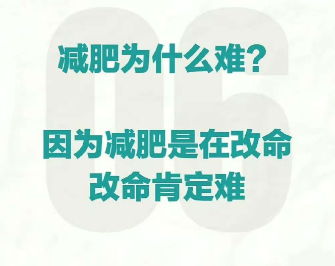
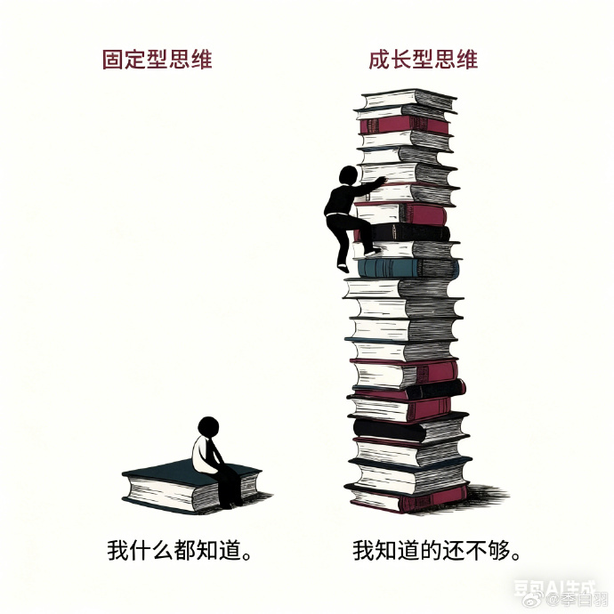

# 每日文字

AI 带来的问题，不在于机器人即将到来，而在于你不知道自己究竟应该擅长什么。

-- [《你的工作并没有消失，只是不断缩小》](https://newsletter.jantegze.com/p/your-job-isnt-disappearing-its-shrinking)

2、

AI 公司总是说，由于他们的工具，人们可以专注于更高价值的工作。但是，没人能够定义，高价值工作究竟是什么工作。

-- [《你的工作并没有消失，只是不断缩小》](https://newsletter.jantegze.com/p/your-job-isnt-disappearing-its-shrinking)

## 阮一峰 2026年 第6周

### 为什么软件股下跌
大家知道，最近两三年，由于生成式 AI 的出现，美国股市大涨。

所有 AI 相关公司，股价都涨上了天：模型公司、应用公司、芯片公司、存储公司......

但是，我最近看新闻，才知道有一类股票，不仅没涨，还下跌了。你真想不到，这种倒霉的股票就是软件股。

新闻这样写：

"1月29日，SAP 公司表示云端业务将放缓增长，股价就暴跌了15%。受其影响，其他软件股 ServiceNow 跌了13%，Salesforce 7%，Workday 8%。

这反映了人们对软件行业的未来，日益感到紧张。该行业在疫情期间经历了高速增长，但是后来就急剧放缓。过去一年，美国上市的企业软件公司，整体下跌了10%。"

新闻还配了一张股价走势图。

上图中，向上的黑线是大盘，向下的彩色线就是软件股，真是跌得惨不忍睹。

读完新闻，我的第一反应就是，这是美国软件股，那么中国的软件股呢？

我找来了中国的前10大企业软件股：中国软件、用友网络、久其软件、浪潮软件、超图软件......

大家可以自己查股价，这10家公司过去一年中，居然没有一家跑赢大盘，全部下跌或者横盘。

我就得到了结论：软件股的一蹶不振，看来是全球性现象，不分国别，软件公司的业务都不太乐观。

这是为什么呢，AI 一路高歌，不断上涨，软件股却阴跌不已？难道 AI 不属于软件吗？

回答是，这些上市的软件股全部都是企业软件供应商，而且已经上市多年，产品在 AI 出现之前就定型了。

AI 对这些软件公司不是促进，而是冲击。

（1）AI 让企业能够自行开发一部分所需软件，减少了外购。

（2）基于 AI 的软件创业公司不断涌现，从现有软件企业手里抢走业务。

（3）AI 能够快速地、源源不断地生成代码，所以代码变得廉价了。这一点最重要。软件公司卖的就是代码，因此它们也变得廉价。

以上三点在未来不会消失，只会加剧，这就是为什么人们不看好软件股。

但是，不确实性也存在。有一个"杰文斯悖论"，说的是一种资源如果提高了使用效率，它的使用量不仅不会减少，反而会增加。

软件就是这种情况，AI 提高了软件的生产效率，只会让世界消费更多的软件。而且，企业总是有一部分软件，需要外购。关键就是，新增的需求，会不会抵消 AI 所减少的传统软件采购。如果抵消不了，软件公司就不再属于高增长行业了。

## 2026-01-27

无论在什么时候都不要丧失对自己的信心
无论遇到多大的困难，
无论遇到多大的挑战，
无论遇到多大的挫折，
你总觉得自己在原地踏步，
你总觉得自己并没有在前进，
但实际上你在积蓄力量因为
好的前进是由后退推动的。

---

独处时守心，——你的未来 群居时守口。——你的人际关系。
一个人的时候管住自己的念头，有人的时候管住自已的话语

独处时守心，群居时守口

---

**10、****真的不要随便借人钱，简直是没事给自己找事。**

现在的情况是欠钱的是大爷，你今天催明天，明天催后天，他就是不还，你有什么办法？

从一开始就不要借，解决一切麻烦。

特别是能借钱的关系，基本上沾亲带故，你催又拉不下脸，不催自己吃亏，难道把这个钱当白丢了吗？

> 不要借钱，不要借钱，不要借钱。 20260207

想继续做朋友做亲戚，就是不要扯上钱的关系

---

**13、****一个朋友，在北京的一家医院工作，不是医生，她学习不行，具体干啥工作我没听懂。**

我问，现在国际部是不是也是医院的一个重要创收点？

她说，未来的主要增长点，就是给公立医院开了一个可能性，高端服务、高端用药、医保不能报销，针对外国人是假，针对国内高净值客户是真，你陪床就知道了，现在住院什么环境？

我说，这个季节，整个走廊里都是臭味，臭脚丫子的味道，我突然觉得护士真的好难，就这样的工作，竟然需要研究生，我那天去ICU找骑友，护士姐姐跟我讲，卫生巾都需要她们给换。

---

**14、****人一旦不联系，就什么都不是了。**

成年人的关系，说到底是一种合作与交换。我们交换时间、交换情绪、交换价值。人们一旦停止了交换，关系也就淡了。听起来很冷，但这是现实。

不要高估你在别人心中的位置

也不要把别人在你心中的位置挂起

人都是会变的，现在重要不代表永远重要。

---

**15、****今天腾讯开年会，马化腾做了全员演讲，感觉字字句句都在回应外界的一些传闻，有点稳军心的味道了，我简答总结一下：**

\- 腾讯降本增效，是迫于形势，别马后炮

2022年腾讯的股价暴跌75%，进入寒冬，所以才启动了降本增效，对于AI的投入也因此受到影响——ChatGPT刚好卡在同年问世——直到2025年，腾讯能花在AI上的钱才开始回暖；

\- 在AI行业，腾讯的动作确实慢了，正在提速

浑元（模型）和元宝（应用）在2024年底才从TEG转到CSIG事业群，这首先是一个组织效率的问题，然后才是技术问题，对比字节的CEO梁汝波是在2024年初就在反思大公司病了，觉得内部在2023年才开始讨论ChatGPT是很严重的迟滞；

\- 技术上，腾讯自研大模型的主要问题在于Infra不足

说人话可能就是，缺卡⋯⋯总之就是在恢复投入之后，给钱给人给资源，中途也成功抽到了姚顺雨这样的SSR，并逐渐摸索出了腾讯的方法论，即「产模不能分离」，模型团队和产品团队要联合做事、共享代码；

\- 马化腾锐评豆包和千问，褒贬分明

提到豆包主要是豆包手机，结论是不太支持，提到千问倒是有些赞赏，主要觉得阿里能调动整个阿里生态来服务千问，组织效率很不错，就是「阿里生态的业务并不是所有都是行业里最好的」；

\- 微信依然是腾讯的一张底牌，等大招

微信会用介于豆包和千问之间的某种「居中」位置来做全面的Agent生态，慢一点没有错，需要考虑的事情很多，不希望服务方被管道化，还是希望腾讯/微信来做底层，入口交给那些愿意在微信生态里提供AI产品的供应商；

\- 元宝在测试自己的社交玩法，微信依然不开放主场

这个今天已经都在测试了，元宝App现在可以拉群，可以导入关系链，可以跟AI一起听歌看剧并随时提问，还通过了第一波10亿现金红包的预算，也效仿阿里让腾讯系的应用接入元宝，全家桶还是香的，这个春节，元神启动！

---

**17、**我观察过球友、骑友里的酒蒙子，最初都是小酌，因为圈子或工作，参加的场合越来越多，酒量慢慢被撑开了，最初可能喝两三瓶啤酒就醉了，后来就到了一顿一斤白酒了，这不是关键，关键是有了心理依赖，一到了饭点就想找酒喝，最初只晚饭喝，后来中午也喝，再后来早上也喝。

一个人从参加工作开始参加各类聚餐。

45岁左右，就进入了酒蒙子模式。

一天两顿模式了。

一顿一斤或两顿一斤，有酒场就蹭，没酒场就自己在家喝，这些人也就是靠着天天运动，若不是天天运动？

早垮掉了。

为什么我提醒朋友要戒酒？

我发现，她自己也喝。

这是危险的。

刘胜讲的很有道理，哪怕毒瘾能戒掉，酒精依赖也戒不掉，因为这东西不是单纯的生理瘾，还有心理瘾，氛围瘾，最关键的是酒精太好满足了，随便一个小卖部就卖酒。

防微杜渐。

---

**18、****判断一个人认知比你高的感受：**

①首先，他说的话，我能听懂，但我自己说不出来。

②其次，他给你带来了一种舒服的碾压，他的观点，不仅告诉了你答案，还瓦解了问题的根基。

③终极信号，有一种被滋养和被托举之感。且，不会随着他的离去而消散，而是会慢慢的，逐渐的，弥散在你的人生里。

和你谈的非常来的

一定是比你认知高的

因为他在向下兼容你

---

**我的合伙人很通透。**他说人生有三关要过，过了以后就会很幸福。一个是人关，他就说我之所以老是出现那种被人背刺的小故事，就是我识人不清，我的短板。经历多了应该清醒了。一个人的人品好不好，做事情是否踏实，意志是否坚定，一眼就应该看出来。还有那些劣质亲戚的小故事，不要做烂好人，不该帮的人别帮，否则会被拖入泥潭。此为“人关”。

二是钱关，顾名思义就是金钱观。缺钱时能否放下尊严的同时守住底线。赚钱时能否不膨胀，控制欲望。财富达到一定规模后，能否驾驭避免反噬。还有能否把握“大方”和“节省”的尺度。比如某些房东一毛不拔，前任租客留下的生活用具，哪怕他自己用不到，都全部搜刮走，就是不想留给下任租客。有的房东就很好。还经常自掏腰包帮租客解决小问题。还有就是破财后能否保持一个好的心态，我一些朋友破财后翻盘心切，错误操作导致负债越来越多。还有赌博的人远离，还有某些平台上面的花花世界，给人造成幻觉，导致和自己经济实力不匹配的过度消费，让自己陷入困境，这也属于没过钱关。

三是情关。这里男女都会遇到。女的碰到渣男，被对方提供的情绪价值蒙蔽，越陷越深。男的也一样，成为荷尔蒙的傀儡。我身边就有好几个男的，找小三导致家庭破裂，最终一无所有。

当然犯错并不可怕，可怕的是执迷不悟。如果你遇到过上面那些难关，经历过以后，清醒了通透了，那后面人生就会少走很多弯路，越来越顺。

 

很多人问我找合伙人的标准，能过得了以上这三关，而且有能力有事业心，那我相信就会是一个很好的合伙人。

---

**2、**如果一个人，能靠交易活下来，你不用管他有多聪明，也不用羡慕他赚了多少钱，你只要需要明白，这个人一定经历过，常人无法忍受的痛苦和煎熬，他必须看透并克服人性，交易不会奖励聪明人，只会奖励:

能熬，

能忍，

能改，

**他的成功不是因为运气好，而是在大家看不到的地方“死”过无数次 !**

---

纳米比亚死亡谷，枯死的骆驼刺树形成了黑白对比的生命张力，背后白色的盐沼地，橙色的沙丘，黑色的沙丘阴影，蓝色的纯净天空，则组成了抽象的色块背景，让整个场景变成了一幅大自然的抽象画。

**5、****继续说穿越，普通人不是人的时代，为什么想穿越回去呢？我们的生死就是人家的一句话，而且死法可以有千千万。**

在封建王朝时代，谋反是什么罪？

株连九族。

凌迟算什么？

我之前里写过，有的人就喜欢研究酷刑，甚至烤着吃，满门抄斩的时候，先烤儿子，然后切一片肉喂爹嘴里问：香不？好吃不？要不要再多撒点孜然？

时代在进步的一大表现是什么？

有些东西在慢慢被塞进笼子里。

二战是人类文明进步的一大转折点，我曾经写过这个点，我摘抄一下：二战后的《世界人权宣言》。简单一点理解，就是你有没有罪，该不该死，不是某个人或某个组织就可以下结论的，必须由依法成立的法庭进行公开公正的审判，并且你有质证权利，包括交叉询问和对质的权利，而不是审判前置。

我学历史的时候，我还喜欢研究每个人的晚年，死于什么病。

例如洪秀全死的时候才50岁。

营养不良，肠道感染。

**大部分历史名人，过了50岁以后，生命的最后10年生命质量都很一般**，毕竟没有今天的医疗条件，大家还动不动迷信什么那个这个

---

**6、****养生很重要的一点，别拧巴。**

尊重自己的情感，尊重自己的情绪，直接表达自己的态度。

很明确的表达态度，别藏着掖着让别人猜，别默认别人必须懂自己。

表达态度不是说去表演生气的态度不高兴的态度。

表达态度就是这件事我怎么看，正确表达，不人身攻击，不辱骂，正向表达，讲文明懂礼貌的沟通。

不要怕表达态度以后会失去朋友。

君子和而不同。

认知不同很正常。

表达态度、尊重自己的感情感受，就是对自己的爱。

---

**9、****一个朋友，开个咖啡馆，她非常喜欢研究咖啡。**

我问，你研究这些东西兴奋吗？

她说，超级兴奋，有时我晚上睡不着，不是因为我咖啡喝多了，而是我突然想到了一个IDEA，然后就穿着睡衣起来捣鼓。

我说，这是一份让你兴奋的事业。

她说，既澎湃又平静，我从来没指望赚到多少钱，我创业的初衷就是不赔钱就好，能赚出装修、房租、员工工资，这就很好了，至于我自己有没有钱分，那真无所谓，关键是没有客户，我研发出新品也白搭，没有市场反馈，而这样等于我可以不断得到一些正反馈。 

我说，李银河有个观点，人生的高标准是获得快乐，低标准是获得平静。没达到这两个境界，人生就是痛苦的。你等于直接通关了。

---

## 2026-01-26

**中年人最后的倔强，不是鸡娃，不是认命。而是敢于重新学习，重新像少年时期那样充满激情。** 

人到中年，大部分人已经自我定性。

**如果能够把自己再次归零，打破这种定性，那么你自然就不会有什么中年危机。**

---

**在一段关系中，不管是人与人，还是国与国，如果你是严重的利益受损方，不要害怕打破和中止这种关系，不要怕打破这种关系会造成双输。**

因为这个时候，你很难通过提要求和谈判就能让对方让步妥协。既然利益获取严重不对等，那就寻求双输打破这种关系结构，而双输对方一定是更大的利益受损方。

如果对方还有理性，想要减少利益损失，它就会寻求和你妥协，而这个时候就是你赢的开始。

这个过程，需要的是常识，判断力和勇气，因为不健康的关系维持时间长了，受害方往往也会沉溺和依赖于这种关系结构之中，变得适应，要打破这种路径依赖并不那么容易。

---

**给小伙伴提个醒，近来管好嘴巴，不要胡咧咧。**

很多事情，你惹不起，也不要惹了。

到时候一记火光四溅，眼冒金星的大耳光下来，你就要哭了。

也给做自媒体的朋友们

无论是文字的，还是视频

有些话不要说了

有些话题不要去讨论了。

---

**一个年薪72万的中层说，他观察一个人有没有潜力，只看会议里的两分钟：**

被问到一个问题时，他会不会先把背景复述一遍。

比如被问：“你觉得这个功能应该怎么做？”

普通回答：

“我觉得可以这样做，也可以那样做……”

而高潜力的回答是：

“我先确认一下背景——我们现在想解决的是这个场景，对吗？限制条件是这个，对吧？”

他说：“能复述背景的人，是能把事做稳的人。做不稳的人，是连事都没听明白。”

这话听上去严肃，但特别真实。

---

**17、****一****般情况下，微信是不会被永封的，会给机会。**

什么情况会被永封？

要么，涉案了。

要么，涉黄了。

要么，涉诈了。

要么，涉政了。

最敏感的是群，哪怕两个人的群。

私聊的话。

无所谓。

自媒体领域，永封也很难。

要么，涉国内品牌了，被法务部盯上了。

要么，涉危害国家安全了。

要么，账号足够大了，例如1000万粉丝以上了，任何风吹草动都必须死，因为1000万的基数完全相当于一门中教了。

所以，每个自媒体人都必须在电脑上贴上四个字：莫谈国是。

这个国是，包括所有的国内知名品牌。

骂骂特斯拉，无所谓。

---

**我还是那句话，不要去理解任何一个膈应你的人的动机，甚至可以说不需要我们花费心思去想对方怎么能这么对你。**事实是ta就是这么对你了，ta没素质，ta早晚遭报应。这就足够了真的，不要去试图搞懂对方的动机，ta经历过什么都不应该这么对你！你要这么想！ 

**就像村上春树说的，不是所有的鱼都生活在同一片海洋**

**所以我们不要跟傻瓜论长短，别跟烂人烂事周旋。**

---

**请一定相信，人生真的会在某个瞬间豁然开朗。**

你要好好吃饭、踏实睡觉，把房间收拾干净，专注研究热爱的事——用心把生命力养得旺盛，让自己浑身是劲、气血充盈。 

当你满身都透着明媚向上的劲儿，就会发现，生活的每个瞬间，都有无数力量在托着你往上走。

---

**过马路时，看到有外卖小哥闯红灯了，他闯红灯的时候，路口双向确实一辆车都没有。**

这个红灯100多秒，对咱而言无所谓，等等就等等吧，但是对他们而言，时间就是一切，送晚了平台就会有处罚，有人做过测试，若是不闯红灯，不超速，每天工作八小时，并且双休，一个月也就是两三千块钱的收入，够干什么的？

这就是卷的结果。

其实，卷呢，也有积极意义，例如点个外卖一会就送上门了，例如快递成本这么低，找人维修马上有人上门，欧美人为什么动手能力那么强？因为没有这么廉价的劳动成本，之前我写过一篇文章，发达国家是物便宜人贵，发展中国家是人便宜物贵……

---

有些人能逃出这种诅咒

比如医生

医生会对你说要戒烟戒酒

但是你看医生里面

抽烟的，喝酒的，不占少数。

---

我从二楼上朝下看，一上车，俩人就点上了烟。

不知道脱了衣服后，小姑娘有没有大花背？

这类女生都是负能量，而且高危，要离的远远的才行，你还当个宝贝了，领着出来炫耀，看我的妞多年轻……

使我想起了那句话，男人其实挺可悲的，一辈子都在为性欲买单。

这个买单，不仅仅是金钱上的。

还有精力上的，人生上的。

他走了老半天，又给我发信息，问我柴油车有没有缺点？

若是很少玩柴油车，还真玩不习惯。

---

**经常有朋友说，不学无术的网红粉丝几千万，年入多少亿，读书还有什么用？** 

其实吧，各个区县街道乡镇二三十年前开游戏厅、发廊、ktv、典当行、假大牌店、洗浴洗脚、高端饭店宴会中心等等的也是这些人，其中有一小部分还成了当地的房地产开发商和风云人物。这些人是一直在的，他们提供的需求也一直有被需要

只是现在搬到网上，然后平台为虎作伥，噢，不，平台是虎，观看、点赞、打赏、购买的才是伥

读书人也不用气馁

**产品是最好的内容**

**知识是最长久的网红**

这个我其实写过

这个是个概率的问题

---

**11、****审美好的人干什么都成**

我一直坚信这个道理。我大学老师讲，审美几乎是一个人的全部，家境、学识、经历和性格表现在外在就是审美

---

**谈到了恋爱。**

朋友谈恋爱要谈自己喜欢的，要主动拒绝喜欢我们而我们不喜欢的，我学佛以前很佛系，觉得遇到什么人都是缘分，很在意自己遇到的每个人，觉得不同的人会带我看不同的世界，他们有求于我，我也积极的回应，后来发现把自己搞的很累。

我说，类似高晓松坐牢认识了个狱友，高晓松在极力的托举他。

朋友说，是，现在我更在乎的是自己想要寻找一个什么样的世界，在那个世界里我自然会遇到我想遇到的人，我们要把依赖性转化为主动性，既然谈一次恋爱了，肯定谈自己喜欢的，而不是自己去成全别人。

我说，自己喜欢的男人，未必是适合结婚的，**拿破仑有句话**:**女孩只喜欢有特殊技巧的男朋友**。我在互联网上征战这么多年，非常赞同这句话，每个细分领域出彩的选手，都是女朋友无数，不管是双截棍耍的好的还是魔术变的好的，还是唱歌好听的，还是喜欢收藏烟盒的，反正只要你有一技之长，就有优先择偶权。

朋友说，的确有这个可能，**若是奔着结婚去的话，则必须卡三大原则，身体、家风、智商，缺一不可。**

我说，还有门当户对。

朋友说，那是基本前提。

我说，恋爱观这个话题，是人人谈理论一套一套的，真到实践了，个个都跑偏了，尤其是女人，女人太容易感性。

---

**送礼，有个关键的一条，是一次送足送到位**

**要送对方有钱却舍不得买的东西，要小件大送。**

---

**15、****练专注，好的商业模式一定是简单的，一个人做的事情越多，越不容易赚钱；一个人脑子越复杂，赚钱也就越困难；一个人处事越简单，赚钱也变得简单。**

---

**7、****有人谈过一件事情，若是拿今天的足球比赛录像去给秦汉时期的人看，但是把足球给P掉，他们会怎么理解？会推测，这是一种舞蹈吗？是一种仪式吗？**

只会觉得怪怪的。

理解不了。

为什么理解不了？

因为，缺失了足球，那个支配行为的核心目标。

这个核心目标，很多时候也是具体的信仰，例如我们理解不了欧美人很多行为，欧美人也理解不了我们在特殊时期的很多行为。

根源是什么？

文化不同，我们看不到对方的那个球。

从而，我们觉得他们魔怔了。

他们觉得，我们魔怔了。

---

**18、****某邪教兴盛的时候我上高中，有一次听领导说，当年邪教头头仗着信徒众多居然跟政府谈判，我一听简直惊呆，这人不是疯了吧？**

后来有一次我去同学家，亲眼看见广场舞大妈跟街道的人说，我下面有300人，你们必须给我们配备音响，还要一个大房子免费给他们用，我当时就觉得那个邪教头子干的蠢事可能是真的。

网红们，请注意这段话。

---

**19、****有人问我怎么才算把事做好了？**

先问自己：你有给自己定底线吗？有设想过理想结果吗？如果连目标都没有，那不叫做事，那叫应付。 

很多人一辈子困在“做完”和“做好”之间，就是因为还在用学生时代的思维等老师划重点。

---

**1、****和一个群内的大学生闲聊。** 

他问我，你们刚开始上网的那会，是不是爱国氛围比较浓？

我说，恰好相反，那时人人的梦想都是出国留学或定居

互联网氛围也很宽松，都可以拿长者开玩笑的

表情包更奇葩，不管谁的头像随意搞，我觉得很重要的原因是监管滞后

其次呢，当时能上网的多是精英群体，本身就是叛逆的、自由的，今天上网主力军变了，整体下移了，精英反而保持沉默了，所以今天的帖子没有当年好看

当年逛论坛就一个感觉，这些人的脑子是什么做的？咋这么牛逼？任一领域都有神人的存在，包括算命的。

当时还有研究六合彩的呢。

当时有个帖子非常火，说《天线宝宝》的发行方与六合彩有关联，密码就藏在这部动画片里，有人每天就搞连载，分析这部动画片，寻找各类比喻，各类数字

这个流派现在依然很火，未来也会很火

---

**3、****35岁以前，进攻的能力决定成败。**

**35岁以后，防守的能力决定成败。**

为什么地产商纷纷陨落，其实是一种必然，他们是靠时代风口赚到的钱，但是他们并没有对应的防守能力，他们赚钱的逻辑是房产一直涨，永不停歇，他们的潜意识里，压根就没有房价下跌这个选项，也没有做应急预案。

防守能力包括哪些？

第一，攒钱的能力，不该消费的不消费，把收入大头流入储蓄账户。

第二，钱生钱的能力，要建立一套年化收益大于等于7%的系统，不是靠猜，而是靠逻辑，在不确定市场里做确定性的事。

第三，并入时代浪潮的能力，例如现在各行各业都在拥抱互联网，那么你自己必须主动拥抱，微博、抖音、小红书都开开，把自己主动年轻化，20岁的年轻人怎么玩互联网，你也怎么玩，在这个过程中，不断的寻找突破口，让自己的生意与互联网结合，看一点就行了，现在县城里，能赚钱的特色店，全是网红老板。

---

**5、** **我以前写过一个观点**

优质朋友是拿来干什么的？就是拿来帮我们做判断题的

例如医疗问题我有不懂的，那么我就请教球友医生们，他们给出的建议一定是专业的，我无脑听从就可以了

他们俩若有写作问题，问我，我给的建议也无脑听就可以了

这样等于可以移植优秀想法的大脑

以前天涯论坛也有过一个类似的论调，**读书的本质是借脑，花几十块钱去借用一个天才的思想**。

---

**7、****冯唐：中年以后，过度分享就是作死。**

中年以后，最好的状态是什么？我认为是八个字：销声匿迹、半隐半藏。

除了绕不开的工作关系和血脉相连的骨肉亲情，剩下的所有关系都可以弱化，非必要不经营，尤其是善良而简单的人，不要去强求人际关系的技巧，你没有圆滑机智的天赋，就不要靠近复杂的关系。

来来去去，只会消耗自己的精力和元气。

---

---

我是文字类的自媒体，他们是视频类的自媒体，其实没啥交集，我也没有能力去给协调，在人家眼里，我算个屁啊？！哪有我说话的份？

我都是躲的远远的。

我跟小网红分享了我的几点看法：

第一，县城人的劣根性是见不得别人好，踩人是基本操作，你要习惯这个生态，同时告诫自己，咱不要这样，你要学的贾老师，你看，他是本土网红里被调侃最多的一个人，但是他从来没回应过，一直都在前行，而且谁找到他，他也很谦卑。

第二，可以以本地为起步点，但是无论内容还是定位，都要跳出本地，因为你聚焦于本地，从而就显的荆棘丛生，前面有无数拦路虎，为什么我们没有这样的困扰？因为我们几乎不深耕本地。

第三，联合同行，谁优秀，请谁吃饭，搞个小圈子，三五个人，也不要太多，相互交流行业经验，然后设个学习频率，例如每一个月拜访一位优秀的同行，要走出去，去省会，去杭州，去上海，去深圳……

这样可以最快速度的发展。

草根电商圈子里，我最佩服的是某地那群，他们搞了一个私董会性质的，每个月出行一次，选不同领域，对自己成长有帮助的，主动去设宴请对方吃饭。

我怎么知道的？

我被这么请过。

他们来了十个人，订了一个大包间，一开场，先自我介绍，然后有人负责主持，挨着提问，当然来之前，肯定要对我有个系统的了解，甚至不少本身就是资深读者，甚至是我老铁。

只要你走不出本地，注定就跟这群人内耗。

毫无意义。

更不要立目标成为本地王。

要立目标为本地的路人甲，没有任何人关注你，盯着你，你才是真正的王者。

那些在台上扭腚的。

都是傻逼！

采访本地这些企业人，有没有前途？

没有。

第一，真正有深度的内容，他们谈不出来。

第二，他们真正想表达的，你不敢播。

最终，就是假大空。

普通企业人，在视频、口才表达方面，约等于文盲。

你看马云、周鸿祎、雷军，侃侃而谈。

他们是亿里挑一。

若是文字采访，会好一些，但是需要写作者会表达，会包藏祸心，把真正想表达的内容藏在字缝里。

前面我分享过，普通人学写作就两条路。

有事业，就写随笔，记录事业，把上下游变成自己的粉丝，从而生意越来越好做。

无事业，就写采访录，借用别人的思维，别人的价值，来体现自己的价值。

若是鲁豫采访的不是名人，而是路人甲。

没人知道鲁豫是谁。

最近闹的挺火的程前，他怎么有机会能跟王石、周鸿祎、冯仑同台的？

就因为他做的是采访录。

借别人的力量成就了自己的名气……

暂时的德不配位。

但是，随着财富、经历越来越丰富，他也会成为OLD MONEY。

---

