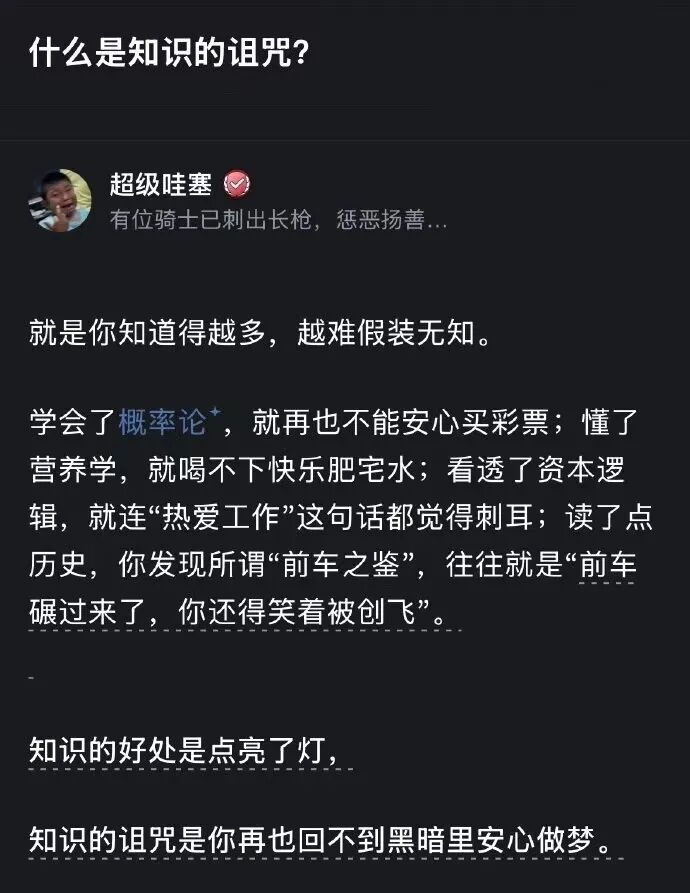
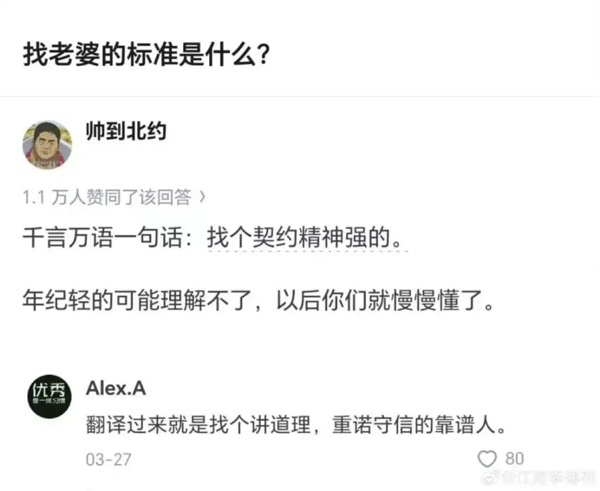
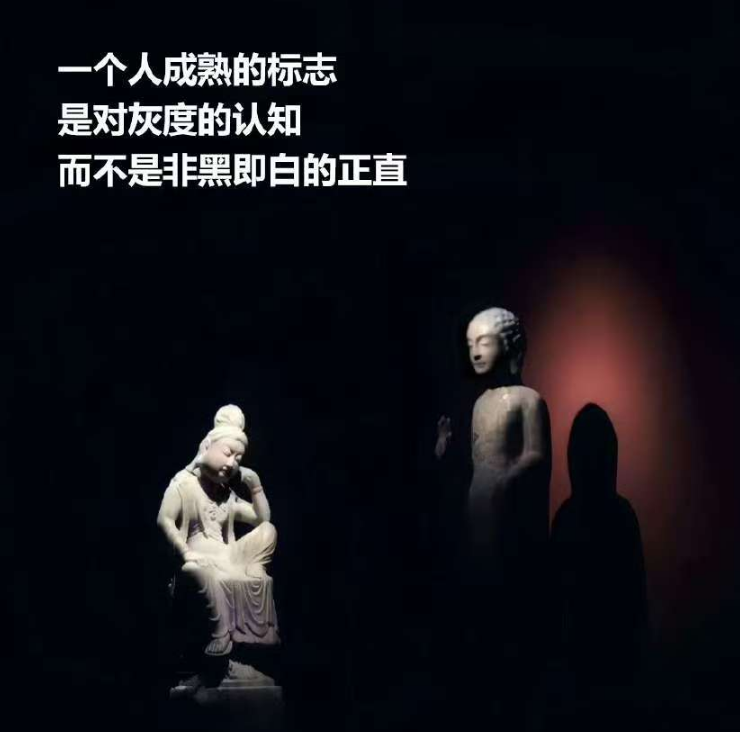
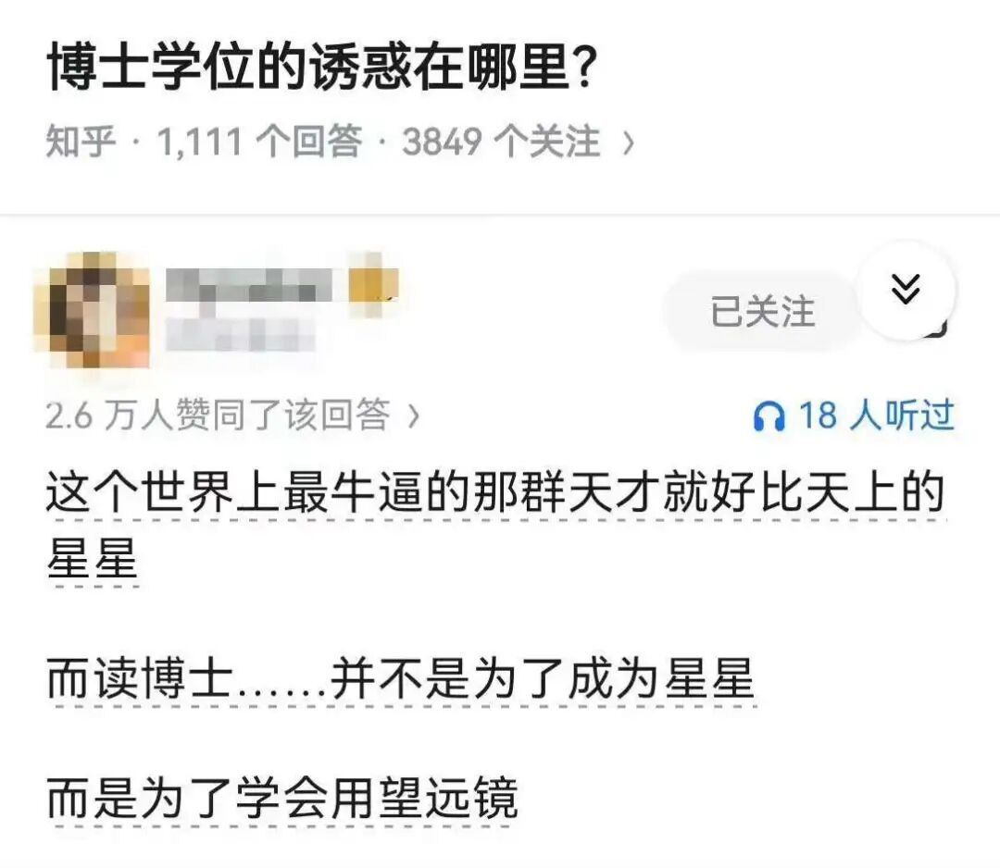
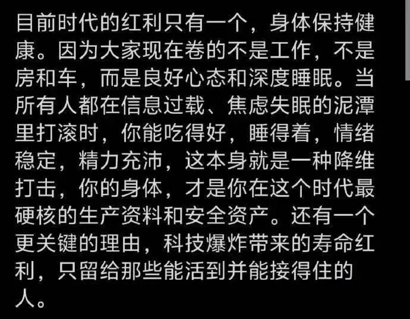

# 每日文字

## 2026-01-26

**中年人最后的倔强，不是鸡娃，不是认命。而是敢于重新学习，重新像少年时期那样充满激情。** 

人到中年，大部分人已经自我定性。

**如果能够把自己再次归零，打破这种定性，那么你自然就不会有什么中年危机。**

---

**在一段关系中，不管是人与人，还是国与国，如果你是严重的利益受损方，不要害怕打破和中止这种关系，不要怕打破这种关系会造成双输。**

因为这个时候，你很难通过提要求和谈判就能让对方让步妥协。既然利益获取严重不对等，那就寻求双输打破这种关系结构，而双输对方一定是更大的利益受损方。

如果对方还有理性，想要减少利益损失，它就会寻求和你妥协，而这个时候就是你赢的开始。

这个过程，需要的是常识，判断力和勇气，因为不健康的关系维持时间长了，受害方往往也会沉溺和依赖于这种关系结构之中，变得适应，要打破这种路径依赖并不那么容易。

---

**给小伙伴提个醒，近来管好嘴巴，不要胡咧咧。**

很多事情，你惹不起，也不要惹了。

到时候一记火光四溅，眼冒金星的大耳光下来，你就要哭了。

也给做自媒体的朋友们

无论是文字的，还是视频

有些话不要说了

有些话题不要去讨论了。

---

**一个年薪72万的中层说，他观察一个人有没有潜力，只看会议里的两分钟：**

被问到一个问题时，他会不会先把背景复述一遍。

比如被问：“你觉得这个功能应该怎么做？”

普通回答：

“我觉得可以这样做，也可以那样做……”

而高潜力的回答是：

“我先确认一下背景——我们现在想解决的是这个场景，对吗？限制条件是这个，对吧？”

他说：“能复述背景的人，是能把事做稳的人。做不稳的人，是连事都没听明白。”

这话听上去严肃，但特别真实。

---

**17、****一****般情况下，微信是不会被永封的，会给机会。**

什么情况会被永封？

要么，涉案了。

要么，涉黄了。

要么，涉诈了。

要么，涉政了。

最敏感的是群，哪怕两个人的群。

私聊的话。

无所谓。

自媒体领域，永封也很难。

要么，涉国内品牌了，被法务部盯上了。

要么，涉危害国家安全了。

要么，账号足够大了，例如1000万粉丝以上了，任何风吹草动都必须死，因为1000万的基数完全相当于一门中教了。

所以，每个自媒体人都必须在电脑上贴上四个字：莫谈国是。

这个国是，包括所有的国内知名品牌。

骂骂特斯拉，无所谓。

---

**我还是那句话，不要去理解任何一个膈应你的人的动机，甚至可以说不需要我们花费心思去想对方怎么能这么对你。**事实是ta就是这么对你了，ta没素质，ta早晚遭报应。这就足够了真的，不要去试图搞懂对方的动机，ta经历过什么都不应该这么对你！你要这么想！ 

**就像村上春树说的，不是所有的鱼都生活在同一片海洋**

**所以我们不要跟傻瓜论长短，别跟烂人烂事周旋。**

---

**请一定相信，人生真的会在某个瞬间豁然开朗。**

你要好好吃饭、踏实睡觉，把房间收拾干净，专注研究热爱的事——用心把生命力养得旺盛，让自己浑身是劲、气血充盈。 

当你满身都透着明媚向上的劲儿，就会发现，生活的每个瞬间，都有无数力量在托着你往上走。

---

**过马路时，看到有外卖小哥闯红灯了，他闯红灯的时候，路口双向确实一辆车都没有。**

这个红灯100多秒，对咱而言无所谓，等等就等等吧，但是对他们而言，时间就是一切，送晚了平台就会有处罚，有人做过测试，若是不闯红灯，不超速，每天工作八小时，并且双休，一个月也就是两三千块钱的收入，够干什么的？

这就是卷的结果。

其实，卷呢，也有积极意义，例如点个外卖一会就送上门了，例如快递成本这么低，找人维修马上有人上门，欧美人为什么动手能力那么强？因为没有这么廉价的劳动成本，之前我写过一篇文章，发达国家是物便宜人贵，发展中国家是人便宜物贵……

---

有些人能逃出这种诅咒

比如医生

医生会对你说要戒烟戒酒

但是你看医生里面

抽烟的，喝酒的，不占少数。

---

我从二楼上朝下看，一上车，俩人就点上了烟。

不知道脱了衣服后，小姑娘有没有大花背？

这类女生都是负能量，而且高危，要离的远远的才行，你还当个宝贝了，领着出来炫耀，看我的妞多年轻……

使我想起了那句话，男人其实挺可悲的，一辈子都在为性欲买单。

这个买单，不仅仅是金钱上的。

还有精力上的，人生上的。

他走了老半天，又给我发信息，问我柴油车有没有缺点？

若是很少玩柴油车，还真玩不习惯。

---

**经常有朋友说，不学无术的网红粉丝几千万，年入多少亿，读书还有什么用？** 

其实吧，各个区县街道乡镇二三十年前开游戏厅、发廊、ktv、典当行、假大牌店、洗浴洗脚、高端饭店宴会中心等等的也是这些人，其中有一小部分还成了当地的房地产开发商和风云人物。这些人是一直在的，他们提供的需求也一直有被需要

只是现在搬到网上，然后平台为虎作伥，噢，不，平台是虎，观看、点赞、打赏、购买的才是伥

读书人也不用气馁

**产品是最好的内容**

**知识是最长久的网红**

这个我其实写过

这个是个概率的问题

---

**11、****审美好的人干什么都成**

我一直坚信这个道理。我大学老师讲，审美几乎是一个人的全部，家境、学识、经历和性格表现在外在就是审美

---

**谈到了恋爱。**

朋友谈恋爱要谈自己喜欢的，要主动拒绝喜欢我们而我们不喜欢的，我学佛以前很佛系，觉得遇到什么人都是缘分，很在意自己遇到的每个人，觉得不同的人会带我看不同的世界，他们有求于我，我也积极的回应，后来发现把自己搞的很累。

我说，类似高晓松坐牢认识了个狱友，高晓松在极力的托举他。

朋友说，是，现在我更在乎的是自己想要寻找一个什么样的世界，在那个世界里我自然会遇到我想遇到的人，我们要把依赖性转化为主动性，既然谈一次恋爱了，肯定谈自己喜欢的，而不是自己去成全别人。

我说，自己喜欢的男人，未必是适合结婚的，**拿破仑有句话**:**女孩只喜欢有特殊技巧的男朋友**。我在互联网上征战这么多年，非常赞同这句话，每个细分领域出彩的选手，都是女朋友无数，不管是双截棍耍的好的还是魔术变的好的，还是唱歌好听的，还是喜欢收藏烟盒的，反正只要你有一技之长，就有优先择偶权。

朋友说，的确有这个可能，**若是奔着结婚去的话，则必须卡三大原则，身体、家风、智商，缺一不可。**

我说，还有门当户对。

朋友说，那是基本前提。

我说，恋爱观这个话题，是人人谈理论一套一套的，真到实践了，个个都跑偏了，尤其是女人，女人太容易感性。

---

**送礼，有个关键的一条，是一次送足送到位**

**要送对方有钱却舍不得买的东西，要小件大送。**

---

**15、****练专注，好的商业模式一定是简单的，一个人做的事情越多，越不容易赚钱；一个人脑子越复杂，赚钱也就越困难；一个人处事越简单，赚钱也变得简单。**

---

**7、****有人谈过一件事情，若是拿今天的足球比赛录像去给秦汉时期的人看，但是把足球给P掉，他们会怎么理解？会推测，这是一种舞蹈吗？是一种仪式吗？**

只会觉得怪怪的。

理解不了。

为什么理解不了？

因为，缺失了足球，那个支配行为的核心目标。

这个核心目标，很多时候也是具体的信仰，例如我们理解不了欧美人很多行为，欧美人也理解不了我们在特殊时期的很多行为。

根源是什么？

文化不同，我们看不到对方的那个球。

从而，我们觉得他们魔怔了。

他们觉得，我们魔怔了。

---

**18、****某邪教兴盛的时候我上高中，有一次听领导说，当年邪教头头仗着信徒众多居然跟政府谈判，我一听简直惊呆，这人不是疯了吧？**

后来有一次我去同学家，亲眼看见广场舞大妈跟街道的人说，我下面有300人，你们必须给我们配备音响，还要一个大房子免费给他们用，我当时就觉得那个邪教头子干的蠢事可能是真的。

网红们，请注意这段话。

---

**19、****有人问我怎么才算把事做好了？**

先问自己：你有给自己定底线吗？有设想过理想结果吗？如果连目标都没有，那不叫做事，那叫应付。 

很多人一辈子困在“做完”和“做好”之间，就是因为还在用学生时代的思维等老师划重点。

---

**1、****和一个群内的大学生闲聊。** 

他问我，你们刚开始上网的那会，是不是爱国氛围比较浓？

我说，恰好相反，那时人人的梦想都是出国留学或定居

互联网氛围也很宽松，都可以拿长者开玩笑的

表情包更奇葩，不管谁的头像随意搞，我觉得很重要的原因是监管滞后

其次呢，当时能上网的多是精英群体，本身就是叛逆的、自由的，今天上网主力军变了，整体下移了，精英反而保持沉默了，所以今天的帖子没有当年好看

当年逛论坛就一个感觉，这些人的脑子是什么做的？咋这么牛逼？任一领域都有神人的存在，包括算命的。

当时还有研究六合彩的呢。

当时有个帖子非常火，说《天线宝宝》的发行方与六合彩有关联，密码就藏在这部动画片里，有人每天就搞连载，分析这部动画片，寻找各类比喻，各类数字

这个流派现在依然很火，未来也会很火

---

**3、****35岁以前，进攻的能力决定成败。**

**35岁以后，防守的能力决定成败。**

为什么地产商纷纷陨落，其实是一种必然，他们是靠时代风口赚到的钱，但是他们并没有对应的防守能力，他们赚钱的逻辑是房产一直涨，永不停歇，他们的潜意识里，压根就没有房价下跌这个选项，也没有做应急预案。

防守能力包括哪些？

第一，攒钱的能力，不该消费的不消费，把收入大头流入储蓄账户。

第二，钱生钱的能力，要建立一套年化收益大于等于7%的系统，不是靠猜，而是靠逻辑，在不确定市场里做确定性的事。

第三，并入时代浪潮的能力，例如现在各行各业都在拥抱互联网，那么你自己必须主动拥抱，微博、抖音、小红书都开开，把自己主动年轻化，20岁的年轻人怎么玩互联网，你也怎么玩，在这个过程中，不断的寻找突破口，让自己的生意与互联网结合，看一点就行了，现在县城里，能赚钱的特色店，全是网红老板。

---

**5、** **我以前写过一个观点**

优质朋友是拿来干什么的？就是拿来帮我们做判断题的

例如医疗问题我有不懂的，那么我就请教球友医生们，他们给出的建议一定是专业的，我无脑听从就可以了

他们俩若有写作问题，问我，我给的建议也无脑听就可以了

这样等于可以移植优秀想法的大脑

以前天涯论坛也有过一个类似的论调，**读书的本质是借脑，花几十块钱去借用一个天才的思想**。

---

**7、****冯唐：中年以后，过度分享就是作死。**

中年以后，最好的状态是什么？我认为是八个字：销声匿迹、半隐半藏。

除了绕不开的工作关系和血脉相连的骨肉亲情，剩下的所有关系都可以弱化，非必要不经营，尤其是善良而简单的人，不要去强求人际关系的技巧，你没有圆滑机智的天赋，就不要靠近复杂的关系。

来来去去，只会消耗自己的精力和元气。

---

